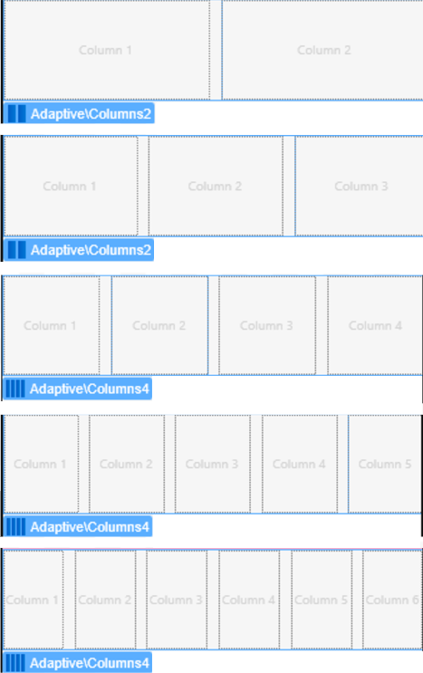
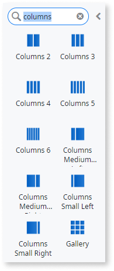
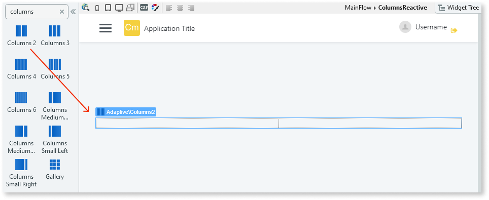
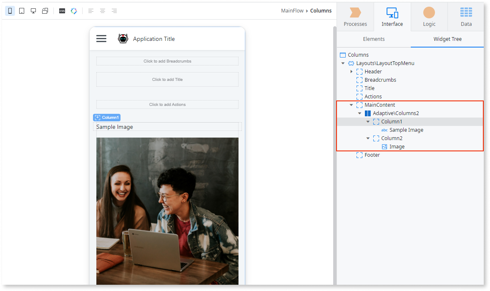
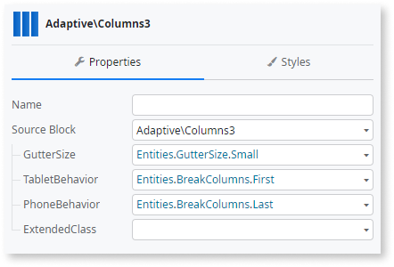
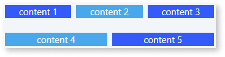
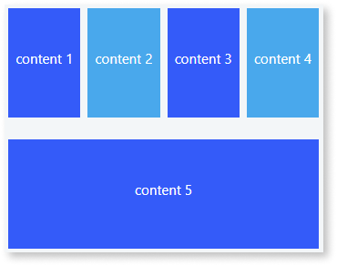
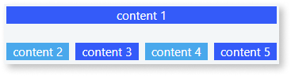

# Columns

You can use the Columns UI Pattern to split content into separate columns, improving the way information is displayed on-screen. <!--You can configure the behavior using the properties. They will define how columns will stack in different devices. This is ideal to improve the way information is displayed across  different devices. You can use this pattern to display a list of elements side by side, with a different number of items per row on different devices. -->

<!-- The following is a preview of the different ways content can be split into columns:

-->

## How to use the Columns UI Pattern

1. In Service Studio, in the Toolbox, search for `Columns`.

    The various Columns widgets are displayed. 

    

1. From the Toolbox, drag the required Column widget into the Main Content area of your application's screen. The following example uses the Columns 2 widget.

    

1. Add the required content to the Columns widget. In this example we add an image and text.

    

1. On the **Properties** tab, you can customize the Column's look and feel by setting any of the (optional) properties, for example, the size of the space between each of the columns (GutterSize), and in what order the columns display on different devices. 

    

1. After following these steps, and publishing the module, you can test the pattern in your app. 

## Properties

**Property** |  **Description** |  
---|---
GutterSize (GutterSizeIdentifier): Optional | Defines the space between columns.  Examples  <ul><li>_Empty_ - Leaves a space of 16px between columns. This is the default (Entities.GutterSize.Base).</li><li>_Entities.GutterSize.None_ - No space between columns.</li></ul> |
TabletBehavior (BreakColumns Identifier): Optional | Defines how the columns are displayed on tablets. The predefined options for the tablet behavior are:  <ul><li>All</li><li>First</li><li>Last</li><li>Middle</li><li>None</li></ul>See below for an example of how each of the options look. |
PhoneBehavior (BreakColumns Identifier): Optional | Defines how the columns are displayed on phones. The predefined options for the phone behavior are:  <ul><li>All</li><li>First</li><li>Last</li><li>Middle</li><li>None</li></ul>See below for an example of how each of the options look. |
ExtendedClass (Text): Optional | Add custom style classes to the Columns UI Pattern. You define your [custom style classes](../../../look-feel/css.md) in your application using CSS.  Examples  <ul><li>_Blank_ - No custom styles are added (default value).</li><li>_"myclass"_ - Adds the _myclass_ style to the Columns UI styles being applied.</li><li>_"myclass1" "myclass2"_ - Adds the _myclass1_ _myclass2_ styles to the Columns UI styles being applied.</li></ul> |

**Entities.ColumnBreak.BreakNone (default)**

  

**Entities.ColumnBreak.BreakMiddle**

**Entities.ColumnBreak.BreakLast**

**Entities.ColumnBreak.BreakFirst**

