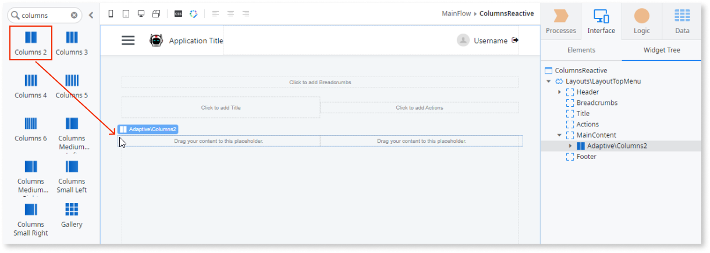

# Columns

Applies to Mobile Apps and Reactive Web Apps only

You can use the Columns UI Pattern to split content into separate columns, improving the way information is displayed on-screen.

## How to use the Columns UI Pattern

1. In Service Studio, in the Toolbox, search for `Columns`.

    The various Columns widgets are displayed. 

    

    If the UI widget doesn't display, it's because the dependency isn't added. This happens because the Remove unused references setting is enabled. To make the widget available in your app:

    1. In the Toolbox, click **Search in other modules**.

    1. In **Search in other Modules**, remove any spaces between words in your search text.
    
    1. Select the widget you want to add from the **OutSystemsUI** module, and click **Add Dependency**. 
    
    1. In the Toolbox, search for the widget again.

1. From the Toolbox, drag the required Column widget into the Main Content area of your application's screen. The following example uses the Columns 2 widget.

    

1. Add the required content to the Columns widget. In this example we add an image and text.

    

1. On the **Properties** tab, you can customize the Column's look and feel by setting any of the (optional) properties, for example, the size of the space between each of the columns (GutterSize), and in what order the columns display on different devices. 

    

1. After following these steps, and publishing the module, you can test the pattern in your app. 

## Properties

**Property** |  **Description** |  
---|---
GutterSize (GutterSizeIdentifier): Optional | Defines the space between columns.  Examples  <ul><li>_Empty_ - Leaves a space of 16px between columns. This is the default (Entities.GutterSize.Base).</li><li>_Entities.GutterSize.None_ - No space between columns.</li></ul> |
TabletBehavior (BreakColumns Identifier): Optional | Defines how the columns are displayed on tablets. The predefined options for the tablet behavior are:  <ul><li>All</li><li>First</li><li>Last</li><li>Middle</li><li>None</li></ul>See below for an example of how each of the options look. |
PhoneBehavior (BreakColumns Identifier): Optional | Defines how the columns are displayed on phones. The predefined options for the phone behavior are:  <ul><li>All</li><li>First</li><li>Last</li><li>Middle</li><li>None</li></ul>See below for an example of how each of the options look. |
ExtendedClass (Text): Optional | Adds custom style classes to the Pattern. You define your [custom style classes](../../../look-feel/css.md) in your application using CSS.  Examples  <ul><li>Blank - No custom styles are added (default value).</li><li>"myclass" - Adds the ``myclass`` style to the UI styles being applied.</li><li>"myclass1 myclass2" - Adds the ``myclass1`` and ``myclass2`` styles to the UI styles being applied.</li></ul>You can also use the classes available on the OutSystems UI. For more information, see the [OutSystems UI Cheat Sheet](https://outsystemsui.outsystems.com/OutSystemsUIWebsite/CheatSheet). |

**Entities.ColumnBreak.BreakNone (default)**

  

**Entities.ColumnBreak.BreakMiddle**

**Entities.ColumnBreak.BreakLast**

**Entities.ColumnBreak.BreakFirst**

