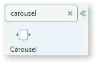
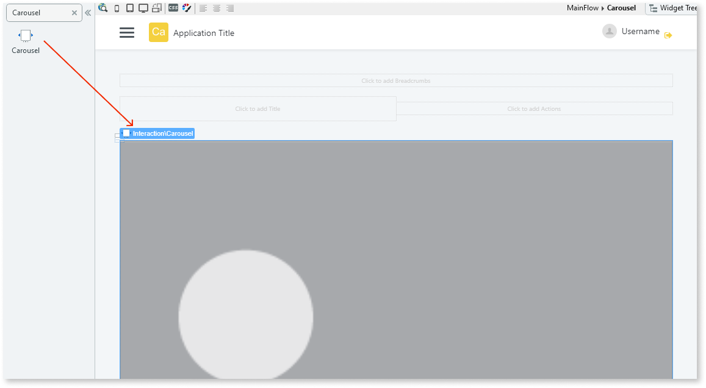
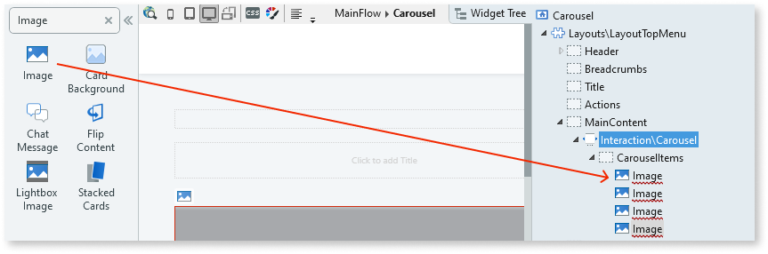
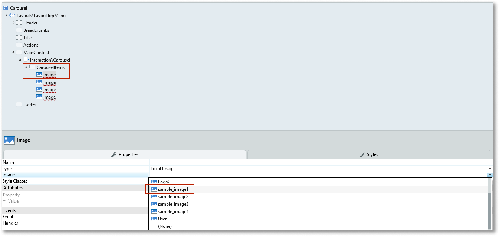
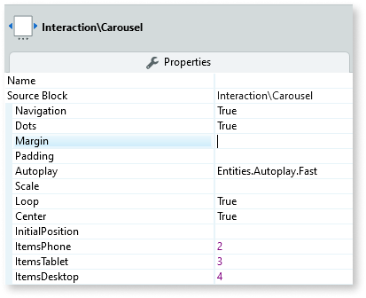

# Carousel

You can use the Carousel UI Pattern to display multiple items in a horizontal slide. This pattern is ideal for creating horizontal slides in smaller screens. You can also use this pattern for dynamic content, by placing a List directly inside the placeholder. 

## How to use the Carousel UI Pattern

1. In Service Studio, in the Toolbox, search for `Carousel`.
  
     The Carousel widget is displayed.

    
  
1. From the Toolbox, drag the Carousel widget into the Main Content area of your application's screen. 

    

    By default, the Carousel widget contains a Carousel Items placeholder, a list list-group placeholder, and an Image widget.

1. Add content to the **Carousel Items** placeholder. 

    In this example, we delete the list list-group and add 3 more Image widgets. You can also add a list of images. 

      

1. On the Element tree, select the Image widget, and on the **Properties** tab, from the Image drop-down, select or import the image you want in the Carousel. 

    Note: In this example, the image property Type is set to **Local** image. You can also add [External and Binary Data](../../../../develop/ui/image/display-image.md) images.   

       

    Repeat step 4 for each of the images in the Carousel. 

1. From the Element tree, select the Carousel widget, and on the **Properties** tab, set the relevant (optional) properties, for example, navigation arrows and dots.

      

After following these steps and publishing the module, you can test the pattern in your app.

## Properties

| **Property** |  **Description** |
|---|---|
|Navigation(Boolean): Optional | Enable or disable arrow buttons to navigate left and right. 
Examples<ul><li>_Blank_ - No navigation arrows are displayed.</li><li>_True_ - Navigation arrows are displayed.</li><li>_False_ - No navigation arrows are displayed. This is the default value.</li></ul>
 |
|Dots(Boolean): Optional | Enable or disable navigational dots that represent items on the Carousel.
Examples<ul><li>_Blank_ - Navigational dots are displayed. This is the default value.<li>_True_ - Navigational dots are displayed.</li><li>_False_ - No navigational dots are displayed.</li> |
|Margin(Integer): Optional  |  Set the distance between each Carousel item. 
Examples<ul><li>_Blank_ - No distance between each Carousel item. this is the default</li><li>_2_ - A distance of 2 pixels between each Carousel item.</li></ul>
  | 
|Padding(Integer): Optional |  Set the distance between the screen edges and the visible items on the screen. 
Examples<ul><li>_Blank_ - No distance between the screen edges and the on screen item. This is the default value.</li><li>_5_ - A distance of 5 pixels between the screen edges and the on screen item.</li></ul>
 |
|AutoPlay(Autoplay Identifier): Optional | Enable or disable the autoplay functionality which displays the items in the Carousel automatically. You can also set the autoplay velocity.The predefined autoplay values are: 
<ul><li>Disabled</li><li>Fast</li><li>Normal</li><li>Slow</li></ul>

Examples<ul><li>_Blank_ - Autoplay is disabled.</li><li>_Entities.Autoplay.Fast_ - Images are displayed automatically at a fast speed.</li><li>_Entities.Autoplay.Disabled_ - Autoplay is disabled.</li></ul>
 |  
|Scale(Boolean): Optional | Use this setting for the active Carousel items. If set to True, when navigating through the images, the size of the active item begins to decrease and the size of the next element that becomes the active item increases. The default value is False.  | 
|Loop(Boolean): Optional  | If set to True, once the last item in the Carousel is reached, it loops around to the first item and begins displaying the all of the items again. If set to False, the slide of the Carousel items ends when the last item is reached. This is the default value.| 
|Center(Boolean): Optional  | If set to True, the active item in the Carousel is displayed centered horizontally. If set to False, the active item is not centered horizontally. This is the default value.  |
|InitialPosition(Integer): Optional  |  Set which element you want to show first in the Carousel. 
Examples <ul><li>_Blank_ - The first element in the Carousel is displayed. This is the default value.</li><li>_3_ - The 4th element in the Carousel is displayed. </li></ul>
  | 
|ItemsPhone(Integer): Optional | Number of Carousel items visible at the same time on a phone.
Examples<ul><li>_Blank_ - 1 item is displayed. This is the default value.</li><li>_4_ - 4 items are displayed.</li></ul>
 |  
|ItemsTablet(Integer): Optional  | Number of Carousel items visible at the same time on a tablet.
Examples<ul><li>_Blank_ - 1 item is displayed. This is the default value.</li><li>_4_ - 4 items are displayed.</li></ul>
| 
|ItemsDesktop(Integer):Optional  |  Number of Carousel items visible at the same time on a desktop.
Examples<ul><li>_Blank_ - 1 item is displayed. This is the default value.</li><li>_4_ - 4 items are displayed.</li></ul>
 | 
  
 
## Compatibility with other patterns

Avoid using the Carousel inside patterns with swipe events, such as the Tabs and Stacked Cards Patterns.

## Samples

See how the [Product Dashboard sample](https://silkui.outsystems.com/Samples_Mobile.aspx#Mobile_Content-Samples_ProductDashboard) uses the Carousel pattern:

<!--Added to yml file

## See also
* OutSystems UI Live Style Guide: [Carousel](https://outsystemsui.outsystems.com/WebStyleGuidePreview/Carousel.aspx)
* OutSystems UI Pattern Page: [Carousel](https://outsystemsui.outsystems.com/OutSystemsUIWebsite/PatternDetail?PatternId=17)