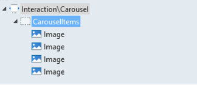
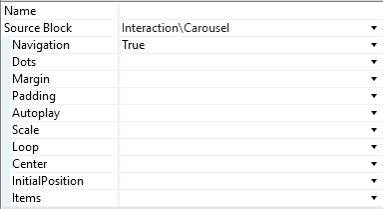
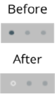

# Carousel Pattern

The Carousel Pattern
enables you to display multiple items in a horizontal slide. Elements inside
the placeholder will be split into different items. For dynamic content, use a
List directly inside the placeholder. The Carousel block is ideal to create
horizontal slides in smaller screens.

Here's the preview in Service Studio:

## How to Use the Carousel Pattern

Drag the elements into the placeholder to split them into different items. For
dynamic content, use a List directly inside the placeholder, disable
virtualization and set the **Animated** items to _False_ . The List Items will
be Carousel Items, by default.

1\. Drag the Carousel Pattern into your screen.

2\. Place your content into the **CarouselItems** placeholder. To use a List,
drag it into **CarouseItems** placeholder (disable virtualization and set
**Animated items** to _False_ ).

3\. All available options have default parameters, but you can change them.

4\. Publish your app.

### Customizing the Dots

You can use CSS to customize the look and feel of the dots.

**Example 1:**

    
    
    .carousel .carousel-dots-container .carousel-dot.active {
         opacity: 1;
        width: 16px;
        height: 2px;
        margin-top: 2px;
        transition: opacity 275ms ease-out;
    }
    
    
    .carousel .carousel-dots-container .carousel-dot {
        border-radius: 0;
        height: 1px;
        margin: 3px 3px;
        width: 8px;
        transition: opacity 275ms ease-out;
    }

**Example 2:**

    
    
    .carousel-dots-container .carousel-dot {
         background: #fff;
        border: 0px solid #fff;
        height: 4px;
        margin: 3px;
        opacity: .5;
        width: 4px;
    }
    
    
    .carousel-dots-container .carousel-dot.active {
        background: transparent;
        border: 1px solid #fff;
        opacity: 1;
    }

### Using the Carousel Inside Columns

If you want to use a Carousel inside any [Columns pattern](<columns.md>) , you must fix the columns’ overflow, by adding this style
to the CSS:

    
    
    .col {
        overflow: hidden;
    }
    

### Getting the CurrentPosition of a Carousel Item

  1. Create an **Integer** local variable (ex: Position) on the screen. 
  2. In the **OnItemChange** event of the block, create a new client action for the handler (CarouselCurrentPosition).   
a. The action receives a variable **Index** , which is the event that
indicates the current position in the Carousel.

  3. Drag an **Assign** node and set the Position (your local variable) to Index. 

### Creating an Onboarding with the Carousel Pattern

A typical onboarding screen has a Carousel that takes the full height of the
screen, slides for a couple of items and then displays a button to start using
the app on the last slide. Follow the steps below to create your own
onboarding screen using the Carousel.

#### Creating a Carousel that Occupies the Screen Height

1\. Start with a new Screen using a Blank Layout (Common\LayoutBlank).

2\. Drag the **Carousel** pattern into the **Content** placeholder
(Interaction\Carousel).

3\. Add content to the Carousel, either static or dynamic items, from a List.  
**Note: If you use a List Widget, you need to disable virtualization.**

Here's what it would look like:

** **

#### Displaying a Button when Viewing the Last Carousel Item

1\. Create a **boolean** local variable on the screen called **ShowButton**.

2\. Create an action called **OnChange** and add it to the **OnItemChange**
handler of the Carousel.

3\. In this action, we will verify if the current position is equal to the
total number of elements in the OnBoarding’s Carousel.

4\. The logic is: if **“Index = 2”** the local variable is assigned to _True_
, otherwise it is assigned to _False_ .

2\. The variable **showButton** shows the button to the user.

3\. Drag the **FloatingContent** pattern (Content\FloatingContent) into the
screen.

7\. Add a **Container** and in the **Visible** parameter, set the local
variable **showButton**.  
a. Drag the “ **Animate** ” block into the container, and set the **Animation
Type**.  
b. Add a button into the Content placeholder.  
  
8\. Publish your app.

### Creating a Carousel with Buttons to Navigate

This pattern includes [public actions](<public-actions.md>) that you can use without having to use the Carousel's own
navigation (Next, Previous or GoTo). In this use case, we will only use
buttons to navigate in the Carousel:

1\. Create an action and drag either one of the public actions Next, Previous
or GoTo.

2\. Create a button to associate the **onClick** event with the created
action.

3\. See the image below with all possible actions.

### Creating a ListRemove in Carousel

This pattern includes the **UpdateCarousel** [public actions](<public-actions.md>) to update all variables and positions in the Pattern:

1\. Create an action and drag the **ListRemove** and **CarouselUpdate**
actions.

2\. Create a **ListRemoveOnClick** button and associate the created action.

3\. See the example in the image below.

## Input Parameters

Input Name |  Description |  Default Value  
---|---|--- 
   Navigation  |  Enable or disable buttons to navigate left and right.  |  _False_
   Dots  |  Enable or disable dots to represent items on the Carousel, which can be tapped to navigate directly to a given item.  | _True_
   Margin  |  Set the distance between each Carousel item.  |  0 
   Padding  |  Set the distance between the screen edges and the visible items on the screen.  |  0
   AutoPlay  |  Enable or disable the autoplay velocity. |  Disabled
   Scale  |  Use the scale option for each carousel item.  |  _False_
   Loop  |  Enable or disable continuous slide of the Carousel even after it reaches the end.  |  _False_
   Center  |  Display the active item centered horizontally.  |  _False_
   InitialPosition  |  Set the first element to show.  | 0
   Items  |  Number of visible Carousel items at the same time on the screen.  |  1
  
## Events

**Event Name** |  **Description** |  **Mandatory**  
---|---|---  
 OnItemChange  |  Returns the active item's current position.  |  False  
  
## Layout and Classes

## CSS Selectors

**Element** |  **CSS Class** |  **Description**  
---|---|---  
 Carousel Wrapper  |  .carousel  |  Container that wraps all Carousel elements.  
 Navigation Dots  |  .carousel-dot  |  All dots that represent the number of Carousel items.  
 Selected Navigation Dot  |  .carousel-dot.active  |  The dot that represents the currently active item.  
  
## Compatibility with Other Patterns

Avoid using the Carousel inside patterns with swipe events, like Tabs Stacked Cards.

## Samples

See how the [Product Dashboard sample](https://silkui.outsystems.com/Samples_Mobile.aspx#Mobile_Content-Samples_ProductDashboard) uses the Carousel pattern:

