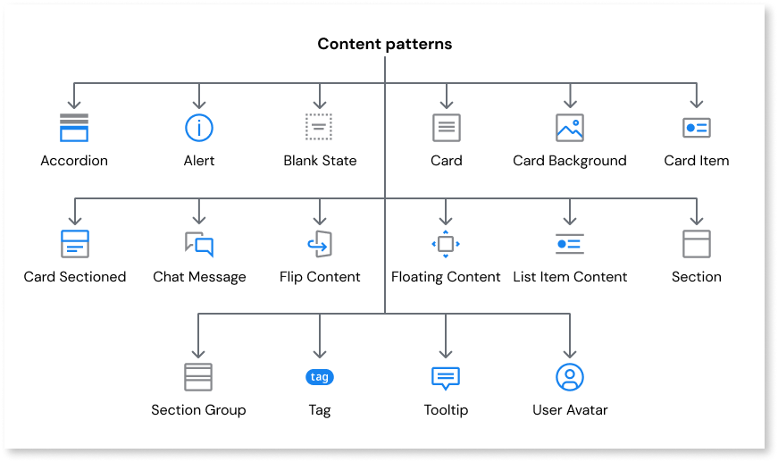

# Content

Applies to Mobile Apps and Reactive Web Apps only

Content patterns allow you to highlight and display important information to users in different ways, such as warnings, errors, tooltips, notifications and chat screens. Content patterns also allow you to organize information into sections and lists, making the on-screen content more easily readable for users.

 The available content patterns include the following:
 
* [Accordion](accordion.md)
* [Alert](alert.md)
* [Blank Slate](blankslate.md)
* [Card](card.md)
* [Card Background](cardbackground.md)
* [Card Item](carditem.md)
* [Card Sectioned](cardsectioned.md)
* [Chat Message](chatmessage.md)
* [Flip Content](flipcontent.md)
* [Floating Content](floatingcontent.md)
* [List Item Content](listitemcontent.md)
* [Section](section.md)
* [Section Group](sectiongroup.md)
* [Tag](tag.md)
* [Tooltip](tooltip.md)
* [User Avatar](useravatar.md)

