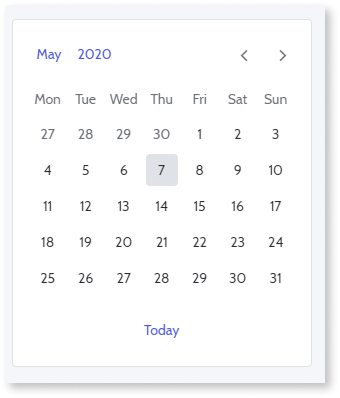

# Date Picker Pattern

You can use the Date Picker UI Pattern to allow the user to select a single or a range of dates using a calendar.

 
<!-- The Date Picker pattern provides you with a date and time picker with a flat UI to display inline on the screen. It can receive lists of dates with events and it enables you have a selection within a range of days. The Date Picker was created using the [Pikaday.js
library](https://github.com/dbushell/Pikaday/blob/master/README.md "https://github.com/dbushell/Pikaday/blob/master/README.md").

You can use this pattern to display a list of elements side by side, with a different number of items per row on different devices.-->

## How to Use the Date Picker UI Pattern

<!--Use static data or a **List** widget inside this block to display items in a gallery pattern.-->

1. In Service Studio, in the Toolbox, search for `Date Picker`.

    The Date Picker Image widget is displayed.

    

1. From the Toolbox, drag the Date Picker widget into the Main Content area of your application's screen.

    
    
    On the **Properties** tab, you are prompted to create an event.
    
    
      
1. To have access to the picked date, you need to create an assign to the
**startDate** (if SelectInterval is False ).

    

1. Set the default value of the variable **PickedDate** as CurrDateTime().

    

**Result**

### Listing Events of a Selected Day

1. Set the area where you want to put the list of events.

    

1. Create an entity with a **DateTime** attribute.

1. Set the entity in your **EventList** parameter on eventList, using the
right attribute to map.

      

1. Add the list to the page.

      

1. Create a Local Variable.

      

1. Get another Aggregate for the Events and set a filter on the aggregate:  
DateTimeToDate(Events.DateTime) = Date

    

**Result**

 

## Properties

| **Properties** |  **Description** |
|---|---|
| InputWidgetId (Text): Mandatory  | Input element Id that triggers the element so it is visible.  |
| ButtonWidgetId (Text): Optional  |  Element name (example: button) that  triggers the element so it is visible. | 
| EventList (Date Time List): Optional  |  Receives a List of DateTime records that are used to highlight days as event days. |  
| MinDate (Date Time): Optional  |  Days before this date will be disabled. |  
| MaxDate (Date Time): Optional  |  Days after this date will be disabled.  |   
| InitialDate (Date Time): Optional |  The initially selected day for the Date Picker. If not set, it will be the current day by default.  | 
| ShowWeekNumbers (Boolean): Optional  | If True, the week number is displayed on the left side of the Date Picker. If False, the week number is not dispalyed. This is the default. |  
| FirstWeekDay (Integer): Optional  |  Defines which weekday is displayed first.
<ul><li>0: Sunday</li> <li>1: Monday (default)</li><li>2: Tuesday</li> <li>3: Wednesday</li><li>4: Thursday</li><li>5: Friday</li><li>6: Saturday</li></ul>
 | 
| ShowTime (Boolean): Optional  | If True, a time picker is displayed below the Date Picker. If False, there is no time picker displayed. This is the default. |   
| Show24HourFormat (boolean) | If True, the time picker is displayed in a 24-hour format. This is the default. If False, the time picker is displayed in a 12-hour format. |  
| DisabledDaysList (Date Time List): Optional  |  Receives a List of DateTime records that will be disabled on the DatePicker. If this parameter is not set, all days between the MinDate and MaxDate are enabled. No default value.  |  
| DisabledWeekDays (Text): Optional  |  String containing disabled weekdays.
<ul><li>0: Sunday </li><li>1: Monday </li><li>2: Tuesday </li><li>3: Wednesday </li><li>4: Thursday</li><li> 5: Friday </li><li>6: Saturday </li></ul>

Example<ul><li>_Blank_ - All weekdays are active. </li><li>_"0,5"_ - Sunday and Friday are disabled.</li></ul>
 | 
| SelectInterval (Boolean): Optional |  Allows the selection between two dates. If True, the Block Event "On Select" has the values for both parameters.  |   
| StartEmpty (Boolean): Optional |  Defines whether the input for the Date Picker starts as empty.   | 
| DateFormat (Text): Optional| Defaults to the date format defined in the server configuration. The default is the server date format. 
Examples<ul><li>DD/MM/YYYY - 15/05/2020 </li> <li>MM/DD/YYYY - 05/15/2020</li><li>DD MMM YYYY - 15 May 2020</li></ul>
 |
|ShowTodayButton (Boolean): Optional | If True, the Today button is displayed. If False, the Today Button is not displayed. This is the default. |
|AdvancedFormat (Text): Optional | Allows fors more options beyond what is provided through the inputs. |
