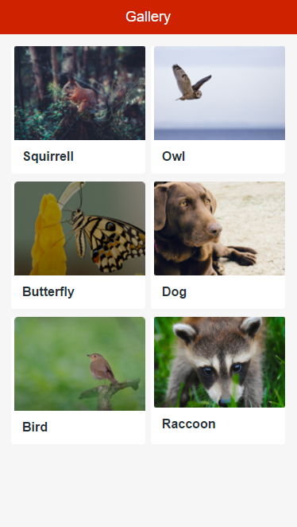

# Gallery 

You can use the Gallery UI Pattern to display content (such as cards) in a specific set of columns, configurable per device type and orientation. 

## How to use the Gallery UI Pattern

1. In Service Studio, in the Toolbox, search for `Gallery`. 

    The Gallery widget is displayed.

    

1. From the Toolbox, drag the Gallery widget onto your application’s screen.

1.  Drag a list or static content into the Content placeholder.

1. On the **Properties** tab, set the number of items.

After following these steps and publishing the module, you can test the pattern in your app.

## Properties

**Property** |  **Description** |  **Default Value**  
---|---|---  
 ColumnsInPhonePortrait  |  Number of columns in a Portrait phone.  |  1  
 ColumnsInPhoneLandscape  |  Number of columns in a Landscape phone.  |  2  
 ColumnsInTabletPortrait  |  Number of columns in a portrait tablet.  |  3  
 ColumnsInTabletLandscape  |  Number of columns in a Landscape tablet.  |  4  
 UseGutter  |  If set, add a gutter to all the columns except the first.  |  _True_  
  

## Samples

The following sample uses the Gallery pattern:

## See also

* OutSystems UI Live Style Guide: [Gallery](https://outsystemsui.outsystems.com/WebStyleGuidePreview/Gallery.aspx)

