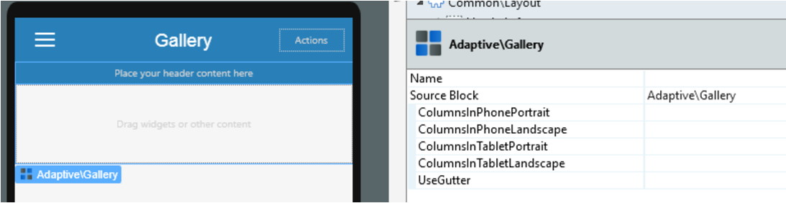
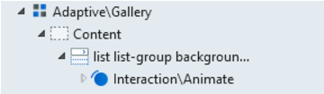

# Gallery

The Gallery pattern
displays content (such as cards) in a specific set of columns, configurable
per device type and orientation. Use this pattern to display a List of
elements side by side, with a different number of items per row on different
devices.

Here's a preview in Service Studio:

## How to Use the Gallery Pattern

1\. Drag a list or static content.

2\. Set the number of items in Input Parameters.

### Using Animations Inside the Gallery

1\. Use the **Animate** block as the first element inside the list.

2\. Place your content inside the b block.

3\. Define the **Animate** block with your desired type of animation, and set
the delay with current row number from the list.

**Note**: If you are using a List inside a Gallery, you need to disable
virtualization.

## Input Parameters

**Input Name** |  **Description** |  **Default Value**  
---|---|---  
 ColumnsInPhonePortrait  |  Number of columns in a Portrait phone.  |  1  
 ColumnsInPhoneLandscape  |  Number of columns in a Landscape phone.  |  2  
 ColumnsInTabletPortrait  |  Number of columns in a portrait tablet.  |  3  
 ColumnsInTabletLandscape  |  Number of columns in a Landscape tablet.  |  4  
 UseGutter  |  If set, add a gutter to all the columns except the first.  |  _True_  
  
## Layout and Classes

## Samples

The following sample uses the Gallery pattern:

