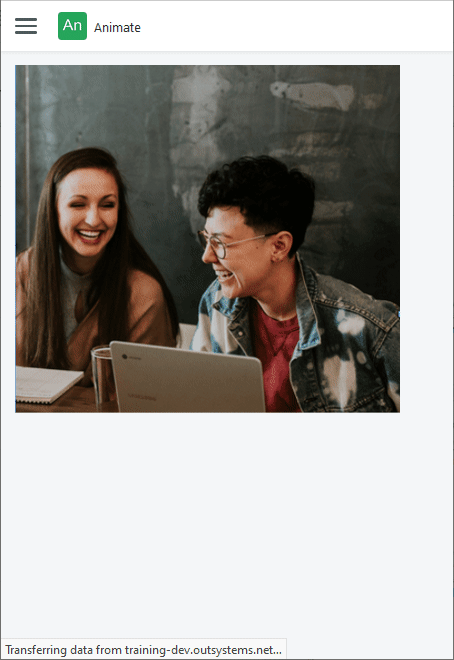

# Animate

You can use the Animate UI Pattern to create animations within your app. This UI pattern allows you to emphasize elements as they appear on screen which enhances the overall usability of the app.

**How to use the Animate UI Pattern**

1. In Service Studio, in the Toolbox, search for `Animate`.

    The Animate widget is displayed.

    

    If the UI widget doesn't display, it's because the dependency isn't added. For example, if you are using a ready-made app, it deletes unused widgets from the module. Make the widget available in your app:

    1. In the Toolbox, click **Search in other modules**.
    
    1. In **Search in other Modules**, select the widget you want to add from the **OutSystemsUI** module, and click **Add Dependency**. 
    
    1. In the Toolbox, search for the widget again.

1. From the Toolbox, drag the Animate widget into the Main Content area of your application's screen.

    

    By default, the Animate widget contains a Content placeholder.

1. Add the content you want to animate to the Content placeholder.

    In this example, we add an image by dragging the Image widget into the Content placeholder, and on the **Properties** tab, from the **Image** dropdown, selecting image from the sample OutSystems UI images.

    

1. Select the Animate widget, and on the **Properties** tab, set the relevant properties, for example, where you want the animation to enter the screen and at what speed.

    

After following these steps and publishing the module, you can test the pattern in your app.

## Properties

| Property | Description |
|---|---|
| AnimationType (AnimationType Identifier): Mandatory | Set how the animation enters the screen. 
The following are the available options: <ul><li>BottomToTop</li> <li>Bounce</li><li>FadeIn</li><li>LeftToRight</li><li>RightToLeft</li><li>Scale</li><li>ScaleDown</li><li>Spinner</li><li>TopToBottom</li></ul>
 
Examples <ul><li>_Entities.AnimationType.BottomToTop_ - Enters from the bottom of the screen to the top of the screen.</li><li>_Entities.AnimationType.Bounce_ - Bounces onto the screen.</li></ul>
 |
| Delay (Integer): Optional | Time to wait before animation starts (in milliseconds). The default value is 0. | 
| Speed (Speed Identifier): Optional | Animation duration. Fast, normal, and slow are the predefined speeds available for the animation. |
| ExtendedClass (Text): Optional | Adds custom style classes to the Pattern. You define your [custom style classes](../../../look-feel/css.md) in your application using CSS. 
Examples <ul><li>_Blank_ - No custom styles are added (default value).</li><li>_"myclass"_ - Adds the myclass style to the UI styles being applied.</li><li>_"myclass1 myclass2"_ - Adds the _myclass1_ and _myclass2_ styles to the UI styles being applied.</li></ul>
You can also use the classes available on the OutSystems UI. For more information, see the [OutSystems UI Live Style Guide](https://outsystemsui.outsystems.com/StyleGuidePreview/Styles). |
