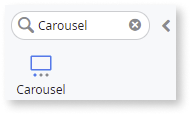
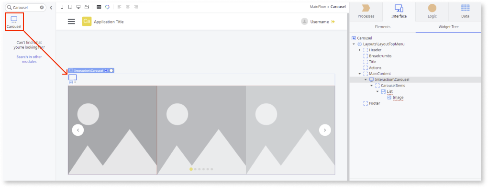
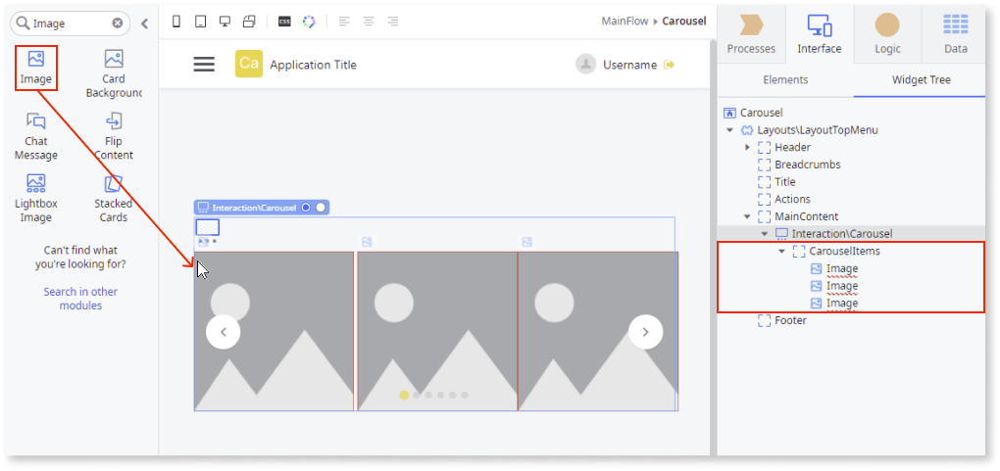
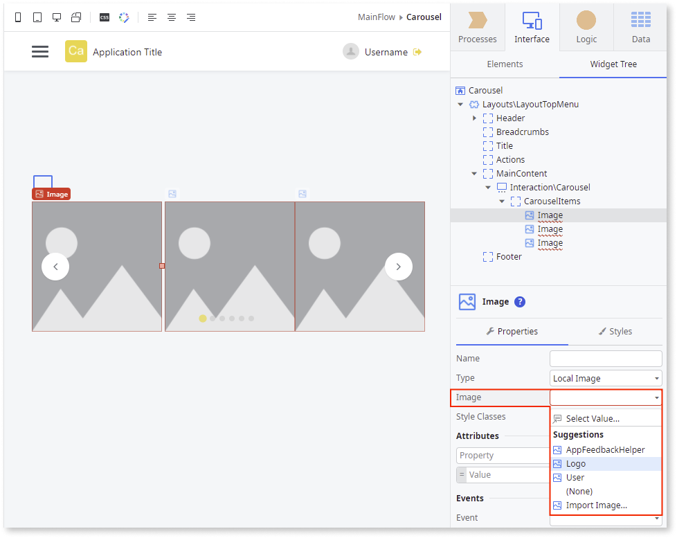
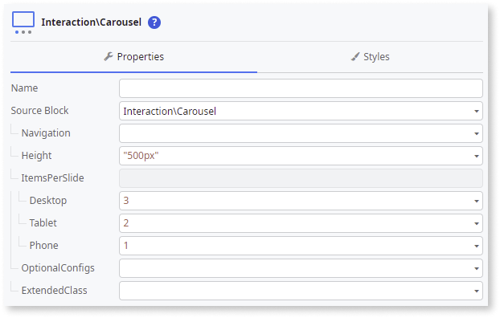

# Carousel

Applies to Mobile Apps and Reactive Web Apps only

**This component is deprecated for versions of OutSystems UI lower than 2.8.3.** For more information on how to migrate old versions, see the [Patterns and Versions Overview](https://outsystemsui.outsystems.com/OutsystemsUiWebsite/MigrationOverview).

To find out what version of OutSystems UI you are using, see [OutSystems UI version](../../intro.md#outsystems-ui-version).

You can use the Carousel UI Pattern to display multiple items in a horizontal slide.  The Carousel Pattern optimizes screen space by displaying only a few images from a larger collection which you can view using the navigation controls. 

The Carousel Pattern is based on the Splide.js library (v3). For more information about the Carousel’s behaviors and extensibility methods, see [Splide.js](https://splidejs.com/).  

## How to use the Carousel UI Pattern

1. In Service Studio, in the Toolbox, search for `Carousel`.
  
     The Carousel widget is displayed.

    

    If the UI widget doesn't display, it's because the dependency isn't added. This happens because the Remove unused references setting is enabled. To make the widget available in your app:

    1. In the Toolbox, click **Search in other modules**.

    1. In **Search in other Modules**, remove any spaces between words in your search text.
    
    1. Select the widget you want to add from the **OutSystemsUI** module, and click **Add Dependency**. 
    
    1. In the Toolbox, search for the widget again.

1. From the Toolbox, drag the Carousel widget into the Main Content area of your application's screen. 

    

    By default, the Carousel pattern contains a **CarouselItems** placeholder with a **List** widget and **Image** widget. If you want a Carousel with static images, you can remove the **List** widget and add your images inside the **CarouselItems** placeholder.

1. Add your content to the **Carousel Items** placeholder. 

    In this example, the List is deleted and 3 Image widgets are added.  

     

1. Select the **Image** widget, and on the **Properties** tab, from the **Image** drop-down, select or import the image you want in the Carousel. 

    **Note:** In this example, the image Type is set to Local image. You can also add External and Binary Data images. In this example, the image property Type is set to **Local** image. You can also add [External and Binary Data](../../../image/display-image.md) images.   

       

1. Repeat step 4 for each of the images in the Carousel. 

1. You can configure the Carousel by selecting the pattern, and on the **Properties** tab, set the relevant (optional) properties, for example, **Navigation** or **ItemsPerSlide**.For more configurations, expand the **OptionalConfigs** property.

      

After following these steps and publishing the module, you can test the pattern in your app.

## Properties

| **Property**|**Description**|
|---|---|
|Navigation (CarouselNavigation Identifier): Optional | Defines the type of navigation for the carousel. The available options are:<ul><li>Dots</li><li>Arrows</li><li>Both (dots and arrows)</li><li>None</li></ul> |
|Height (Text): Optional| Defines a custom height for the carousel. The parameter accepts any CSS format, except percentage (library constraint). The default value is 'auto'. This means that the height is adapted to the same height as the parent element in the DOM.|
|ItemsPerSlide (CarouselItems): Optional|Defines the number of items shown per slide according to the device. <ul><li>Desktop (Integer): Defines the number of items that are shown simultaneously on a desktop. By default, 1 item is displayed.</li><li>Tablet (Integer): Defines the number of items that are shown simultaneously on a tablet. By default, 1 item is displayed.</li><li>Phone (Integer): Defines the number of items that are shown simultaneously on a phone. By default, 1 item is displayed.</li></ul> |
|OptionalConfigs (CarouselOptionalConfigs): Optional| Defines additional parameters to customize the Carousel behavior and functionality.|
|OptionalConfigs.AutoPlay (Boolean): Optional| If set to True, the Carousel changes slides automatically. This is the default value. |
|OptionalConfigs.Loop (Boolean): Optional|Enables the continuous slide of the Carousel even after it reaches the end.|
|OptionalConfigs.Padding (Text): Optional|Defines the distance between the Carousel edges and the visible items on each slide. Accepts any css size unit (such as px, vw, %) or even css variables. Example: "100px" |
|OptionalConfigs.ItemsGap (Text): Optional| Defines the distance between each Carousel item. Accepts any css size unit (such as px, vw, %) or even css variables. Example: "var(--space-base)".|
|OptionalConfigs.StartingPosition (Integer): Optional| Defines the first element to show in the Carousel.|
|ExtendedClass (Text): Optional| Adds custom style classes to the Pattern. You define your [custom style classes](../../../../../develop/ui/look-feel/css.md) in your application using CSS.  Examples <ul><li>Blank - No custom styles are added (default value).</li><li>"myclass" - Adds the ``myclass`` style to the UI styles being applied.</li><li>"myclass1 myclass2" - Adds the ``myclass1`` and ``myclass2`` styles to the UI styles being applied.</li></ul> You can also use the classes available on the OutSystems UI. For more information, see the [OutSystems UI Cheat Sheet](https://outsystemsui.outsystems.com/OutSystemsUIWebsite/CheatSheet). |

## Events

### Carousel

|Event| Description  | 
|---|---|
|Initialized: Optional | Event triggered after the Carousel is initialized. | 
|OnSlideMoved: Optional | Event triggered after the Carousel slides move.  | 

## Compatibility with other patterns

Avoid using the Carousel inside patterns with swipe events, such as the Tabs and Stacked Cards Patterns.
