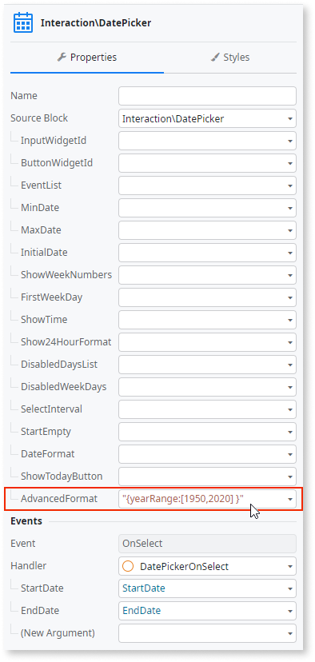

# Date Picker advanced use cases

This article guides you on how to implement more advanced use cases for the Date Picker UI Pattern.

## Hide keyboard on Mobile devices

When using the Date Picker bound to an input, one of the main issues for the user experience is the native keyboard opening when the input is clicked. To prevent this, add the **readonly="true"** attribute to the input.


This way, the keyboard won’t open but the Date Picker opens as a popover. Furthermore, on iOS, to prevent the browser zoom when selecting a month or year, add the following CSS to your theme:

    .ios .pika-label {
        font-size: var(--font-size-base);
    }

This issue is due to an iOS default of zooming in when an input’s font-size is smaller than 16px. 

## Create custom strings on the input

The Date Picker code automatically sets the input value. This ensures that the correct date format is always set. However, this makes it difficult to create custom strings.

To create a custom string, you can set the **disableInputOverride** option to True, using the **AdvancedFormat** property. The following is an example using the **SelectInterval** property.

1. Enter **"{disableInputOverride:true}"** in the **AdvancedFormat** property.

    

1. On the **OnSelect** event, assign the input’s variable to the desired value.

    

**Result**


<div class="info" markdown="1">

When using the **disableInputOverride** as True with a custom Date Format, you must set the data format yourself for the **OnSelect** event using the Data [Conversion functions](https://success.outsystems.com/Documentation/11/Reference/OutSystems_Language/Logic/Built-in_Functions/Data_Conversion). Otherwise, it will change to the default server format when selecting a date.

</div>

## Create a button to clear the input date

To clear the date on both the Date Picker and the bound input, using the library clear() method, follow these steps:

1. Drag a **Button** widget to the screen and create a new client action called **ClearDateOnClick**.

    

1. On the action flow, drag the client action **DatePickerClearInputDate** and set the **InputId** property to the Id of the input bound to the Date Picker.

    

**Result**


## Customize the available years in the year selection drop-down

You can customize the year range available in the Date Picker year dropdown using one of the following syntaxes:

* `{ yearRange: <number> }` – The year dropdown displays a range of years between `<number>` years back and `<number>` years forward, counting from the currently selected year. For example:

        { yearRange: 20 }

* `{ yearRange: [<start_year>, <end_year>] }` – Defines the exact year range available in the year drop-down. For example:

        { yearRange: [1950, 2020] }

* Enter this advanced configuration option in the **AdvancedFormat** property. Remember that you must enter a string value using double quotes. For example: 

    ```
    "{ yearRange: [1950, 2020] }"
    ```

    

    The Date Picker appears as follows:

    

    **Note:** If you already have some configuration settings in the **AdvancedFormat** property, you must merge any new option with the existing value. The resulting string content must be a valid JSON object.
