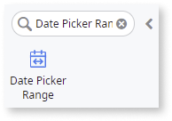
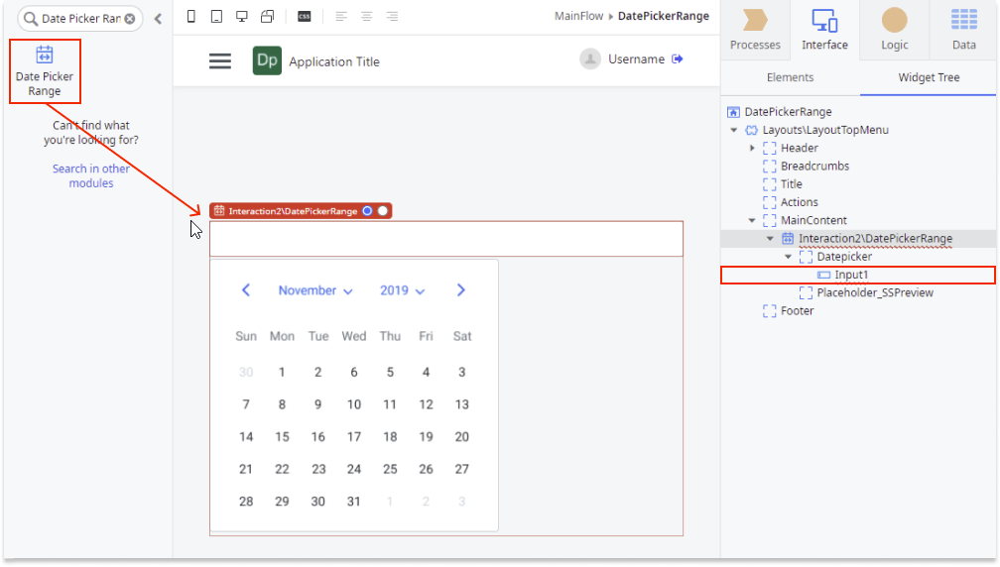
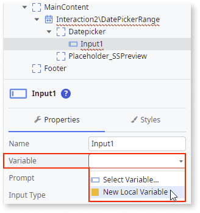
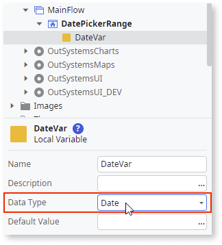
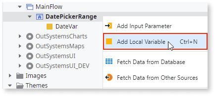
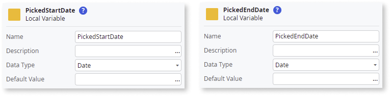
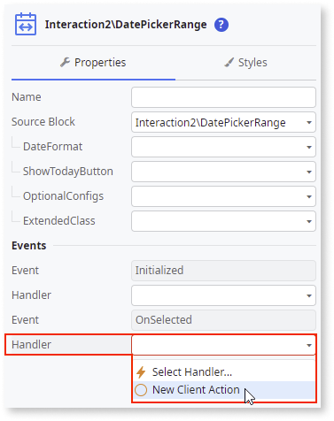
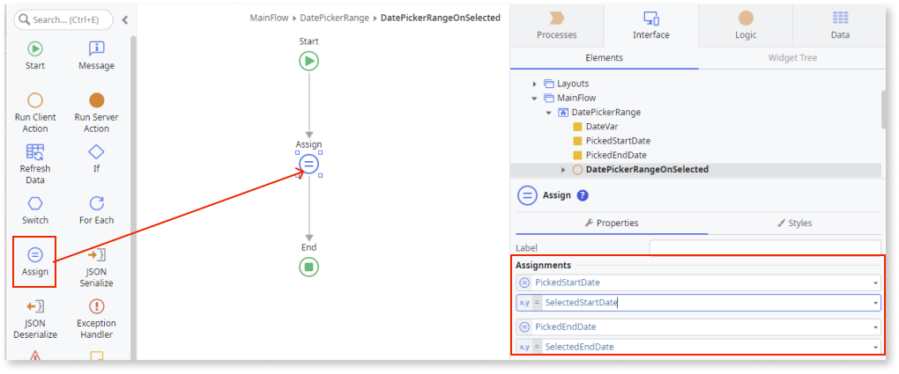
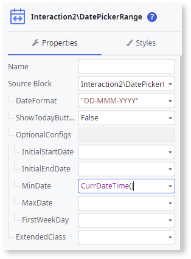
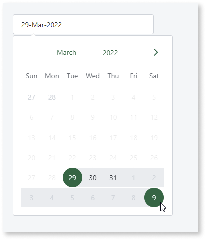

# Date Picker Range

Applies to Mobile Apps and Reactive Web Apps only

The Date Picker Range UI Pattern allows users select a range date using a calendar. The Date Picker Range Pattern is based on the [flatpickr library](https://flatpickr.js.org/). For more advanced options, you can refer to this library.

In this example, the user selects a range of dates from the calendar. The dates are saved in a variable and then displayed in an input widget.

1. In Service Studio, in the Toolbox, search for `Date Picker Range`.

    The Date Picker Range widget is displayed.

    

    If the UI widget doesn't display, it's because the dependency isn't added. This happens because the Remove unused references setting is enabled. To make the widget available in your app:

    1. In the Toolbox, click **Search in other modules**.

    1. In **Search in other Modules**, remove any spaces between words in your search text.
    
    1. Select the widget you want to add from the **OutSystemsUI** module and click **Add Dependency**. 

    1. In the Toolbox, search for the widget again.

1. From the Toolbox, drag the Date Picker Range widget into the Main Content area of your application's screen.

    By default, the Date Picker Range contains an **Input** widget (type Text).

    

1. Create a variable by selecting the **Input** widget, and on the **Properties** tab, select **New Local Variable** from the **Variable** dropdown.

    This variable stores any value entered into or received by the Input widget.

    

1. Enter a name for the variable (in this example **DateVar**) and select **Date** as the **Data Type**.

    

1. Right-click your main screen and add 2 local variables (one to store the start date and one to store the end date selected by the user).

    This variable stores the date selected by the user.

    

1. Enter a name for the variables (in this example **PickedStartDate** and **PickedEndDate**) and select **Date** as the **Data Type**.

    
   

1. To create an **OnSelect** event for the Date Picker Range, on the **Properties** tab, from the **Handler** dropdown, select New **Client Action**.

    

1. To access the date range selected by the user, create an **Assign** and set the **PickedStartDate** to **SelectedStartDate** and **PickedEndDate** to **SelectedEndDate**.

    

1. You can configure the Date Picker Range by selecting the pattern, and on the **Properties** tab, set the relevant optional properties. For more configurations, expand the **OptionalConfigs** property.

    

After following these steps and publishing the module, you can test the pattern in your app.

**Result**

## Properties

| Properties|Description|
|---|---|
| DateFormat (Text): Optional|Defines the input date format. If empty, the date format is the same as the server format. When using formats with time, make sure to set the **TimeFormat** property.  The following are some examples:<ul><li>"DD/MM/YYYY" - 15/05/2022 </li> <li>"MM/DD/YYYY" - 05/15/2022</li><li>"DD MMM YYYY" - 15 May 2022</li><li>"DD-MMM-YYYY" - 15-May-2022</li><li>"DD.MMM.YYYY" - 15.May.2022</li><li>"MMM DDD, YYYY" - May Sun, 2022</li><li>"MMM DDD, YY" - May Sun, 22</li></ul>  |
|ShowTodayButton (Boolean): Optional | If True, the **Today** button is displayed below the Date Picker Range.  This button allows users to pick the date of the current day. If False, the **Today** Button is not displayed. The default value is False.|
|OptionalConfigs (DatePickerRangeOptionalConfigs): Optional | Defines additional parameters to customize the Date Picker Range behavior and functionality.|
|OptionalConfigs.InitialStartDate (Date): Optional | Defines the initial selected start date for the Date Picker Range. If not set, no initial nor end date is selected.|
|OptionalConfigs.InitialEndDate (Date): Optional| Defines the initial selected end date for the Date Picker Range. If not set, no initial nor end date is selected. |
|OptionalConfigs.MinDate (DateTime): Optional | All days before this date are disabled.|
|OptionalConfigs.MaxDate (DateTime): Optional| All days before this date are disabled.|
|OptionalConfigs.FirstWeekDay (DatePickerWeekDay Identifier): Optional | Defines which weekday is displayed first.|
|OptionalConfigs.ShowWeekNumbers (Boolean): Optional| If True, the week numbers are displayed on the left side of the Date Picker Range.|
|ExtendedClass (Text): Optional| Adds custom style classes to the Pattern. You define your [custom style classes](../../../look-feel/css.md) in your application using CSS.   Examples:<ul><li>_Blank_ - No custom styles are added (default value).</li><li>"myclass" - Adds the ``myclass`` style to the UI styles being applied.</li><li>"myclass1 myclass2" - Adds the ``myclass1`` and ``myclass2`` styles to the UI styles being applied.</li></ul>You can also use the classes available on the OutSystems UI. For more information, see the [OutSystems UI Framework Cheat Sheet](https://outsystemsui.outsystems.com/OutsystemsUiWebsite/CheatSheet). |

## Events

|Event| Description  | 
|---|---|
|Initialized: Optional| Event triggered after the Date Picker Range instance is ready.| 
|OnSelected: Mandatory| Event triggered when a range of dates is selected.| 
