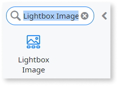
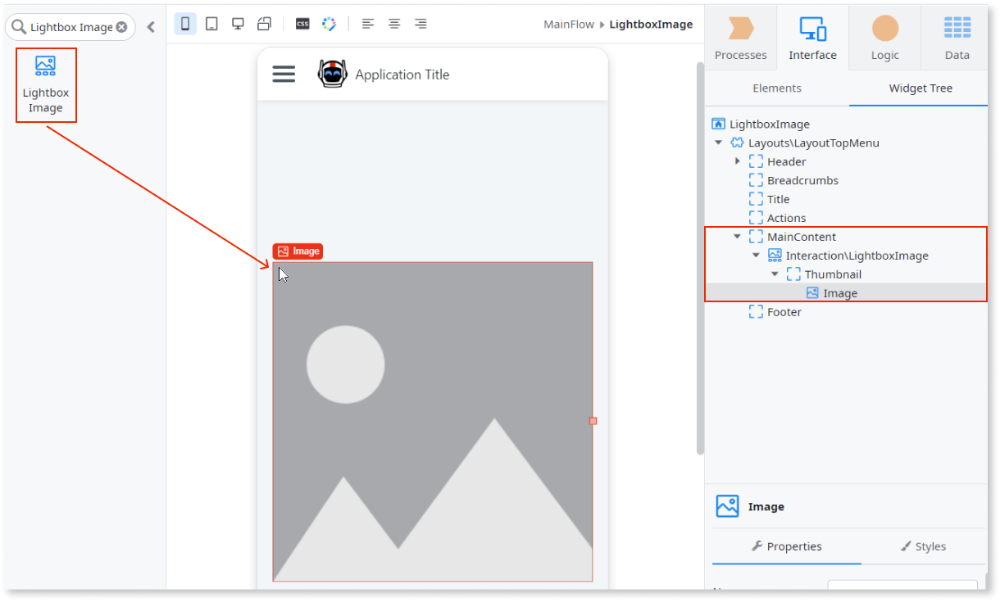
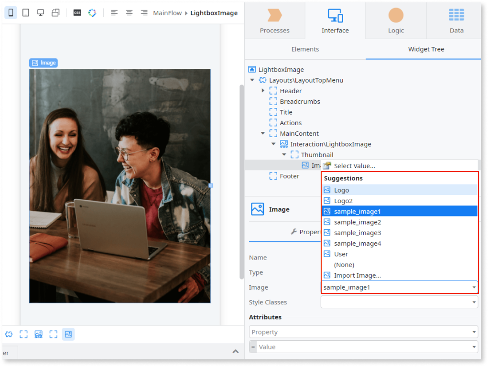

# Lightbox Image

You can use the Lightbox Image UI Pattern to open smaller thumbnail images in full screen mode. This UI pattern is often used when creating an image gallery, allowing you to navigate through each of the images and view them in more detail.

## How to Use the Lightbox Image UI Pattern

1. In Service Studio, in the Toolbox, search for `Lightbox Image`.

    The Lightbox Image widget is displayed.

    

    If the UI widget doesn't display, it's because the dependency isn't added. For example, if you are using a ready-made app, it deletes unused widgets from the module. Make the widget available in your app:

    1. In the Toolbox, click **Search in other modules**.
    
    1. In **Search in other Modules**, select the widget you want to add from the **OutSystemsUI** module, and click **Add Dependency**. 
    
    1. In the Toolbox, search for the widget again.

1. From the Toolbox, drag the Lightbox Image widget into the Main Content area of your application's screen.

      

      By default, the Lightbox Image widget contains an Image placeholder. You can add as many images as required by dragging the Image widget from the Toolbox into the Lightbox Image widget.

1. Select the **Image** placeholder and on the **Properties** tab, from the **Image** drop-down, select or import the thumbnail image you want to display. In this example, we use the sample OutSystems UI Images.
    
    

    Note: In this example, the image property is set to **Local Image**. You can also choose [External URL or Binary Data](../../../image/display-image.md).

1. Repeat step 3 for each of the images.

1. From the Widget Tree, select the Lightbox Image widget, and on the **Properties** tab, set the relevant (optional) properties.

## Properties

**Property** |  **Description** |  
---|---| 
Title (Text): Optional | Image title that is displayed when previewing the image in full screen mode.  Examples  <ul><li>_"Image 1"_ - Displays _Image 1_ as the image title.</li></ul> | 
Group (Text): Optional | Name of the group of images. Similar to the concept of a picture album, images in the same group are displayed in a gallery. You can navigate through pictures with the same group name when viewing them in full screen mode.  Examples  <ul><li>_Gallery 1_ - Adds this image to the _Gallery 1_ group.</li></ul> |  
ImageURL (Text): Optional | URL for the image you want to show in full screen mode. If empty, a zoomed version of the thumbnail is displayed. Use this if you want to load a lower quality image as a thumbnail and display a higher quality version in full screen mode. |  
ImageZoom (Decimal): Optional | Defines the size of the image that opens in full screen mode (based on the thumbnail size). To avoid rendering problems, try to use images with the same ratio.  Examples  <ul><li>_2_ - A thumbnail with 100x100, and zoom 2 opens with 200x200.</li><li>_0.5_ - A thumbnail with 500x500, and zoom 0.5 opens with 250x250.</li></ul> |  
ExtendedClass (Text): Optional | Adds custom style classes to the Pattern. You define your [custom style classes](../../../look-feel/css.md) in your application using CSS.  Examples  <ul><li>_Blank_ - No custom styles are added (default value). </li><li>_"myclass"_ - Adds the _myclass_ style to the UI styles being applied.</li><li>_"myclass1 myclass2"_ - Adds the _myclass1_ and _myclass2_ styles to the UI styles being applied.</li></ul>You can also use the classes available on the OutSystems UI. For more information, see the [OutSystems UI Live Style Guide](https://outsystemsui.outsystems.com/StyleGuidePreview/Styles). |

## Compatibility with other patterns

The Lightbox Image UI pattern can be used only with images.

## Samples

Watch how the [Product Overview sample](https://silkui.outsystems.com/Samples_Mobile.aspx#Mobile_Details-Samples_ProductOverview) uses the Lightbox Image UI Pattern:

