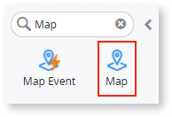
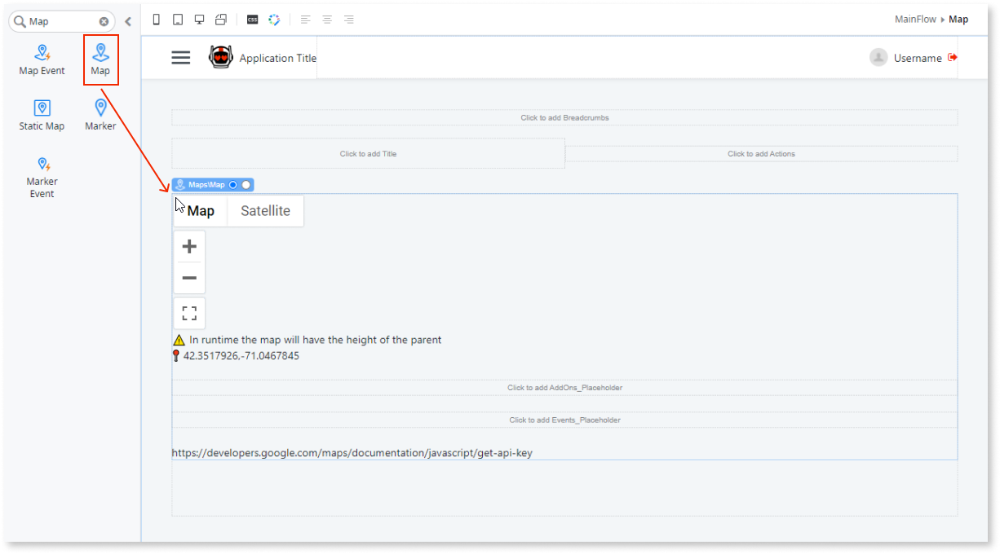
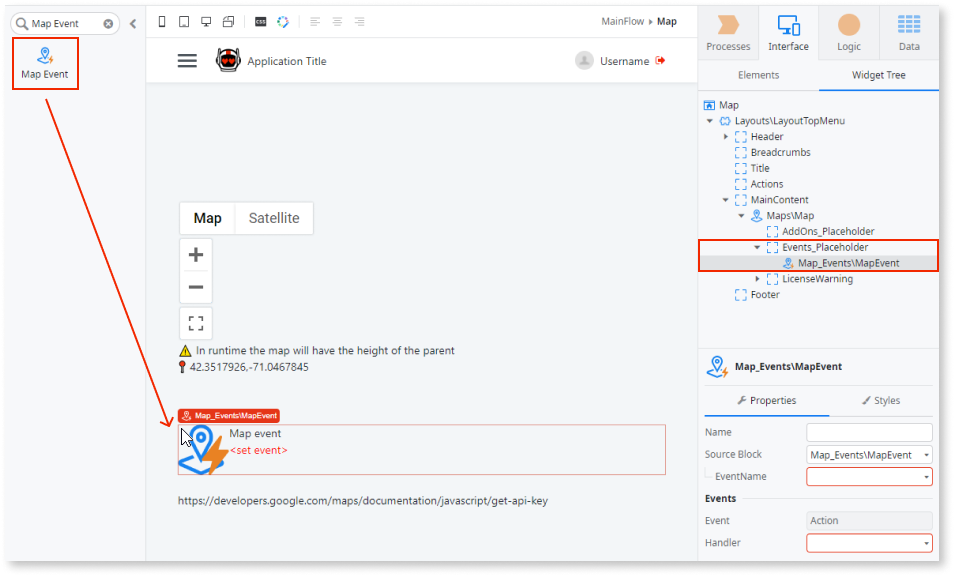
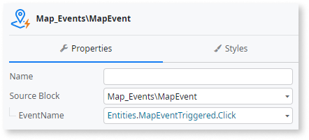
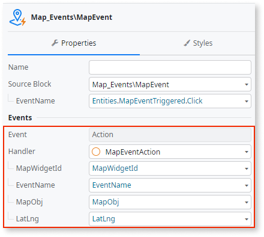
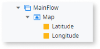
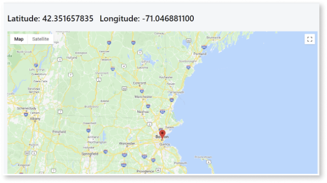

# How to add a marker on map click 

Applies to Mobile Apps and Reactive Web Apps only

**Prerequisites**

* Download and install the [OutSystems Map component](https://www.outsystems.com/forge/component-overview/9909/outsystems-maps) from Forge.

This example demonstrates how to get the coordinates of a location when the user clicks the map.

1. In Service Studio, in the Toolbox, search for `Map`.

    The Map widget is displayed.

    

    If the UI widget doesn't display, it's because the dependency isn't added. This happens because the Remove unused references setting is enabled. To make the widget available in your app:

    1. In the Toolbox, click **Search in other modules**.

    1. In **Search in other Modules**, remove any spaces between words in your search text.
    
    1. Select the widget you want to add from the **OutSystemsMaps** module, and click **Add Dependency**. 
    
    1. In the Toolbox, search for the widget again.

1. From the Toolbox, drag the Map widget into the Main Content area of your application's screen.

    

1. On the **Properties** tab, enter an API key so that the "For development purposes" watermark is removed. 

    

1. Drag the **Map Event** block inside the **Events_Placeholder**.

    

1. On the **Properties** tab, set the **EventName** property to **Click**. 

    This allows you to handle the event every time the user clicks the map.

    
        
1. Create a handler for the event.

    
    
1. Create two new local variables (Latitude and Longitude) to store the new coordinate values.

    

1. From the Toolbox, drag the Marker block onto the Drag markers here screen area.
    
    On the **Properties** tab, set the **Position** property to Latitude + "," + Longitude

1. Create a handler for the event and assign the new marker coordinates to the variables. 

    

After following these steps and publishing the module, you can test the component in your app.
   
**Result**

