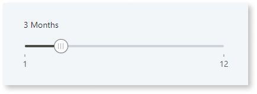
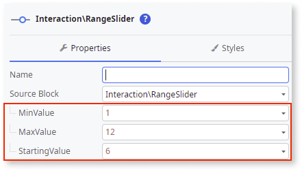
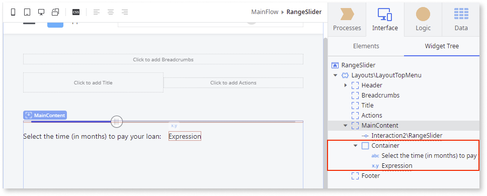
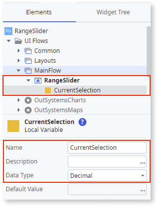
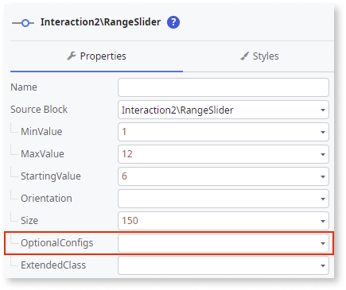

# Range Slider

Applies to Mobile Apps and Reactive Web Apps only

**This component is deprecated for versions of OutSystems UI lower than 2.8.1.** For more information on how to migrate old versions, see the [Patterns and Versions Overview](https://outsystemsui.outsystems.com/OutsystemsUiWebsite/MigrationOverview).

To find out what version of OutSystems UI you are using, see [OutSystems UI version](../../intro.md#outsystems-ui-version).

You can use the Range Slider UI Pattern to allow users select a single value between two range values. This pattern enables the adjustment of content within a predetermined range. Moving the slider along the track increases or decreases the value.  

The Range Slider Pattern is based on the [noUiSlider library](https://refreshless.com/nouislider/) (v15.5.1). For more information about the Range Slider’s behaviors and extensibility methods, see the provider’s documentation.

## How to use the Range Slider UI Pattern

In this example, we create a Range Slider that allows the user select the number of months it will take them to pay back a loan.

1. In Service Studio, in the Toolbox, search for `Range Slider`.

    The Range Slider widget is displayed.

    

    If the UI widget doesn't display, it's because the dependency isn't added. This happens because the Remove unused references setting is enabled. To make the widget available in your app:

    1. In the Toolbox, click **Search in other modules**.

    1. In **Search in other Modules**, remove any spaces between words in your search text.
    
    1. Select the widget you want to add from the **OutSystemsUI** module, and click **Add Dependency**. 
    
    1. In the Toolbox, search for the widget again.

1. From the Toolbox, drag the Range Slider widget into the Main Content area of your application's screen.

    

1. On the **Properties** tab, enter the mandatory minimum, maximum, and starting values. 
    
    In this example, we add static values.

    

1. To create an OnChange event, on the **Properties** tab, from the **Handler** drop-down, select **New Client Action**.

    

    By default, the **Value** input parameter is created.  

    

1. From the Toolbox, drag the **Container** widget into the Main Content area of your application's screen, and add your content to the Container placeholder.

    In this example we add some text and an expression.

    

1. To create a variable for the expression, right-click your screen name, select **Add Local Variable**, and on the **Properties** tab, enter a name and data type (in this example, we use **Decimal**).

    

1. To bind the new variable to the expression, double-click the expression widget, and in the **Expression Value** editor, select the variable you just have created, and click **Done**.

    

1. So that the **Value** parameter reads the range slider selection, double-click your client action, and from the Toolbox, add the **Assign** action to the client action. Set the Assign **Variable** to the local variable you created, and the Assign **Value** to the automatically generated input parameter (Value).

    

1.  You can configure the Range Slider by selecting the pattern, and on the **Properties** tab, set the relevant (optional) properties, for example, the size. For more configurations, expand the **OptionalConfigs** property.

    

After following these steps and publishing the module, you can test the pattern in your app.

## Properties

| Property| Description|
|---|---|
|MinValue (Decimal): Mandatory|Defines the slider's minimum value.|
|MaxValue (Decimal): Mandatory|Defines the slider's maximum value.|
|StartingValue (Decimal): Mandatory| Defines the value selected by default. Must be between min and max values. |
|Orientation (Orientation Identifier): Optional| Define the direction of the Range Slider. By default, the direction is horizontal.    |
|Size (Text): Optional| Defines the Range Slider size. If horizontal, the size is the width. Otherwise (vertical), the size is the height. Accepts any kind of unit (px, %, vw). By default, "100%". |
|OptionalConfigs (RangeSliderOptionalConfigs): Optional | Defines additional parameters to customize the Range Slider behavior and functionality.|
|OptionalConfigs.ShowFloatingLabel (Boolean): Optional | Set to True to add a floating label above the handler. The default value is False.|
|OptionalConfigs.Step (Decimal): Optional| Defines the sliders increment. The slider moves in increments of a step. If Step is 10, the slider will go from 0 to 10, to 20, to 30, etc. The default value is 1.|
|OptionalConfigs.ShowTickMarks (Boolean): Optional | If True, tick marks are displayed below the slider. If False, no tick marks are displayed. To generate the tick marks, you will must set the TickMarksInterval. The default value is True.|
|OptionalConfigs.TickMarksInterval (Integer): Optional | Defines the range interval after which a tick mark is drawn (when ShowTickMarks is enabled). Example: if TickMarksInterval = 5, a tick mark is shown for every 5 steps. The value can not be less than 0 (library restraint). If you do not want the tick marks to show, set the ShowTickMarks parameter to False.|
|OptionalConfigs.IsDisabled (Boolean): Optional| Set as True to disable the Range Slider. The default value is False.|
|ExtendedClass (Text): Optional| Adds custom style classes to the Pattern. You define your [custom style classes](../../../../../develop/ui/look-feel/css.md) in your application using CSS.  Examples <ul><li>Blank - No custom styles are added (default value).</li><li>"myclass" - Adds the ``myclass`` style to the UI styles being applied.</li><li>"myclass1 myclass2" - Adds the ``myclass1`` and ``myclass2`` styles to the UI styles being applied.</li></ul>You can also use the classes available on the OutSystems UI. For more information, see the [OutSystems UI Cheat Sheet](https://outsystemsui.outsystems.com/OutSystemsUIWebsite/CheatSheet). |

## Events

|Event| Description  | 
|---|---|
|Initialized: Optional | Event triggered after the RangerSlider instance is ready. With this event, you get the element ID that can be used to call methods from the RangeSliderAPI: ``OutSystems.OSUI.Patterns.RangeSliderAPI`` | 
|OnValueChange: Mandatory  | Event triggered after selecting a new value on the slider. By default, the event is triggered while the user is dragging the RangeSlider handler. You can use the SetRangeSliderChangeOnDragEnd to trigger the event only after the user releases it. | 
