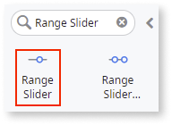
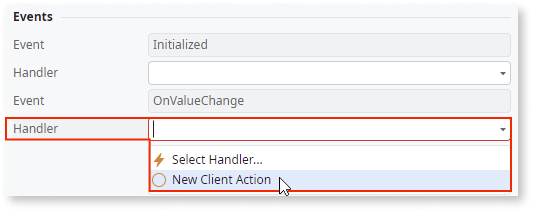
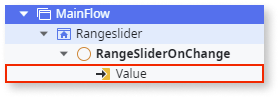
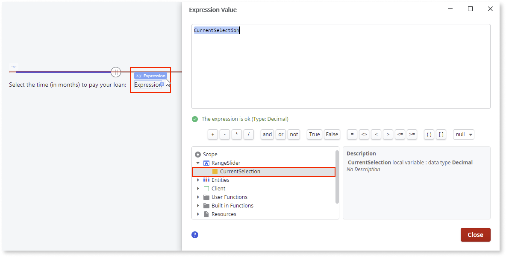

# Range Slider

If you are using an OutSystems UI version between 2.3.0 and 2.8.1, please see the [Patterns and Versions Overview](https://outsystemsui.outsystems.com/OutsystemsUiWebsite/MigrationOverview).
                            

You can use the Range Slider UI Pattern to allow users select a single value between two range values. This pattern enables the adjustment of content within a predetermined range. Moving the slider along the track increases or decreases the value.  

The Range Slider Pattern is based on the [noUiSlider library](https://refreshless.com/nouislider/) (v15.5.1). For more information about the Range Slider’s behaviors and extensibility methods, see the provider’s documentation.

## How to use the Range Slider UI Pattern

In this example, we create a Range Slider that allows the user select the number of months it will take them to pay back a loan.

1. In Service Studio, in the Toolbox, search for `Range Slider`.

    The Range Slider widget is displayed.

    

    If the UI widget does not display, it may be because you used a ready-made app, which deletes unused widgets from the module. To make additional widgets available in your app:

    a. Go to **Module > Manage dependencies**.

    b. Search for and select the relevant Producer, for example OutSystemsUI. Ensure **Show All** is selected. 

    c. On the Public elements for the selected Producer displayed on the right, ensure **Show All** is selected.
    
    d. Search for and select the element you want to add, and click **Apply**. 
    
    e. In Service Studio, in the Toolbox, search for the widget again.

1. From the Toolbox, drag the Range Slider widget into the Main Content area of your application's screen.

    

1. On the **Properties** tab, enter the mandatory minimum, maximum, and starting values. 
    
    In this example, we add static values.

    

1. To create an OnChange event, on the **Properties** tab, from the **Handler** drop-down, select **New Client Action**.

    

    By default, the **Value** input parameter is created.  

    

1. From the Toolbox, drag the **Container** widget into the Main Content area of your application's screen, and add your content to the Container placeholder.

    In this example we add some text and an expression.

    

1. To create a variable for the expression, right-click your screen name, select **Add Local Variable**, and on the **Properties** tab, enter a name and data type (in this example, we use **Decimal**).

    

1. To bind the new variable to the expression, double-click the expression widget, and in the **Expression Value** editor, select the variable you just have created, and click **Done**.

    

1. So that the **Value** parameter reads the range slider selection, double-click your client action, and from the Toolbox, add the **Assign** action to the client action. Set the Assign **Variable** to the local variable you created, and the Assign **Value** to the automatically generated input parameter (Value).

    

1.  You can configure the Range Slider by selecting the pattern, and on the **Properties** tab, set the relevant (optional) properties, for example, the size. For more configurations, expand the **OptionalConfigs** property.

    

After following these steps and publishing the module, you can test the pattern in your app.

## Properties

| Property | Description |
|---|---|
|MinValue (Decimal): Mandatory | Slider's minimum value. |
|MaxValue (Decimal): Mandatory | Slider's maximum value. |
|StartingValue (Decimal): Mandatory | Value selected by default when the page is rendered. Must be between min and max values. |
|Orientation (Orientation Identifier): Optional|Sets the Range Slider direction. Default value is horizontal.|
|Size (Text): Optional | Sets the Range Slider size. If horizontal, the size is the width. Otherwise (vertical), the size is the height.  Accepts any kind of unit (px, %, vw). Default value is 100%.|
| ExtendedClass (Text): Optional | Adds custom style classes to the Pattern. You define your [custom style classes](../../../../../develop/ui/look-feel/css.md) in your application using CSS. 
Examples <ul><li>Blank - No custom styles are added (default value).</li><li>``"myclass" ``- Adds the ``myclass`` style to the UI styles being applied.</li><li>``"myclass1 myclass2"`` - Adds the ``myclass1`` and ``myclass2`` styles to the UI styles being applied.</li></ul>
You can also use the classes available on the OutSystems UI. For more information, see the [OutSystems UI Cheat Sheet](https://outsystemsui.outsystems.com/OutSystemsUIWebsite/CheatSheet). |
|OptionalConfigs.ShowFloatingLabel (Boolean): Optional |Set to True to add a floating label above the handler. Default value is False. |
|OptionalConfigs.Step (Decimal): Optional |  Slider moves in increments of steps. If the step is set to 10, the slider increases or decreases in units of 10, for example, 0 to 10, to 20, to 30, and so on. |
|OptionalConfigs.ShowTickMarks (Boolean): Optional |  Set to True to display tick marks below the slider. Default value is False. To generate the tick marks, you must set the TickMarksInterval to True.|
|OptionalConfigs.TickMarksInterval (Integer): Optional | Range interval after which a tick mark is displayed (when ShowTickMarks is set to True). For example, if TickMarksInterval = 5, a tick mark is shown for each 5 steps. The value cannot be less than 0 (library restraint).|
|OptionalConfigs.IsDisabled (Boolean): Optional | Set as True to disable the Range Slider. Default value is False. |

