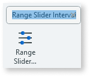
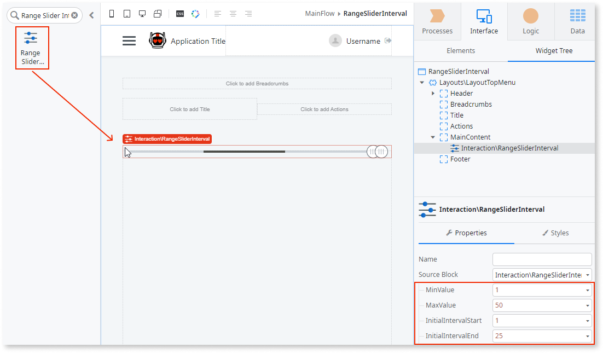
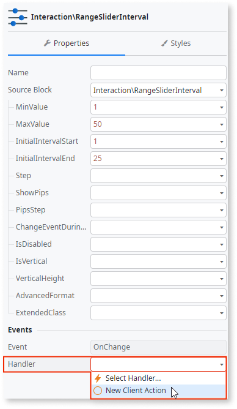
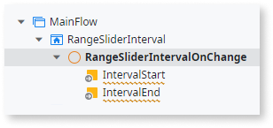
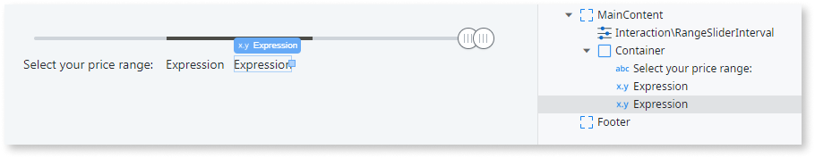
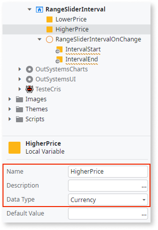
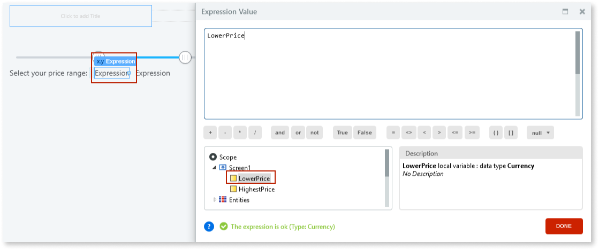
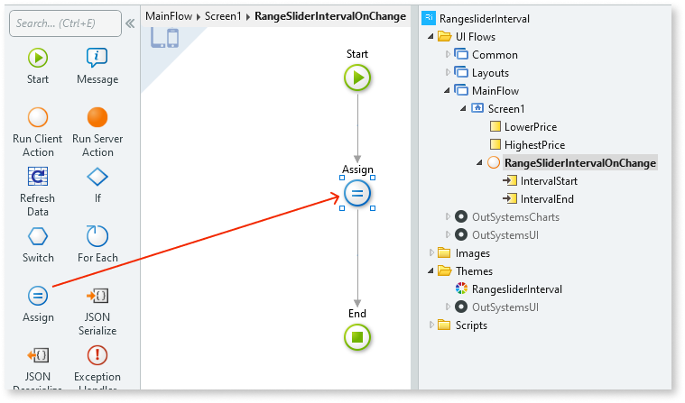
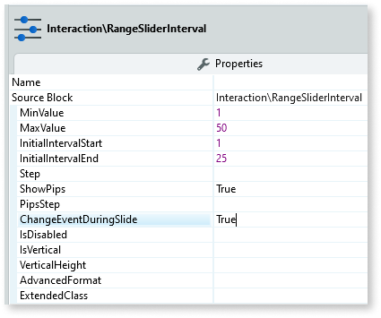

# Range Slider Interval

You can use the Range Slider Interval Pattern to allow users select a single value between two range values. This pattern enables the adjustment of content by predetermined intervals and within a chosen range. Moving the slider along the track, increases or decreases the value.

## How to use the Range Slider Interval UI Pattern

In this example, we create a Range Slider Interval that allows the user select a price range between 1-50.

1. In Service Studio, in the Toolbox, search for `Range Slider Interval`.

    The Range Slider Interval widget is displayed.

    

    If the UI widget does not display, it may be because you used a ready-made app, which deletes unused widgets from the module. To make additional widgets available in your app:

    a. Go to **Module > Manage dependencies**.

    b. Search for and select the relevant Producer, for example OutSystemsUI. Ensure Show All is selected. 

    c. On the Public elements for the selected Producer displayed on the right, ensure Show All is selected.
    
    d. Search for and select the element you want to add, and click **Apply**. 
    
    e. In Service Studio, in the Toolbox, search for the widget again.

1. From the Toolbox, drag the Range Slider Interval widget into the Main Content area of your application's screen, and on the **Properties** tab, enter the **MinValue**, **MaxValue**, **InitialIntervalStart**, and **InitialIntervalEnd** values. In this example, we add static values.

    

1. To create an **OnChange** event, on the **Properties** tab, from the **Handler** drop-down, select **New Client Action**.

    

    By default, the **InitialIntervalStart** and **InitialIntervalEnd** input parameters are created.

    

1. From the Toolbox, drag the Container widget into the Main Content area of your application's screen, and add your content to the Container placeholder. In this example, we add some text and an expression for each of the input paramters.

    

1. To create a variable for each of the expressions, right-click your screen name, select **Add Local Variable**, and on the **Properties** tab, enter a name and data type. In this example we create the **LowerPrice** and **HighestPrice** variables with the **Currency** data type.

    

1. To bind the **IntervalStart** variable to the expression, double-click the expression widget, and in the **Expression Value** editor, select the variable you just have created, and click **Done**.

    

1. Repeat step 6 for the **IntervalEnd** input parameter.

1. So that the parameter read the range slider selections, double-click your client action, and from the Toolbox, add the **Assign** action to the client action.

    

1. Set the variable and value assignments for the Assign action.

    

1. From the **Properties** tab, you can change the Range Slider's look and feel by setting the (optional) properties.

    

After following these steps and publishing the module, you can test the pattern in your app.

## Properties

| Property | Description |
|---|---|
| MinValue (Decimal): Mandatory  |  Slider's minimum value. 
Examples <ul><li>_0_ - The slider's minimum value is 0.</li><li>_12_ - The slider's minimum value is 12</li> </ul>
 |
| MaxValue (Decimal): Mandatory  |  Slider's maximum value. 
Examples <ul><li>_100_ - The slider's maximum value is 100.</li></ul>
 |
| InitialIntervalStart  |  Start value selected by default when the page is rendered. Must be between min and max values. 
Examples <ul><li>_10_ - Slider's default start value when the page is rendered is 10.</li></ul>
 |
| InitialIntervalEnd  |  End value selected by default when the page is rendered. Must be between min and max values. 
Examples <ul><li>_10_ - Slider's default end value when the page is rendered is 10.</li></ul>
 |
| Step (Decimal): Optional  | The slider moves in increments of steps.
Examples <ul><li>_Blank_ - The slider increases in steps of 1. This is the default value. </li><li>_10_ - The slider increases in steps of 10.</li></ul>
|
| ShowPips (Boolean): Optional  | If True, pips are shown below the slider. This is the default value. If False, no pips are shown. |
| PipsStep (Integer): Optional  |  Range interval after which a Pip is drawn (when ShowPips is enabled). If not specified, the component will try to guess what step fits your data. |
| ChangeEventDuringSlide (Boolean): Optional |  Trigger Change events while the slider is being dragged. If set to False, the Change events will only be triggered when the user releases the slider. **Tip**: If you're refreshing a query based on the value of the slider, we recommend you set this property to False. |
|IsDisabled (Boolean): Optional | If True, the slider is disabled. If False, the slider is enabled. This is the default value. |
|IsVertical (Boolean): Optional | If True, the slider orientation is vertical. If False, the slider orientation is horizontal. |
|VerticalHeight (Integer): Optional | If IsVertical is True, use this property to set the height (in px) of the slider. 
Examples <ul><li>_Blank_ - The slider is 100px high. This is the default value. </li><li>_250_ - The slider is 250px high.</li></ul>
 |
|AdvancedFormat (Text): Optional  |  Allow for more options beyond what's provided through the input parameters. For more information, visit: <https://kimmobrunfeldt.github.io/progressbar.js/>. Example: `{ easing: 'bounce' }` |
