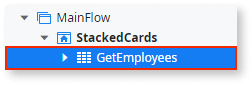
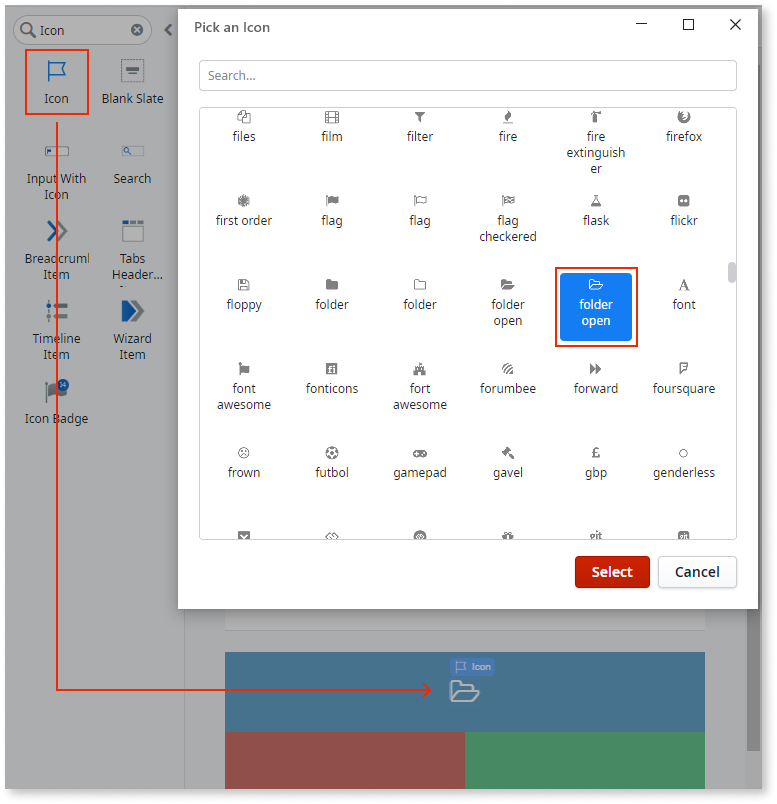

# Stacked Cards

You can use Stacked Cards UI Pattern to add swipeable cards that can be dragged in multiple directions triggering events, such as deny, approve, and archive. This pattern is ideal when you want to individually scan multiple cards.

   

## How to use the Stacked Cards Pattern

1. In Service Studio, in the Toolbox, search for  `Stacked Cards`. 

    The Stacked Cards widget is displayed.

    

1. From the Toolbox, drag the Swipe Events widget into the Main Content area of your application's screen.

    

    By default, the Stacked Cards widget contains a List, Overlay Top, Overlay Right, and Overlay Right placeholders. 

1. Add content to the List placeholder. In this example, from the **Data** tab, we drag a list of Employees into the List placeholder.

    

    The **GetEmployees** aggregate is automatically created.

      

1. From the Toolbox, drag the Icon widget into the OverlayTop placeholder, and from the Pick an Icon editor, choose an icon. Click **Ok**.

      

1. Repeat step 4 for the OverlayRight and OverlayLeft placeholders. 

      

1. To create a swipe action for the OverlayLeft placeholder, select the pattern, and from the OnLeftSwipe **Handler** drop-down, select **New Client Action**.

    

1. From the Toolbox, drag a **Run Server Action** onto the client action, and from the **Select Action** editor, navigate to the action you want the swipe left action to perform. In this example, we use the **DeleteEmployee** action. 

    

1. From the **Id** drop-down, select the action Id. In this example, the Id is the currently selected employee. This means, that when the user swipes left, the currently selected user is deleted form the list of employees.  

   

1. Repeat step 7 for the OverlayTop (swipe up) and OverLayRight (swipe right) placeholders.

1. From the **Properties** tab, you can change the Range Slider's look and feel by setting the (optional) properties.

   

After following these steps and publishing the module, you can test the pattern in your app.

## Properties

**Property** |  **Description** |  
---|---|---  
StackedOptions (StackedCardsPosition Identifier): Optional |  Change stacked cards view from bottom, top, or none.  
Examples <ul><li>_Entities.StackedCardsPosition.Bottom_ - The stacked cards are positioned on the bottom. This is the default. </li><li>_Entities.StackedCardsPosition.Top_ - The stacked cards are positioned on top. </li></ul>
 | 
Rotate (Boolean): Optional| If True, the rotation for each move on the stacked cards is activated. This is the default. If False, each move is not activated.  |  
Items (Integer): Optional |  Number of visible elements when the StackedOptions property is set to bottom or top. 
Examples <ul><li>_Blank_ - 5 elements are visible. This is the default. </li><li>_3_ - 3 elements are visible. </li></ul>
  | 
ElementsMargin |  Define the distance between each element when the StackedOptions property is set to bottom or top. 
Examples <ul><li>_Blank_ - 5 elements are visible. This is the default. </li><li>_3_ - 3 elements are visible. </li></ul>
 | 
UseOverlays (Boolean): Optional | If True, overlays for swipe elements are enabled. This is the default. If False, the overlays are disabled.
  
## Compatibility with other patterns

Avoid using the Stacked Cards Pattern inside patterns with swipe events / touch events, like [Tabs](<tabs.md>) or [Carousel](<carousel.md>).