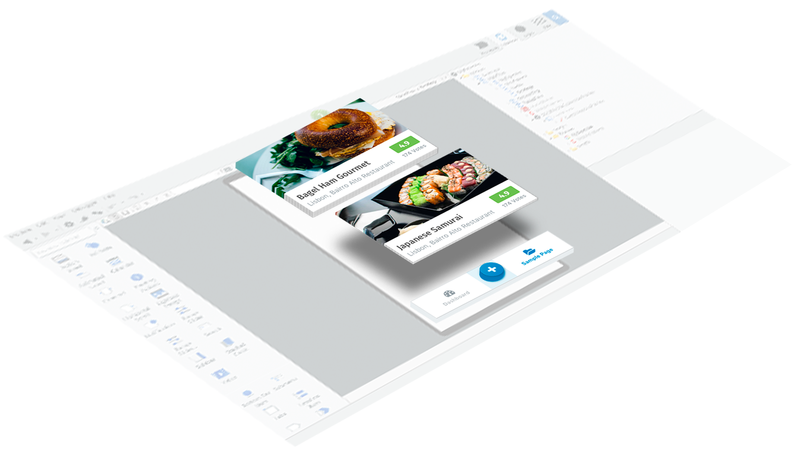

# Using Mobile and Reactive Patterns

Applies only to Mobile Apps and Reactive Web Apps

The following components and UI patterns are specially designed to address common application use cases in mobile development.

OutSystems UI Mobile Framework offers you different patterns that you can drag and drop to the screen for a great mobile experience.
