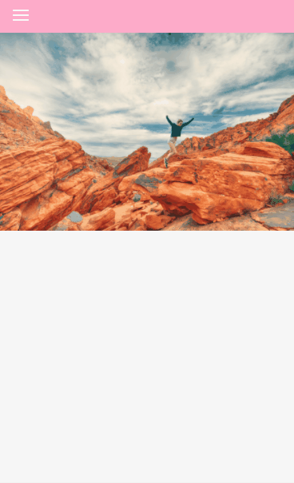
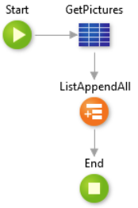
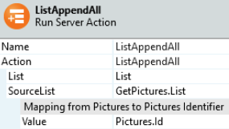
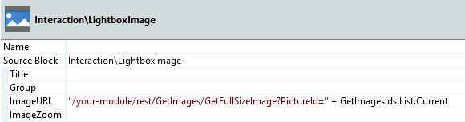

# LightBoxImage Pattern

The LightBoxImage pattern is a block with one single placeholder for a thumbnail image. You can use either local images or an external URL, using the ImageURL parameter on the block. To open items, you need to drag the **Utilities\LightboxImage** block to the screen. Use this pattern when you want to highlight and view in detail images in a higher resolution.

## How to Use the LightBoxImage Pattern

Add the thumbnail image to the corresponding placeholder and configure if it will have **Sharing Options** enabled and the **Group** name. Additionally, you can swipe items in the same group.

### Adding a Filter to an Open Image

**Result**:

### Loading Binary Images After Click on LightBoxImage (images from database)

To expose the image, you need to create a REST service first and then consume that REST service to obtain the URL. Go to the **Logic** tab ( **Integrations** folder) to create the REST services.

Follow the steps below to **expose the REST API**:

1\. Right-click the REST service and select **Expose REST API** (call **GetImages** for example).

2\. Right-click the **Expose REST API** and **add REST API method** (call **GetFullImage** for example).

3\. Add an input parameter to expose the URL. Call **PictureID** and set the Data Type as Pictures Identifier. In the **Advanced** section, select the **URL** option on the **Receive IN** drop-down.

4\. Add an output parameter (call **Image** for example) and set the Data type to Binary Data. In the **Advanced** section, select the **Body** option on the **Send IN** drop-down.

5\. On the **GetFullSizeImage** REST API method, drag your Pictures database and filter by **Pictures.Id=PictureId**.

6\. Drag the assign widget and set Image (output parameter) with **GetPictureById.List.Current.Pictures.Image**.

Follow the steps below to **consume the REST API**:

1\. Right-click the REST service and select **CONSUME REST API** (call **GetImages** for example).

2\. Add Single Method.

3\. On the method URL, paste your domain URL + URL Path (get this on Expose REST API) + ?PictureId={PictureId}

Now we are able to create our screen with all pictures from the database using the LightBoxImage pattern to display them.

1\. Add a new screen.

2\. Right-click on the screen and select **Fetch data from other resources** (call **GetImagesIds** for example).

3\. Rename the **Output parameter** to **List** and define **Pictures Identifier List** as the Data type.

4\. Drag your Pictures database to the **GetImagesIds** action and the **ListAppendAll** action.

5\. In the **ListAppendAll** set the aggregate as source list (GetPictures.List) and map from pictures to Pictures Identifier. To do that, set **Pictures.Id** in the **Value** option.

6\. Drag the List widget to the screen.

7\. Drag the LightboxImage pattern to the List widget.

8\. Set the ImageURL parameter on the **LightboxImage** with your URL REST API + your fetched data.  
a. "/your-module/rest/GetImages/GetFullSizeImage?PictureId=" + GetImagesIds.List.Current

9\. In the Lightbox Thumbnail Image set External URL on type and the URL REST API + your fetched data.  
a. "/your-module/rest/GetImages/GetFullSizeImage?PictureId=" + GetImagesIds.List.Current

10\. Publish your app.

### LightBoxImage with External URL Images

1\. Drag your database to the screen.

2\. Drag the **LightBoxImage** pattern to the List widget.

3\. Set the **ImageURL** parameter on the LightBoxImage and **Thumbnail** image with your external URL.  
For example: GetPictures.List.Current.Pictures.ExternalURL.

4\. Publish your app.  

## Input Parameters

**Input Name** |  **Description** |  **Default Value**  
---|---|---  
 Title  |  Title of the image that will be displayed.  |  none  
 Group  |  Images in the same group will be displayed in a gallery.  |  none  
 ImageURL  |  URL for an image that can be a replacement for the "Image Placeholder" image.  |  none  
 ImageZoom  |  The zoom value is used to define the size of the image that will open in full screen based on the thumbnail size. %%Note: try to use images with the same ratio to avoid rendering problems:  %%- thumbnail with 100x100 and zoom 2 will open with 200x200  %%- thumbnail with 500x500 and zoom 0.5 will open with 250x250  |  none  
  
## Layout and Classes

## Compatibility with other Patterns

The LightBoxImage pattern can be used only with images.

## Samples

Watch how the [Product Overview sample](https://silkui.outsystems.com/Samples_Mobile.aspx#Mobile_Details-Samples_ProductOverview "https://silkui.outsystems.com/Samples_Mobile.aspx#Mobile_Details-Samples_ProductOverview") uses the LightBoxImage pattern:

