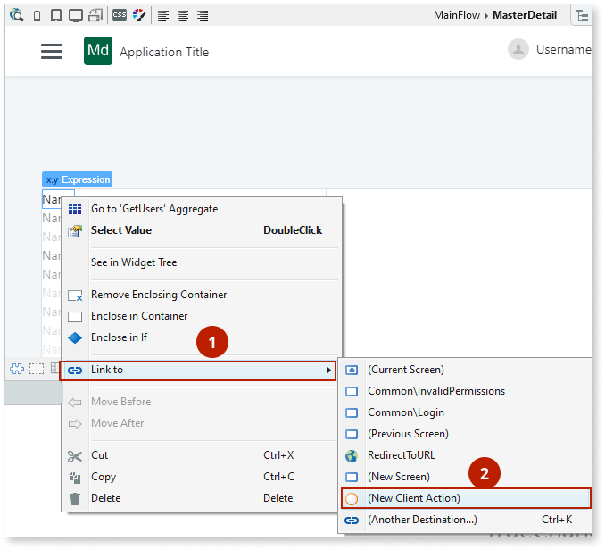
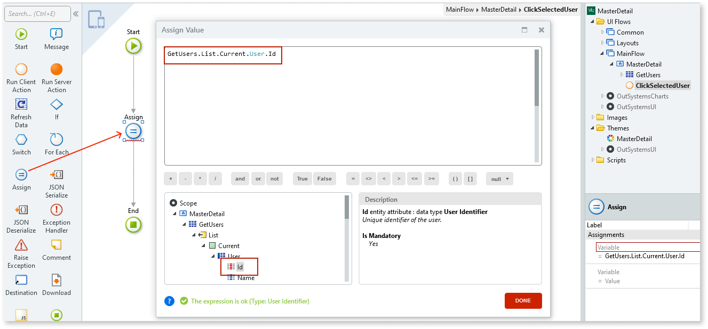

# Master Detail

You can use the Master Detail Pattern to display a master list of items and their related details, for example, a list of employees and their corresponding details. 

## How to use the Master Detail UI Pattern

1. In Service Studio, in the Toolbox, search for `Master Detail`. 

    The Master Detail widget is displayed.
    
    

1. From the Toolbox, drag the Master Detail widget into the Main Content area of your application's screen.

     

     By default, the Master Detail widget contains a right placeholder and left placeholder which expects a list.

1. From the Toolbox, drag the List widget into the LeftContent placeholder.

    

1. To create an aggregate, right-click your screen, and select **Fetch Data From Database**.

1. To add a database entity, click on the screen, select the relevant entity, and click **OK**. In this example, we use the User entity.

    

1. Double-click your screen, and select the List widget. On the **Properties** tab, from the **Source** drop-down, select the aggregate you just created. In this example, GetUsers.List.

    

1. From the Toolbox, drag an Expression widget into the List, and from the Expression Value editor, navigate and select the current users name and click **Done**.

    

    This displays all of the users names on the right side of the screen.

1. To set all of the names in the list to a link, select and right-click the expression in the list, and select **Link to -> New Client Action**.  

    

1. Double-click the new client action and enter a name. In this example, we call it **ClickSelectedUser**.

    

1. From the Toolbox, add the **Assign** logic to the client action, and from the  **Value** drop-down, select the Expression Editor. Navigate and select the current user Id and click **Done**.

    

1. To store this user Id, create a local variable by right-clicking on your screen and selecting **Create Local Variable**. Enter a name for the variable. In this example, we call it **SelectedUserId**.

    

1. From the Toolbox, add the **Refresh Data** logic to the client action, select the relevant aggregate (in this example GetUserDetails), and click **OK**. This executes the aggregate using the currently selected user. 

    

1. Select the **Assign** logic, and from the **Variable** drop-down, select the local variable you created in step 11 (in this example, SelectedUserId).

1. To display the selected user's details on the right side of the screen, create a new aggregate by right-clicking on your screen and selecting **Fetch Data from Database**. 

1. To add a database entity, click on the screen, select the relevant entity, and click **OK**. In this example, we use the User entity.

1. Enter a name for the aggregate. In this example, we call it **GetUserDetails**. 

    

1. On the Main screen, click **Filters**, then click **Add Filter**.

1. From the Filter Condidion editor, enter the following condition and click **Done**.

    `User.Id = SelectedUserId`

    This filters all the results in the User entity to the currently selected user.

1. Double-click on your screen. In the RightContent placeholder, create an expression for the user details you want to appear for the selected user by dragging the Expression widget into the placeholder, navigating and double-clicking the relevant entity attribute from the aggregate you just created, and clicking **Done**. Repeat this step for each of the entities you want to display.

    In this example, we create an expression for the user's email.

   

After following these steps and publishing the module, you can test the pattern in your app. 

## Properties

**Property** |  **Description** |   
|---|---|
| LeftPercentage (Decimal): Optional | Set the LeftContent width using a percentage. Default value is 50%. |
| OpenedOnPhone (Boolean): Optional |  Variable to hold if the detail is opened on a phone. Default value is False.|
| Height | Set the height of the widget (in pixels or %). By default, it is the height of the window, minus the title and header.|
 
## Compatibility with other patterns

This pattern should be used alone inside the screen content because it will adapt to the height of the parent. Additionally, you should avoid using the Master Detail pattern inside patterns with swipe events, such as [Tabs](<tabs.md>).

## Samples

You can use the Master Detail pattern as a sample:

