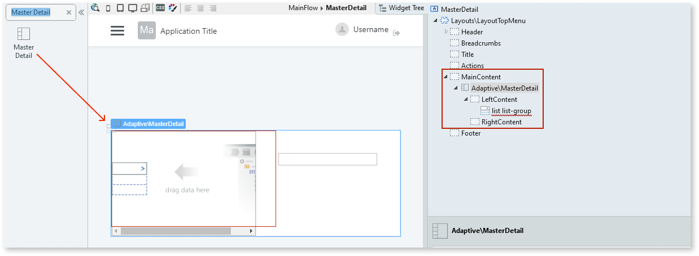

# Master Detail

You can use the Master Detail Pattern to display a master list and the details for the currently selected item.

## How to use the Master Detail UI Pattern

1. In Service Studio, in the Toolbox, search for `Master Detail`. 

    The Master Detail widget is displayed.
    
    

1. From the Toolbox, drag the Master Detail widget into the Main Content area of your application's screen.

     

1. Bind a List to the **ItemList** parameter and leverage the block events to change the content placeholder.

1. Create a local boolean variable and set it on **OpenedOnPhone**.

    

1. To open the detail of the clicked element, use a link for an action, set your local variable to True , and add logic to open the correct detail.

    

1. To close the detail, create an action and set your local variable to False , and use this action in the **DetailClose** event. Add the necessary logic.

    

    

After following these steps and publishing the module, you can test the pattern in your app. 

### Phone landscape with the same behavior as a tablet

You can have your phone in landscape to work the same way as a tablet:

    
    
    .phone.landscape .split-left {
         width: **x; /* This is width value for the left side */**
    }
    
    
    
    .phone.landscape .split-right {
         -webkit-transform: translateX(0) translateZ(0);
          transform: translateX(0) translateZ(0);
        width: **x; /* This is the width value for the right side */**
         left: auto;
        right: 0;
        border-left: 1px solid #d3d3d3;
    }
    
    
    .phone.landscape .detail-open .split-right-close {
        opacity: 0;
        pointer-events: none;
    }
    
    
    .phone.landscape .detail-open .app-menu-icon {
        opacity: 1;
        pointer-events: auto;
    }
    
    

## Properties

**Property** |  **Description** |   
|---|---|
|ItemList  |  These are the items for the list on the left side of the MasterDetail.  |  N/A  
  
 
  
## Compatibility with other patterns

This pattern should be used alone inside the screen content because it will adapt to the height of the parent. Additionally, you should avoid using the MasterDetail pattern inside patterns with swipe events, such as [Tabs](<tabs.md>).

## Samples

You can use the Master Detail pattern as a sample:

