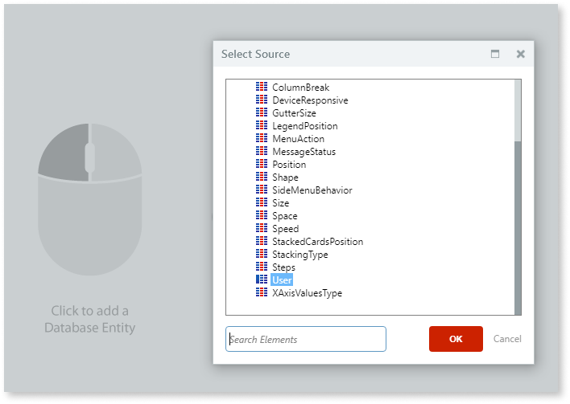
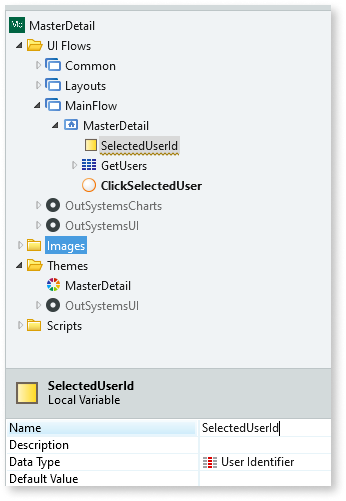
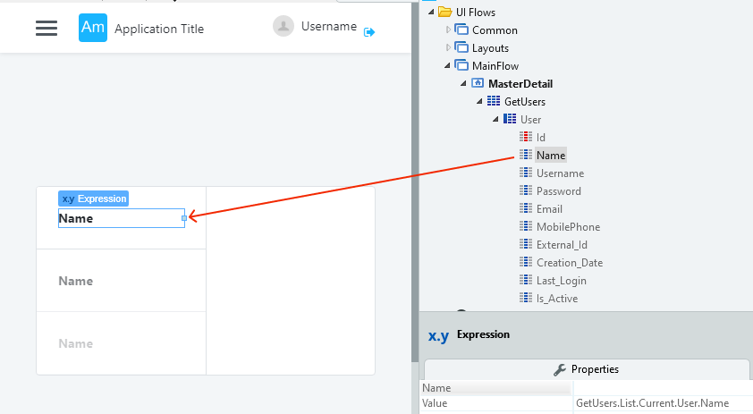

# Master Detail

You can use the Master Detail Pattern to display a master list of items and their related details, for example, a list of employees and their corresponding details. 

## How to use the Master Detail UI Pattern

1. In Service Studio, in the Toolbox, search for `Master Detail`. 

    The Master Detail widget is displayed.
    
    

1. From the Toolbox, drag the Master Detail widget into the Main Content area of your application's screen.

     

     By default, the Master Detail widget contains a right placeholder and left placeholder which expects a list.

 1.  Select the **Data** tab, and from the **Entities** folder, drag the entity you want to display as the master list into the LeftContent placeholder. In this example, we use the Employee entity.
 
     You can also add list items by dragging the List widget into the placeholder and setting the source properties. 

     

     **Note**: By dragging the Employee entity into the list placeholder, the **GetEmployees** aggregate is automatically created.

     

 1. To store the selected user's details, from the  **Interface** tab, right-click your screen, and select **Add Local Variable**. 
 
    
  
 1. On the **Properties** tab, enter a variable name and data type. 

    

1. To set all of the names in the list to a link, select and right-click the the user's name in the first list item, and select **Link to -> New Client Action**.  

   

1. Double-click the new client action and enter a name.

    

1. From the Toolbox, add the **Assign** logic, and set the **Variable** property to the local variable you created earlier (in this case SelectedUserId). 

   

1. From the **Value** drop-down, select Expression Editor, navigate and select the current employee Id, and click **Done**.

    

1. From the Toolbox, add the **Refresh** logic, and select the relevant aggregate (in this case GetEmployees).  

   

1. To display the details of the selected user, create a new aggregate by right-clicking on your screen and selecting **Fetch Data from Database**. Enter a name for the aggregate. 

    

1. To add a database entity, click on the main screen area, and select the relevant source (in this case Employee), and click **OK**.

    

1. Double-click on your screen. In the RightContent placeholder, create an expression for the user details you want to appear for the selected user. In the example below, we create an expression for the user's job position. To do this, drag the Expression widget into the placeholder, navigate and double-click the relevant entity attribute, and click **Done**. Repeat this step for each of the entities you want to display.

   

After following these steps and publishing the module, you can test the pattern in your app. 

## Properties

**Property** |  **Description** |   
|---|---|
| LeftPercentage (Decimal): Optional | Set the LeftContent width using a percentage. Default value is 50%. |
| OpenedOnPhone (Boolean): Optional |  Variable to hold if the detail is opened on a phone. Default value is False.|
| Height | Set the height of the widget (in pixels or %). By default, it is the height of the window, minus the title and header.|
 
## Compatibility with other patterns

This pattern should be used alone inside the screen content because it will adapt to the height of the parent. Additionally, you should avoid using the Master Detail pattern inside patterns with swipe events, such as [Tabs](<tabs.md>).

## Samples

You can use the Master Detail pattern as a sample:

