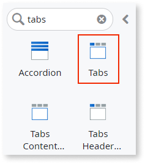
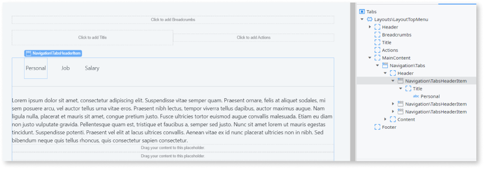
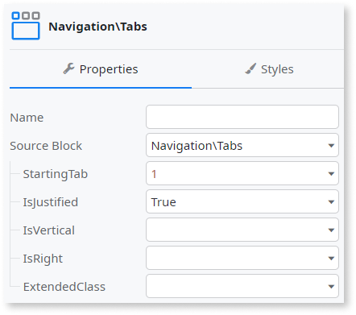

# Tabs

You can use the Tabs UI Pattern to divide content into meaningful sections. Each section is viewable at one time. You use this pattern when you want the user to be able to between sections within the same context, not to navigate to different areas.


## How to use the Tabs UI Pattern

1. In Service Studio, in the Toolbox, search for `Tabs`.

    The Tabs widget is displayed.

    

    If the UI widget doesn't display, it's because the dependency isn't added. For example, if you are using a ready-made app, it deletes unused widgets from the module. To make the widget available in your app:

    1. In the Toolbox, click **Search in other modules**.

    1. In **Search in other Modules**, remove any spaces between words in your search text.
    
    1. Select the widget you want to add from the **OutSystemsUI** module, and click **Add Dependency**. 
    
    1. In the Toolbox, search for the widget again.

1. From the Toolbox, drag the Tabs widget into the Main Content area of your application's screen.

    

    By default, the Tabs widget contains 3 Header Items (tab titles) and 3 Content Items (tab content). You can add or delete as many as required.

1. Add the relevant content to the Header Item and Content Item placeholders, for example, forms, images, link, and text. In this example we add some text by typing directly into each of the placeholders.

    

1. On the **Properties** tab, you can customize the Tabs look and feel by setting any of the optional properties, for example, which tab is displayed as the active tab when the page is rendered and whether the tabs are displayed vertically or horizontally.  

    

After following these steps and publishing the module, you can test the pattern in your app.

### Add styles to tabs and content

The following CSS code is an example of how to change the style of selected items in the tabs:

```css
.tabs-header-tab {
    background-color: #ebebeb;
}

.tabs-header-tab.active {
    border-bottom: 3px solid #000;
    background-color: #ebebeb;
    color: #0097eb;
}

.tabs-content-tab {
    background-color: #ccc;
    padding: 20px;
    font-size: 18px;
    font-stretch: condensed;
}
```

### Hide tabs with no content

All Silk patterns hide `div` HTML elements with no content. If you only need 2 or 3 tabs, and you want to hide the others, you don't need to do anything.

## Properties

|Property | Description |
|---|---|
|StartingTab (Integer): Optional  | Set the index of the currently active tab. The index begins at 0.<p>Examples<ul><li>_Blank_ - The 1st tab is the active tab. This is the default.</li><li>_1_ - The 2nd tab is the active tab.</li></ul></p> |
|IsJustified (Boolean): Optional  | If True, the Tabs are evenly distributed in the space available. If set to False, the Tabs are left aligned. This is the default value. |  
|IsVertical (Boolean): Optional  | If True, the Tabs are displayed vertically. If set to False, the Tabs are displayed horizontally. This is the default value. |  
|IsRight (Boolean): Optional  | If True, the Tabs are displayed to the right of the Tab content. If set to False, the Tabs are displayed to the left of the Tab content. This is the default value. **Note**: This setting is only applicable if the IsVertical property is set to True. |  
| ExtendedClass (Text): Optional | Adds custom style classes to the Pattern. You define your [custom style classes](../../../look-feel/css.md) in your application using CSS. <p>Examples <ul><li>Blank - No custom styles are added (default value).</li><li>"myclass" - Adds the ``myclass`` style to the UI styles being applied.</li><li>"myclass1" "myclass2" - Adds the ``myclass1`` and ``myclass2`` styles to the UI styles being applied.</li></ul></p>You can also use the classes available on the OutSystems UI. For more information, see the [OutSystems UI Cheat Sheet](https://outsystemsui.outsystems.com/OutSystemsUIWebsite/CheatSheet). |

## Device and pattern compatibility

* Incompatible with RTL on Android devices with 4.4.2 OS version.

* Avoid using the Tabs Pattern inside patterns with swipe events, such as the Stacked Cards or Carousel Patterns.
