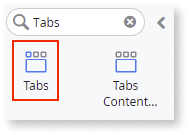
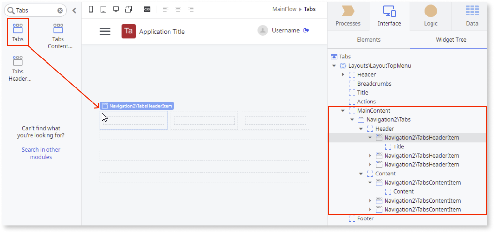
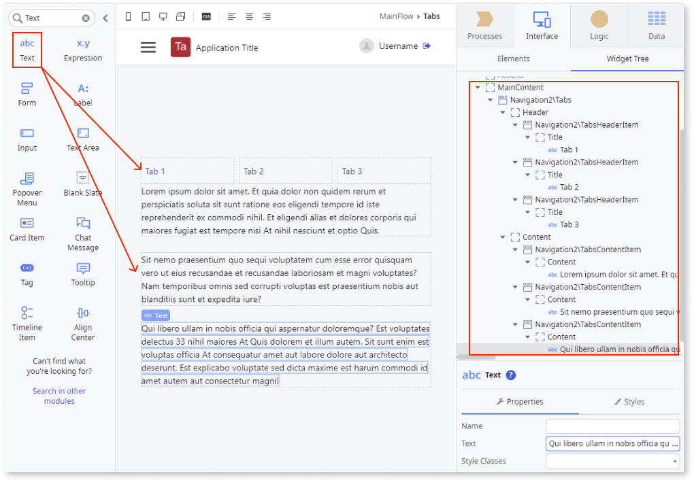
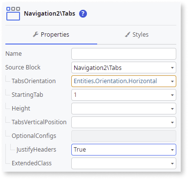

# Tabs

<div class="info" markdown="1">

Applies to Mobile Apps and Reactive Web Apps only

</div>

<div class="info" markdown="1">

**This component is deprecated for versions of OutSystems UI lower than 2.10.0** For more information on how to migrate old versions, see the [Patterns and Versions Overview](https://outsystemsui.outsystems.com/OutsystemsUiWebsite/MigrationOverview).

To find out what version of OutSystems UI you are using, see [OutSystems UI version](../../intro.md#outsystems-ui-version).

</div>

You can use the Tabs UI Pattern to divide content into meaningful sections. This pattern is useful when you want the user to be able to switch between sections within the same context while not having to not to navigate to different areas.


## How to use the Tabs UI Pattern

1. In Service Studio, in the Toolbox, search for `Tabs`.

    The Tabs widget is displayed.

    

    If the UI widget doesn't display, it's because the dependency isn't added. This happens because the Remove unused references setting is enabled. To make the widget available in your app:

    1. In the Toolbox, click **Search in other modules**.

    1. In **Search in other Modules**, remove any spaces between words in your search text.
    
    1. Select the widget you want to add from the **OutSystemsUI** module, and click **Add Dependency**. 
    
    1. In the Toolbox, search for the widget again.

1. From the Toolbox, drag the Tabs widget into the Main Content area of your application's screen.

    

    By default, the Tabs widget contains 3 Header Items (tab titles) and 3 Content Items (tab content). You can add or delete as many as required.

1. Add the relevant content to the Header Item and Content Item placeholders, for example, forms, images, link, and text. 

    In this example, text is added.

    

1. On the **Properties** tab, you can customize the Tabs look and feel by setting any of the optional properties, for example, which tab is displayed as the active tab when the page is rendered and whether the tabs are displayed vertically or horizontally.  

    

After following these steps and publishing the module, you can test the pattern in your app.

### Add styles to tabs and content

The following CSS code is an example of how to change the style of selected items in the tabs:

```css
.osui-tabs__header-item {
    background-color: #ebebeb;
}

.osui-tabs__header-item.osui-tabs--is-active {
    border-bottom: 3px solid #000;
    background-color: #ebebeb;
    color: #0097eb;
}

.osui-tabs__content {
    background-color: #ccc;
    padding: 20px;
    font-size: 18px;
    font-stretch: condensed;
}
```
## Properties

### Tabs

| Property| Description|
|---|---|
|TabsOrientation (Orientation Identifier): Optional | Defines the direction of the tabs. By default, the tabs are displayed horizontally.|
|StartingTab (Integer): Optional| Defines the index of the currently active tab. The index begins at 0.<br/><br/>Examples:<ul><li>Blank - The 1st tab is the active tab. This is the default.</li><li>1 - The 2nd tab is the active tab.</li></ul>|
|Height (Text): Optional|Defines the height of the tabs container. ``Auto`` is the default value.<br/><br/>Examples:<ul><li>Auto - The tab height adjusts to the content.</li><li>400px - The height of the tab is 400px.</li></ul>  |
|TabsVerticalPosition (Direction Identifier): Optional |Defines the position of the tabs headers. By default, tabs appear on left.|
|OptionalConfigs (TabsOptionalConfigs): Optional| Defines additional parameters to customize the Tabs behavior and functionality.|
|OptionalConfigs.ContentAutoHeight (Boolean): Optional| Set to True to fit each tab to its content height. By default, the tab content is the height of the highest tab height.<br/>**Note:** This property is only available for Web apps.|
|OptionalConfigs.JustifyHeaders (Boolean): Optional| Set to True to evenly distribute the items in the space available. The default value is False.|
|ExtendedClass (Text): Optional| Adds custom style classes to the Pattern. You define your [custom style classes](../../../../../develop/ui/look-feel/css.md) in your application using CSS.<br/><br/>Examples <ul><li>Blank - No custom styles are added (default value).</li><li>"myclass" - Adds the ``myclass`` style to the UI styles being applied.</li><li>"myclass1 myclass2" - Adds the ``myclass1`` and ``myclass2`` styles to the UI styles being applied.</li></ul>You can also use the classes available on the OutSystems UI. For more information, see the [OutSystems UI Cheat Sheet](https://outsystemsui.outsystems.com/OutSystemsUIWebsite/CheatSheet). |


### Tabs Content Item

| Property| Description|
|---|---|
| ExtendedClass (Text): Optional| Adds custom style classes to the Pattern. You define your [custom style classes](../../../../../develop/ui/look-feel/css.md) in your application using CSS.<br/><br/>Examples <ul><li>Blank - No custom styles are added (default value).</li><li>"myclass" - Adds the ``myclass`` style to the UI styles being applied.</li><li>"myclass1 myclass2" - Adds the ``myclass1`` and ``myclass2`` styles to the UI styles being applied.</li></ul>You can also use the classes available on the OutSystems UI. For more information, see the [OutSystems UI Cheat Sheet](https://outsystemsui.outsystems.com/OutSystemsUIWebsite/CheatSheet). |


### Tabs Header Item

| Property| Description|
|---|---|
| ExtendedClass (Text): Optional| Adds custom style classes to the Pattern. You define your [custom style classes](../../../../../develop/ui/look-feel/css.md) in your application using CSS.<br/><br/>Examples <ul><li>Blank - No custom styles are added (default value).</li><li>"myclass" - Adds the ``myclass`` style to the UI styles being applied.</li><li>"myclass1 myclass2" - Adds the ``myclass1`` and ``myclass2`` styles to the UI styles being applied.</li></ul>You can also use the classes available on the OutSystems UI. For more information, see the [OutSystems UI Cheat Sheet](https://outsystemsui.outsystems.com/OutSystemsUIWebsite/CheatSheet). |

## Events

### Tabs

|Event| Description  | 
|---|---|
|OnTabChange: Optional| Event triggered when switching Tabs. | 

## Device and pattern compatibility

Avoid using the Tabs Pattern inside patterns with swipe events, such as the Stacked Cards or Carousel Patterns.
