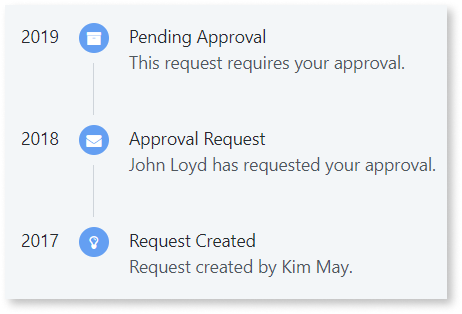
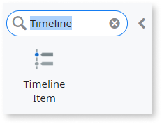
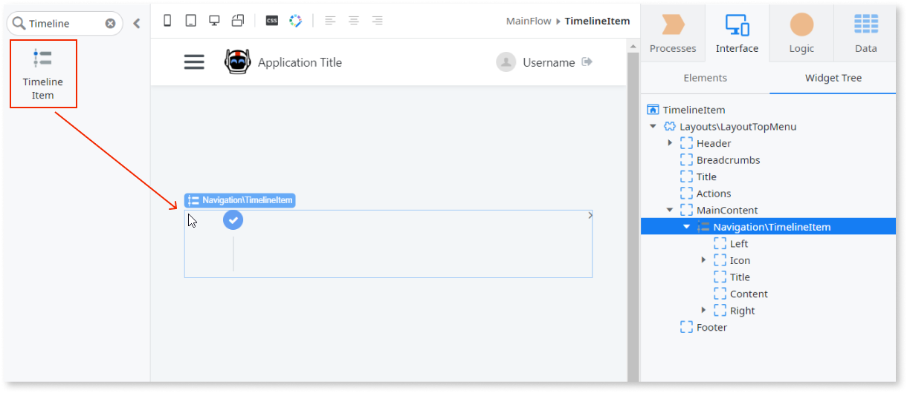
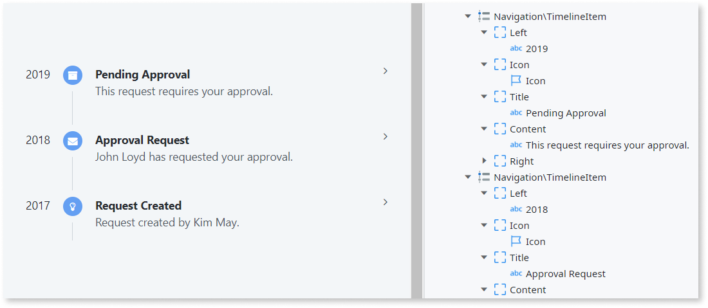

# Timeline Item

Applies to Mobile Apps and Reactive Web Apps only

You can use the Timeline Item UI Pattern to show related events in a chronological order, such as a user's upcoming, current, and past activities.

**How to use the Timeline Item UI Pattern**

1. In Service Studio, in the Toolbox, search for `Timeline Item`.

    The Timeline Item widget is displayed.

    

    If the UI widget doesn't display, it's because the dependency isn't added. This happens because the Remove unused references setting is enabled. To make the widget available in your app:

    1. In the Toolbox, click **Search in other modules**.

    1. In **Search in other Modules**, remove any spaces between words in your search text.

    1. Select the widget you want to add from the **OutSystemsUI** module, and click **Add Dependency**. 

    1. In the Toolbox, search for the widget again.

1. From the Toolbox, drag the Timeline widget onto your application's screen.

    

    By default, the Timeline Item widget contains Left, Icon, Title, Content, and Right placeholders. You can add as many Timeline Item widgets as required.

    In this example we add two more Timeline Item widgets.

1. Set the required content in each of the placeholders.

    In this example we add some icons and text.

    

After following these steps and publishing the module, you can test the pattern in your app.

## Properties

### Timeline Item

| Property| Description|
|---|---|
| IsActive (Boolean): Optional       | If True, the item is set to active. If False, the item is inactive. This is the default.  **NOTE**: This property is deprecated. It renders an element as being active in mobile applications based on the OutSystems UI Base Theme prior to version 2.4.0. It has no effect in applications created after OutSystems UI version 2.4.0.|
| Color (Color Identifier): Optional | Icon background color. Red, orange, yellow, lime, green, blue, violet, and pink are just some of predefined colors available for the badge. 
Examples <ul><li>_Blank_ - The icon background color is the color you chose when creating the app (default value).</li><li>_Entities.Color.Red_ - The icon background color is red.</li></ul>
|
| ExtendedClass (Text): Optional     | 
Adds custom style classes to the Pattern. You define your [custom style classes](../../../../../develop/ui/look-feel/css.md) in your application using CSS.
 
Examples <ul><li>Blank - No custom styles are added (default value).</li><li>"myclass" - Adds the ``myclass`` style to the UI styles being applied.</li><li>"myclass1 myclass2" - Adds the ``myclass1`` and ``myclass2`` styles to the UI styles being applied.</li></ul>
You can also use the classes available on the OutSystems UI. For more information, see the [OutSystems UI Cheat Sheet](https://outsystemsui.outsystems.com/OutSystemsUIWebsite/CheatSheet). |
