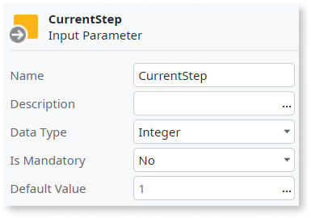
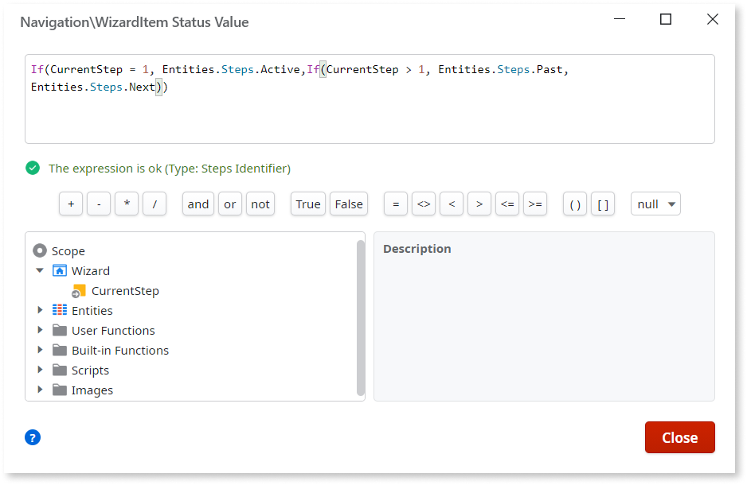
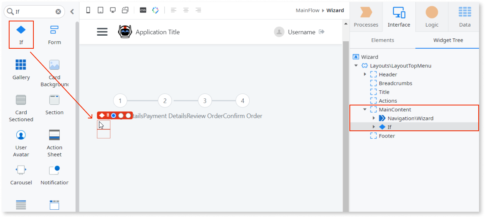
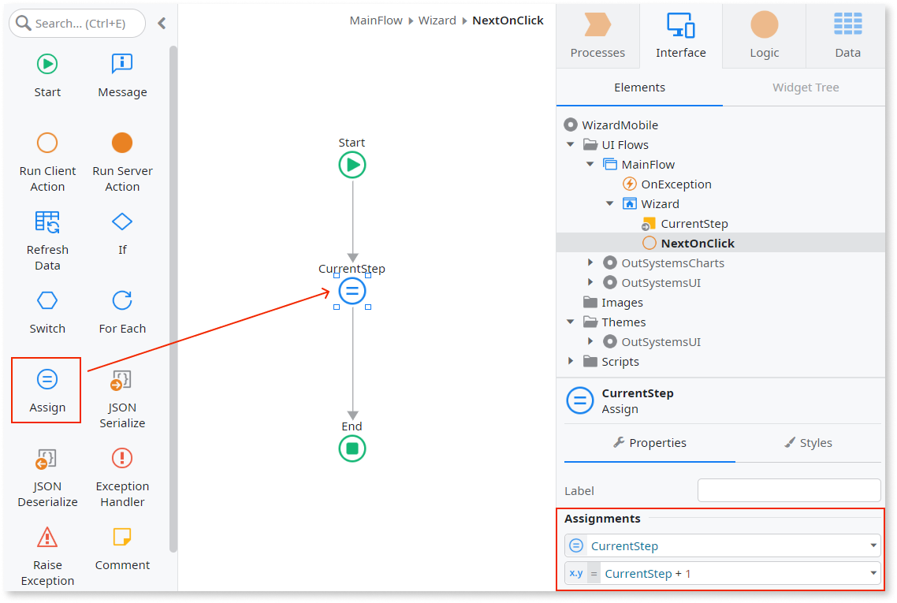
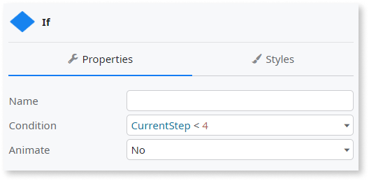

# Wizard

You can use the Wizard UI Pattern to split large complex tasks and processes into smaller manageable steps. A wizard presents a series of steps or conditions that the user needs to complete in order to accomplish a goal. Additionally, wizards usually include explicit button navigation to move a step forward or backward. Some wizard examples include software installation wizards and sign-up screens.

**How to use the Wizard UI Pattern**

The following example demonstrates how you can create a four step Wizard with navigation buttons. The example is made up of the following steps:

* Creating a wizard
* Adding content to the wizard
* Creating the wizard navigation

**Create a wizard**

1. In Service Studio, in the Toolbox, search for `Wizard`.

    The Wizard and Wizard Item widgets are displayed (both of which are required to use this pattern).

    

1. From the Toolbox, drag the Wizard widget into the Main Content area of your application's screen.

    

    By default, the Wizard widget contains three Wizard Item widgets. Each Wizard Item represents a step. You can add or delete Wizard Items as required.

1. From the Toolbox, drag another Wizard Item into your Wizard Pattern. 

    

1. Drag the Text widget into the Icon placeholders, and enter the numbers 1-4 consecutively.

    

1. Enter the following text to each of the Label placeholders:

    * Shopping Details
    * Payment Details
    * Review Order
    * Confirm Order

    

1. From the Element tree, create an Input Parameter by right-clicking on your screen, and from the drop-down, select **Add Input Parameter**.

    The input parameter controls which Wizard step is shown to the user.

    

1. On the **Properties** tab, set the Input Parameter properties as follows:

    * Name: CurrentStep
    * Data Type: Integer
    * Is Mandatory: No
    * Default Value: 1

    

    By setting the **Default Value** to 1, you ensure that the  Wizard always starts on step 1.

1. To create the logic that defines the status of each Wizard Item (as an active step, a past step, or a next step), select the first Wizard Item (step 1), and on the **Properties** tab, from the **Status** drop-down, select **Expression Editor**.

    

1. In the expression editor, enter the following expression and click **Close**:

    `If(CurrentStep = 1, Entities.Steps.Active,If(CurrentStep > 1, Entities.Steps.Past, Entities.Steps.Next))`

    

    This logic has the following meaning:

    * If the user is on step 1, the step is displayed as the active step in the wizard.
    * If the user is on a step greater than step 1, step 1 is displayed as a step that is in the past (completed).
    * If the user is on a step less than 1, the step is displayed as an upcoming (next) step.

1. Repeat steps 8 and 9 for all of the Wizard Items. Replace the number 1 in the expression with 2, 3, and 4 respectively.

**Add content to the wizard**

1. From the Toolbox, drag the If widget onto the main content area of your application's screen, just below the Wizard Pattern.

    

1. On the **Properties** tab, from the **Condition** dropdown, select Expression Editor, enter the following logic and click **Close**:

    `CurrentStep = 1`

    

    You have now created a condition that controls what's displayed on screen when the step is active.

1. Repeat steps 1 and 2 for all of the Wizard Items. Replace the **Condition** logic with 2, 3, and 4 respectively.

1. In the top section (True) of the If widget, create the relevant content for each of the steps.

    The following example shows a Shipping Details step that contains labels and input boxes.

    

**Create the wizard navigation**

1. From the Toolbox, drag two Button widgets onto your screen.

1. On the **Properties** tab, in the **Name** property, enter a name for each of the buttons (in this example, Previous and Next).

1. To ensure that all of the information the user enters is passed from step to step, create a [action](../../../../logic/actions.md) by selecting the **Next** button, and on the **Properties** tab, from the **OnClick** drop-down, select **New Client Action**.

    

1. From the Toolbox, drag the Assign block onto your screen and set the **Variable** property to `CurrentStep` and the **Value** property to `CurrentStep + 1`. This ensures that user inputs are passed from step to step.

    

1. Repeat steps 3 and 4 for the **Previous** button, setting the **Variable** property to `CurrentStep` and the **Value** property to `CurrentStep - 1`.

1. To display the **Next** button when applicable, select the **Next** button, right-click, and select **Enclose in If**.

    

1. On the **Properties** tab, in the **Condition** property, enter the following:

    `CurrentStep < 4`

    

    You have now created a condition that ensures that the user can never go above the number of steps in the wizard.

1. Repeat steps 6 and 7 for the **Previous** button. Enter `CurrentStep > 1` as the **Condition** logic. This ensures the **Previous** button is only displayed when applicable, and the user can never go below the number of steps in the wizard.

After following all of the steps in each of the sections, you can publish the module, and test the Wizard in your app.

## Properties

### Wizard

| Property | Description |
|---|---|
| IsVertical (Boolean): Optional | If True the wizard is displayed vertically. If False, the wizard is displayed horizontally. This is the default.|
| ExtendedClass (Text): Optional | 
Add custom style classes to the Wizard UI Pattern. You define your custom style classes in your application using CSS.
 
Examples <ul><li>_Blank_ - No custom styles are added. This is the default.</li><li>_"myclass"_ - adds the _myclass_ style to the Wizard UI styles being applied</li><li>_"myclass1" "myclass2"_ - Adds the _myclass1_ and _myclass2_ styles to the Wizard UI styles being applied.</li></ul>
 |

### Wizard Item

| Property |  Description |
|---|---|
| Status (Step Identifier): Mandatory | 
Set the status of the Wizard Item relative to the current step of the Wizard. You can customize an expression to set the status of the Wizard Item or you can use the predefined values Active, Next, and Past. 

Examples <ul><li>_Entities.Step.Active_ - Sets the Wizard Item to active, that is, the current step the user is on.</li><li>_Entities.Step.Next_ - Sets the Wizard Item to incomplete, that is, a step that is yet to be completed by the user.</li><li>_Entities.Step.Past_ - Sets the step to inactive, that is, a step that has already been completed by the user.</li></ul>
 |
| UseTopLabel (Boolean): Optional  | If True, the label (text descibing the step) is placed above the icon. If False, the label is placed below the icon. This is the default. |
| ExtendedClass (Text): Optional | 
Add custom style classes to the Wizard Item UI Pattern. You define your custom style classes in your application using CSS.
 
Examples <ul><li>_Blank_ - No custom styles are added. This is the default.</li><li>_"myclass"_ - Adds the myclass style to the Wizard Item UI styles being applied.</li><li>_"myclass1" "myclass2"_ - Adds the _myclass1_ and _myclass2_ styles to the Wizard Item UI styles being applied.</li></ul>
 |
