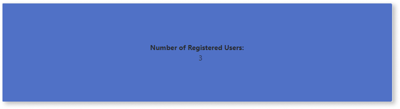
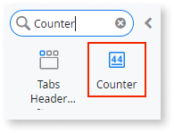
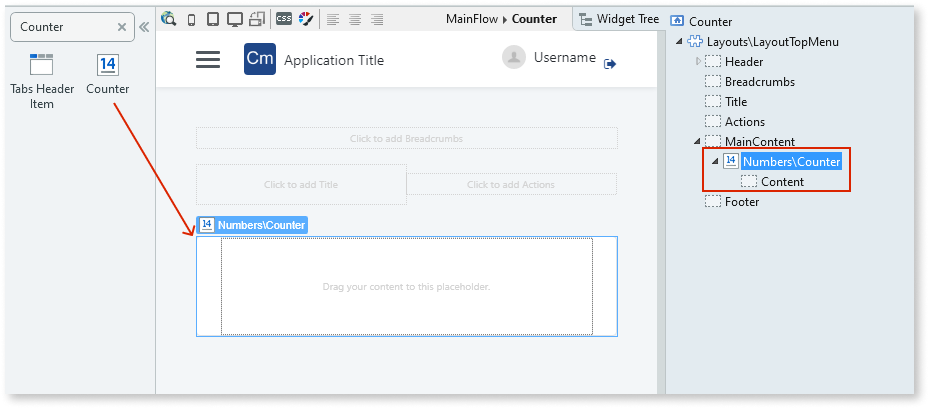
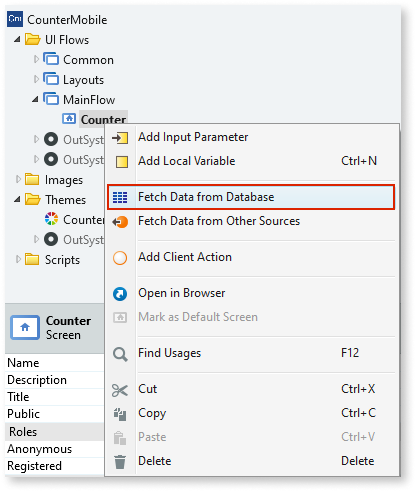
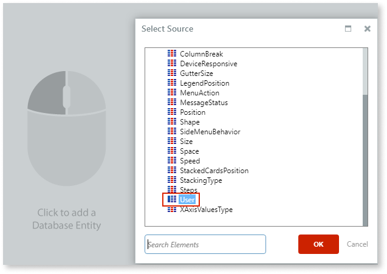
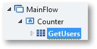
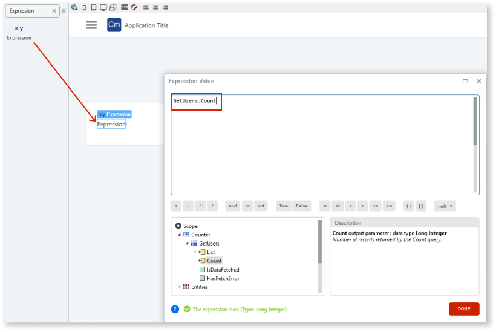
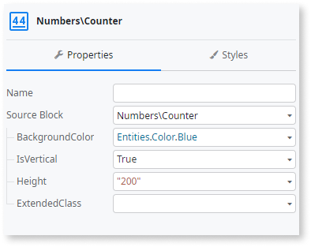

# Counter

Applies to Mobile Apps and Reactive Web Apps only

You can use the Counter UI Pattern to display numerical information as a notification. For example, the Badge UI pattern is frequently used to notify users about the number of unread emails, unopened messages, or new tasks they may have.

**How to use the Counter UI Pattern**

The following example demonstrates how you can display the number of registered users on your platform.

1. In Service Studio, in the Toolbox, search for `Counter`.

    The Counter widget is displayed.

    

    If the UI widget doesn't display, it's because the dependency isn't added. This happens because the Remove unused references setting is enabled. To make the widget available in your app:

    1. In the Toolbox, click **Search in other modules**.

    1. In **Search in other Modules**, remove any spaces between words in your search text.
    
    1. Select the widget you want to add from the **OutSystemsUI** module, and click **Add Dependency**. 
    
    1. In the Toolbox, search for the widget again.

1. From the Toolbox, drag the Counter widget into the Main Content area of your application's screen.

    

    By default, the Counter widget contains a Content placeholder.

1. To create an aggregate (in this example to retrieve all the users on the platform), right-click the screen name and select **Fetch Data from Database**.

    

1. To add a database entity, click the screen, and from the **Select Source** pop-up, select the relevant entity and click **OK**. In this example, we select the **User** entity.

    

    The aggregate **GetUsers** is created.

    

1. To reopen your screen, select the **Interface** tab, and double-click on your screen.

1. From the Toolbox, drag an Expression widget into the Content placeholder, and in the **Expression Editor** enter the following expression and click **Done**.

    `GetUsers.Count`

    

   You have now created an expression that displays the Count property of the Aggregate you created earlier, which gets and displays the number of users on your platform.

1. On the **Properties** tab, you can customize the Counter's look and feel by setting any of the optional properties, for example, the height and orientation.

    

After following these steps and publishing the module, you can test the pattern in your app.

## Properties

| Property| Description|
|---|---|
| BackgroundColor (Color Identifier): Optional | The counter's background color. Red, orange, yellow, lime, green, blue, violet, and pink are just some of predefined colors available for the badge. 
Examples <ul><li>_Blank_ - No background color is applied to the counter. This is the default.</li><li>Entities.Color.Red - Displays a red counter.</li></ul>
|
| IsVertical (Boolean): Optional| If True, the content is displayed vertically. If False, the content is displayed horizontally. This is the default.|
| Height (Text): Optional| The counter's height (in pixels units). By default the counter height is 100 (pixel units).|
| ExtendedClass (Text): Optional| Adds custom style classes to the Pattern. You define your [custom style classes](../../../look-feel/css.md) in your application using CSS. 
Examples <ul><li>Blank - No custom styles are added (default value).</li><li>"myclass" - Adds the ``myclass`` style to the UI styles being applied.</li><li>"myclass1 myclass2" - Adds the ``myclass1`` and ``myclass2`` styles to the UI styles being applied.</li></ul>
You can also use the classes available on the OutSystems UI. For more information, see the [OutSystems UI Cheat Sheet](https://outsystemsui.outsystems.com/OutSystemsUIWebsite/CheatSheet). |
