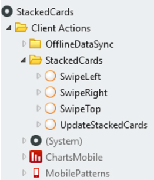

# Public Actions

## Carousel

You can use the [Carousel](<carousel.md>) actions described below anywhere in OutSystems.

### CarouselGoTo Action

Use this action to go to a specific element in the Carousel. It works on static elements or elements created with a list. When the button that is assigned this action is pressed, the Carousel moves to the specific position of the element. If that position doesn't exist, the Carousel jumps to the last element.

### CarouselNext Action

Use this action to move to the next element in the DOM.

### CarouselPrevious Action

Use this action to move to the previous element in the DOM.

### UpdateCarousel Action

Use this action on the ListRemove action. The action destroys all the dots and recreated them in the DOM based on the number of elements on the Carousel.

### ListRemove

To remove elements from the Carousel, create an action with the ListRemove and UpdateCarousel actions.

## Stacked Cards

You can use the [Stacked Cards](<stackedcards.md>) actions described below anywhere in OutSystems.

### SwipeLeft Action

Calling this public action in relation to a button triggers the SwipeRight action and moves the card. You need to set the Stacked Cards ID (Widget ID).

### SwipeRight Action

Calling this public action in relation to a button triggers the SwipeRight action and moves the card. You need to set the Stacked Cards ID (Widget ID).

### SwipeTop Action

Calling this public action in relation to a button triggers the SwipeTop action and moves the card. You need to set the Stacked Cards ID (Widget ID).

### UpdateStackedCards Action

You must use this action on the ListRemove action. The action updates all cards and rearranges the order, scale, and opacity of each one of them.

### ListRemove

To remove elements from the Stacked Cards, create an action with the ListRemove and UpdateCarousel actions (see the example below).

