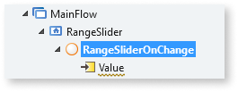

# Range Slider

You can use the Range Slider UI Pattern to allow users select a single value between two range values. This pattern enables the adjustment of content within a predetermined range. Moving the slider along the track, increases or decreases the value.  

## How to use the Range Slider UI Pattern

In this example, we create a Range Slider that allows the user select the number of months it will take them to pay back a loan.

1. In Service Studio, in the Toolbox, search for `Range Slider`. 

    The Range Slider widget is displayed.

    

1. From the Toolbox, drag the Range Slider widget into the Main Content area of your application's screen.

    

1. On the **Properties** tab, enter the the minimum, maximum, and  initial values. In this example, we add static values.

    

1. To create an **OnChange** event, on the **Properties** tab, from the **Handler** drop-down, select **New Client Action**. 

    

    By deafult, the **Value** input parameter is created.  
    
    

1. From the Toolbox, drag the Container widget into the Main Content area of your application's screen, and add your content to the Container placeholder. In this example we add some text and an expression.

    

1. To create a variable for the expression, right-click your screen name, select **Add Local Variable**, and on the **Properties** tab, enter a name and data type (in this example, we use Decimal).

    

1. To bind the new variable to the expression, double-click the expression widget, and in the **Expression Value** editor, select the variable you just have created, and click **Done**.

    

1. So that the **Value** paramenter reads the range slider selection, double-click your client action, and from the Toolbox, add the **Assign** action to the client action.

    

1. Set the Assign **Variable** to the local variable you created, and the Assign **Value** to the automatically generated input parameter (Value).

    

1. From the **Properties** tab, you can change the Range Slider's look and feel by setting the (optional) properties.

    

After following these steps and publishing the module, you can test the pattern in your app. 

**Result**

## Properties

**Property** |  **Description** |
---|---|---  
 MinValue (Decimal): Mandatory  |  Slider's minimum value. 
Examples <ul><li>_1_ - The slider's minimum value is 1.</li> </ul>
 |  
 MaxValue (Decimal): Mandatory  |  Slider's maximum value. 
Examples <ul><li>_100_ - The slider's maximum value is 100.</li></ul>
   | 
 InitialValue (Decimal): Mandatory  |  Value selected by default when the page is rendered. Must be between min and max values. 
Examples <ul><li>_10_ - Slider's default value when the page is rendered is 10.</li></ul>
 |
 Step (Decimal): Optional  | The slider moves in increments of steps.
Examples <ul><li>_Blank_ - The slider increases in steps of 1. This is the default value. </li><li>_10_ - The slider increases in steps of 10.</li></ul>
  |   
 ShowPips (Boolean): Optional  | If True, pips are shown below the slider. This is the default value. If False, no pips are shown. | 
 PipsStep (Integer): Optional  |  Range interval after which a Pip is drawn (when ShowPips is enabled). If not specified, the component will try to guess what step fits your data.  |
 ChangeEventDuringSlide (Boolean): Optional  | If True, a change event is triggered while the slider is being dragged. This is the default value. If False, the change events are only triggered when the user releases the slider. **Tip**: If you're refreshing a query based on the value of the slider, you probably want to set this to False.  | 
 IsDisabled (Boolean): Optional | If True, the slider is disabled. If False, the slider is enabled. This is the default value. | 
 IsVertical (Boolean): Optional | If True, the slider orientation is vertical. If False, the slider orientation is horizontal. | 
 VerticalHeight (Integer): Optional | If IsVertical is True, use this property to set the height (in px) of the slider. 
Examples <ul><li>_Blank_ - The slider is 100px high. This is the default value. </li><li>_250_ - The slider is 250px high.</li></ul>
 | 
 AdvancedFormat (Text): Optional  |  Allow for more options beyond what is provided through the input parameters. For more information, visit: https://kimmobrunfeldt.github.io/progressbar.js/. Example: `{ easing: 'bounce' }` |