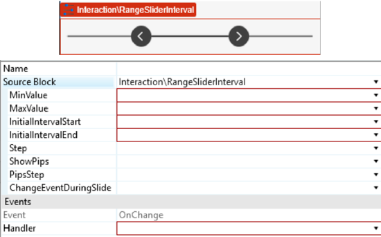
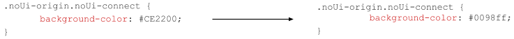
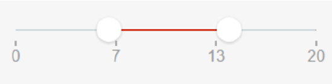
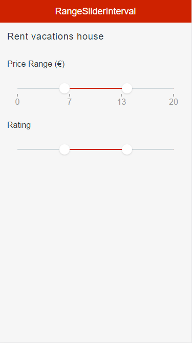

# RangeSliderInterval Pattern

The RangeSliderInterval pattern enables you to set an interval by dragging two handles. You can control an interval value with simple and interactive user input.

## How to Use the RangeSliderInterval Pattern

1\. Bind your variables to the InitialIntervalStart and InitialIntervalEnd inputs and use the OnChange event to add your logic to handle value changes.

  

2\. After setting the MinValue, MaxValue, InitialIntervalStart and the InitialIntervalEnd, create the OnChange event.

  

3\. Create an integer value and assign it.

  

**Result**:

### Changing the Color of the Bar

### Changing the Size of the Handles

## Input Parameters

**Input Name** |  **Description** |  **Default Value**  
---|---|---  
 |  MinValue  |  Slider's minimum value.  |  none  
 |  MaxValue  |  Slider's maximum value.  |  none  
 |  InitialIntervalStart  |  Value selected by default. Must be between min and max values.  |  none  
 |  InitialIntervalEnd  |  Default value for the interval's end. Must be between min and max values.  |  none  
 |  Step  |  Slider moves in increments of Step. If Step is 10, the slider will go from 0 to 10, to 20, to 30, etc.  |  1  
 |  ShowPips  |  Show pips below the slider.  |  _True_  
 |  PipsStep  |  Range interval after which a Pip is drawn (when ShowPips is enabled). If not specified, the component will try to guess what step fits your data.  |  -1  
 |  ChangeEventDuringSlide  |  Trigger Change events while the slider is being dragged. If set to False, the Change events will only be triggered when the user releases the slider.  **Tip**: if you're refreshing a query based on the value of the slider, you probably want to set this to False.  |  _True_  
  
## Events

**Event Name** |  **Description** |  **Mandatory**  
---|---|---  
 OnChange  |  Action to execute after selecting a new value on the slider. Returns the new IntervalStart and the new IntervalEnd.  |  _True_  
  
## Layout and Classes

## CSS Selectors

**Element** |  **CSS Class** |  **Description**  
---|---|---  
 |  noUi-handle  |  .noui-active  |  Class added when you click the handle.  
  
## Samples

This sample uses the RangeSliderInterval pattern:

