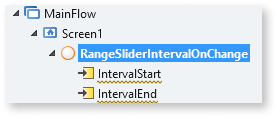
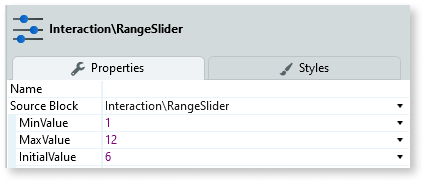

# Range Slider Interval

You can use the Range Slider Interval Pattern to allow users select a single value between two range values. This pattern enables the adjustment of content by predetermined intervals and within a chosen range. Moving the slider along the track, increases or decreases the value. 

## How to use the Range Slider Interval UI Pattern

1. In Service Studio, in the Toolbox, search for `Range Slider Interval`. 

    The Range Slider Interval widget is displayed.

    

1. From the Toolbox, drag the Range Slider widget onto your application's screen.

1. Bind your variables to the InitialIntervalStart and InitialIntervalEnd inputs and use the OnChange event to add your logic to handle value changes.

      

1. After setting the MinValue, MaxValue, InitialIntervalStart and the InitialIntervalEnd, create the OnChange event.

      

1. Create an integer value and assign it.

      

After following these steps and publishing the module, you can test the pattern in your app. 

**Result**

### Changing the color of the bar

### Changing the size of the handles

## Properties

**Property** |  **Description** |  
---|---|
|  MinValue  |  Slider's minimum value.  |
|  MaxValue  |  Slider's maximum value.  |  none  
 |  InitialIntervalStart  |  Value selected by default. Must be between min and max values.  |  none  
 |  InitialIntervalEnd  |  Default value for the interval's end. Must be between min and max values.  |  none  
 |  Step  |  Slider moves in increments of Step. If Step is 10, the slider will go from 0 to 10, to 20, to 30, etc.  |  1  
 |  ShowPips  |  Show pips below the slider.  |  _True_  
 |  PipsStep  |  Range interval after which a Pip is drawn (when ShowPips is enabled). If not specified, the component will try to guess what step fits your data.  |  -1  
 |  ChangeEventDuringSlide  |  Trigger Change events while the slider is being dragged. If set to False, the Change events will only be triggered when the user releases the slider.  **Tip**: if you're refreshing a query based on the value of the slider, you probably want to set this to False.  |  _True_  
  
