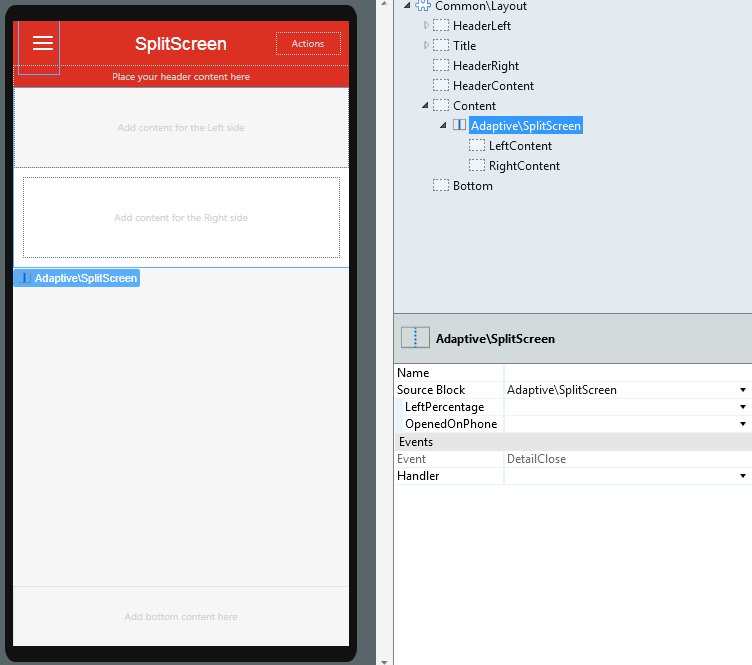
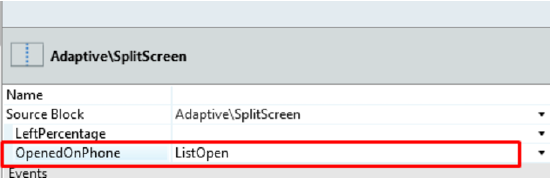
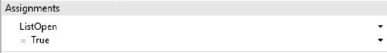
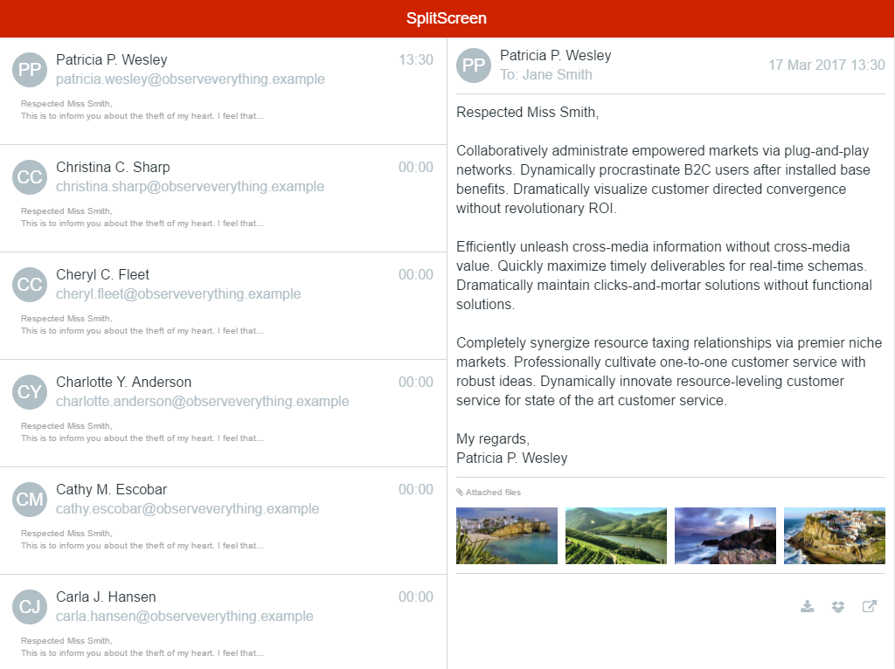

# SplitScreen Pattern

In a tablet, the SplitScreen pattern splits the screen vertically in two independent panels. The width of the left panel can be configured in a percentage of the screen. The Pattern adapts gracefully to a phone layout by showing only one panel at a time.

This is a common tablet pattern, which you can use when the right panel displays the details of the selected item on the left.

Here's the preview in Service Studio:

## How to Use the SplitScreen Pattern

Define the percentage of the screen that the left side will occupy and bind a variable to handle the state of the right area on mobile phones (open and close). You can also bind your own logic to the **DetailClose** event.

1\. Create a local boolean variable and set it on the **OpenedOnPhone** parameter.

2\. To open the detail of the clicked element, use a link for an action and set your local variable to _True_ . Add logic to open the correct detail.

3\. To close the detail, create an action and set your local variable to _False_ , and use this action in the event **DetailClose**. Add logic in this process.

### Phone Landscape with the Same Behavior as Tablet

In **Service Studio** , open the **Style Sheet Editor** , and add the following code:

    
    
    .phone.landscape .split-left {
             width: **x; /* Enter the width value for the left side */**
    }
    
    
    
    .phone.landscape .split-right {
             -webkit-transform: translateX(0) translateZ(0);
                    transform: translateX(0) translateZ(0);
            width: **x; /* Enter the width value for the right side */**
             left: auto;
            right: 0;
            border-left: 1px solid #d3d3d3;
    }
    
    
    .phone.landscape .detail-open .split-right-close {
            opacity: 0;
            pointer-events: none;
    }
    
    
    .phone.landscape .detail-open .app-menu-icon {
            opacity: 1;
            pointer-events: auto;
    }
    

## Input Parameters

**Input Name** |  **Description** |  **Default Value**  
---|---|---  
 |  LeftPercentage  |  Percentage given to the left side of the split screen.  |  50%  
 |  OpenedOnPhone  |  Used to open and close the right side of the splitscreen ( detail ).  |  _False_  
  
## Events

**Event Name** |  **Description** |  **Mandatory**  
---|---|---  
 DetailClose  |  Triggered when the detail (or right side of the splitscreen) is closed.  |  _False_  
  
## Layout and Classes

## CSS Selectors

**Element** |  **CSS Class** |  **Description**  
---|---|---  
 |  MasterDetail Wrapper  |  .split-screen-wrapper  |  Container that wraps elements in left and right container.  
 |  Left Content  |  .split-left  |  Add content for the Left side.  
 |  Right Content  |  .split-right  |  Add content for the Right side. In phone view, this Element is off canvas.  
 |  Close Right Content  |  .split-right-close  |  
  
## Compatibility with other Patterns

Use this pattern alone inside the screen content because it will adapt to the height of the parent element. Avoid using it inside patterns with swipe events, like Tabs or Carousel.

## Samples

The following sample uses the SplitScreen pattern:

