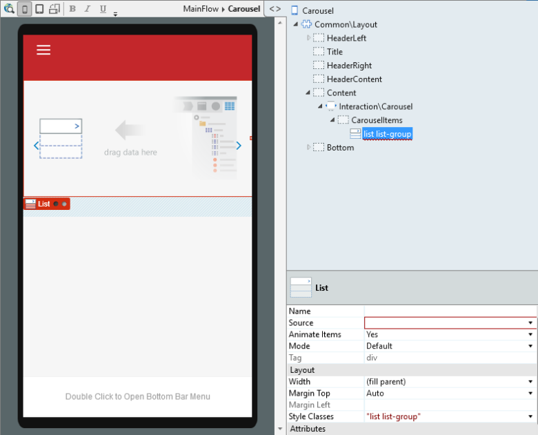
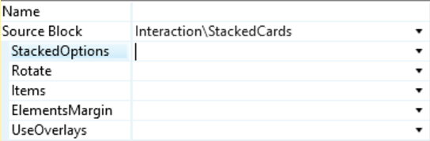
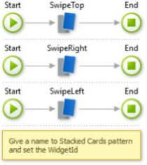

# Stacked Cards

The Stacked Cards pattern includes multiple items. For dynamic content, use a List directly inside the Content placeholder. The content displayed when swiping left, right and top is dynamic and must be set by the user. Use this pattern to create a message board or to display multiple images.

Use this pattern when you want to display your elements dynamically in phone or tablet apps. It’s fully compatible with all templates and screens.

Here's the preview in Service Studio:

## How to Use the Stacked Cards Pattern

1\. Drag the Stacked Cards pattern into your screen.

2\. Put your content into the Content placeholder.

3\. All available options have default parameters, but you can change them.

4.To use the overlays ( **UseOverlays** is _True_ by default), place content inside the respective placeholders ( **OverlayTop** , **OverlayRight** , **OverlayLeft**).

a. If the option " **Use Overlays** " is set to _True_ and you don’t place content in the placeholders, they will not be displayed.  
b. If you change the option “ **Use Overlays** ” to _False_ and add content to the placeholders, they will not be displayed.

5\. Publish your mobile app.

### Adding Styles to Elements

This example shows you how to add styles to elements in the Pattern:

    
    
    .stackedcards-bottom, .stackedcards-top, .stackedcards-none {
         border-bottom: 1px solid #ebebeb; // Add a border-bottom to all elements
        background-color: #000; // Set a background-color to all elements
    }
    

### Setting the Full Height of Elements

To set the full height of your elements in the Pattern so they fill the entire screen, use this CSS code:

    
    
    .stackedcards-container,
    .stackedcards {
        height: 100vh;
        -servicestudio-height: auto;
    }
    

### Defining Specific Heights for All Elements

The height of the first element defines the height of each element in the Pattern. To set a specific height, use this CSS code:

    
    
    .stackedcards-container {
        height: 500px; // set your height
    }
    

### Applying Different Background Colors to Overlays

The overlays are enabled by default and have default colors in the Pattern. If you don’t want to use them, set “ **UseOverlays** ” to _False_ .

1\. If the option " **UseOverlays** " is set to _True_ and you don’t place content in the placeholders, they will not be displayed.

2\. If you change the option “ **UseOverlays** ” to _False_ and add content to the placeholders, they will not be displayed.

You can set other colors either by adding a container to **OverlayTop** , **OverlayRight** or **OverlayLeft** , and set your class. Or by using the following CSS code:

    
    
    .stackedcards-overlay.top {
         background-color: #2980b9; //set your background-color
    }
    .stackedcards-overlay.right {
        background-color: #27ae60; //set your background-color
    }
    .stackedcards-overlay.left {
        background-color: #c0392b; //set your background-color
    }
    

### Creating a Button to Execute Swipes

Create each action and drag the [public actions](<public-actions.md>) (SwipeLeft, SwipeRight or SwipeTop). In the Stacked Cards block, associate the handler to swipe events.  

### Creating a ListRemove Button

Create an “OnListRemove” action and drag the ListRemoveNode and the UpdateStackedCards in the [public actions](<public-actions.md>) of the block.

## Input Parameters

**Input Parameters** |  **Description** |  **Default Value**  
---|---|---  
 StackedOptions  |  Change stacked cards view from bottom, top or none.  |  View from bottom  
 Rotate  |  Activate the elements’ rotation for each move on stacked cards.  |  _True_  
 Items  |  Number of visible elements when the stacked options are bottom or top.  |  5  
 ElementsMargin  |  Define the distance of each element when the stacked options are bottom or top.  |  5  
 UseOverlays  |  Enable or disable the overlays for swipe elements.  |  _True_  
  
## Events

**Event Name** |  **Description** |  **Mandatory**  
---|---|---  
 OnItemChange  |  Return the active card's position.  |  _False_  
 OnLeftSwipe  |  Triggered when swiping left.  |  _False_  
 OnRightSwipe  |  Triggered when swiping right.  |  _False_  
 OnTopSwipe  |  Triggered when swiping top.  |  _False_  
  
## Layout

## CSS Selectors

**Element** |  **CSS Class** |  **Description**  
---|---|---  
 Stacked Cards Wrapper  |  .stackedcards  |  Container that wraps all Stacked cards elements.  
 Selected Active Element  |  .stackedcards-active  |  Represents the currently active element.  
 Overlay Top  |  .stackedcards-overlay top  |  Represents the overlay top with the content placed.  
 Overlay Right  |  .stackedcards-overlay right  |  Represents the overlay right with the content placed.  
 Overlay Left  |  .stackedcards-overlay left  |  Represents the overlay left with the content placed.  
  
## Compatibility with Other Patterns

Avoid using the Stacked Cards Pattern inside patterns with swipe events / touch events, like [Tabs](<tabs.md>) or [Carousel](<carousel.md>).

## Samples

The following samples use the Stacked Cards pattern:

