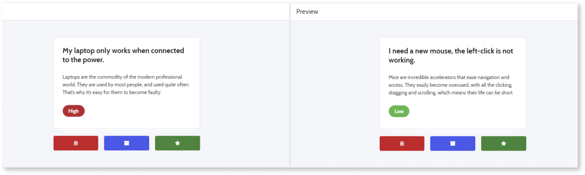
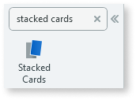
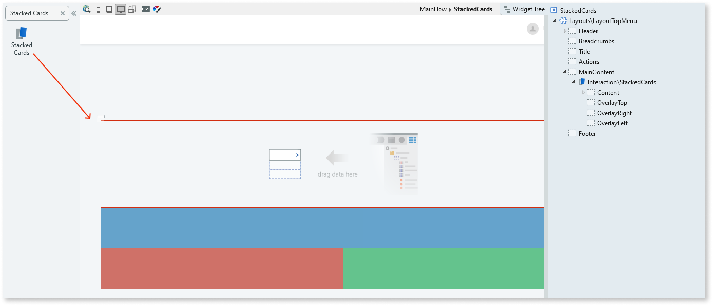

# Stacked Cards

You can use Stacked Cards UI Pattern to add swipeable cards that can be dragged in multiple directions triggering events, such as deny, approve, and archive. This pattern is ideal when you want to individually scan multiple cards.

   

## How to use the Stacked Cards Pattern

1. In Service Studio, in the Toolbox, search for  `Stacked Cards`. 

    The Stacked Cards widget is displayed.

    

1. From the Toolbox, drag the Swipe Events widget into the Main Content area of your application's screen.

    

    By default, the Stacked Cards widget contains a Content placeholder with a list, as well as an Overlay Top, Overlay Right and Overlay Right placeholders. 

1. Add content to the **Content** placeholder.

    In this example, we delete the list and add images by dragging the Image widget into the COntent placeholder. You can also add a list of images.

    

1. From the Element Tree, select the Image widget, and on the **Properties** tab, from the Image drop-down, select or import the image you want in the Stacked Cards pattern.

    Note: In this example, the image property is set to **Local** image. You can also add [External and Binary Data](../../../../develop/ui/image/display-image.md) images.

1. Repeat step 4 for each of the images.

1. Add content to the Overlay placeholders (optional). In this example, we add an icon to each of the placeholders. 

    

After following these steps and publishing the module, you can test the pattern in your app.

## Properties

**Property** |  **Description** |  
---|---|---  
StackedOptions (StackedCardsPosition Identifier): Optional |  Change stacked cards view from bottom, top, or none.  
Examples <ul><li>_Entities.StackedCardsPosition.Bottom_ - The stacked cards are positioned on the bottom. This is the default. </li><li>_Entities.StackedCardsPosition.Top_ - The stacked cards are positioned on top. </li></ul>
 | 
Rotate (Boolean): Optional| If True, the rotation for each move on the stacked cards is activated. This is the default. If False, each move is not activated.  |  
Items (Integer): Optional |  Number of visible elements when the StackedOptions property is set to bottom or top. 
Examples <ul><li>_Blank_ - 5 elements are visible. This is the default. </li><li>_3_ - 3 elements are visible. </li></ul>
  | 
ElementsMargin |  Define the distance between each element when the StackedOptions property is set to bottom or top. 
Examples <ul><li>_Blank_ - 5 elements are visible. This is the default. </li><li>_3_ - 3 elements are visible. </li></ul>
 | 
UseOverlays (Boolean): Optional | If True, overlays for swipe elements are enabled. This is the default. If False, the overlays are disabled.
  
## Compatibility with other patterns

Avoid using the Stacked Cards Pattern inside patterns with swipe events / touch events, like [Tabs](<tabs.md>) or [Carousel](<carousel.md>).

## Samples

The following samples use the Stacked Cards pattern:

