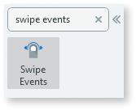

# Swipe Events

You can use the Swipe Events UI Pattern to enable swiping on a specific widget.

## How to use the Swipe Events UI Pattern

the following example shows how you can use the Swipe Events UI pattern to open a sidebar.

1. In Service Studio, in the Toolbox, search for  `Swipe Events`. 

    The Swipe Events widget is displayed.

    

1. From the Toolbox, drag the Swipe Events widget onto your application's screen.

1. On the **Properties** tab, create a local variable called isOpen. This is used in the sidebar.

    

After following these steps and publishing the module, you can test the pattern in your app. The result should look something like the following:

## Properties

**Property** |  **Description** |  **Default Value**  
---|---|---  
 |  WidgetId  |  Element that will be swipeable.  |  none  
  
  
## Compatibility with other patterns

There might be conflicts with any pattern with touch events (unless the code is altered to support the behavior). For example, using the sidebar ID  instead of a container in the previous example.

  * HorizontalScroll 
  * [Carousel](<carousel.md>)
  * [TouchEvents](<touchevents.md>)
  * [StackedCards](<stackedcards.md>)
  * Notification 
  * Sidebar 

## Samples

The following sample uses the Swipe Events UI Pattern:

## See also
* OutSystems UI Pattern Page: [Swipe Events](https://outsystemsui.outsystems.com/OutSystemsUIWebsite/PatternDetail?PatternId=70)