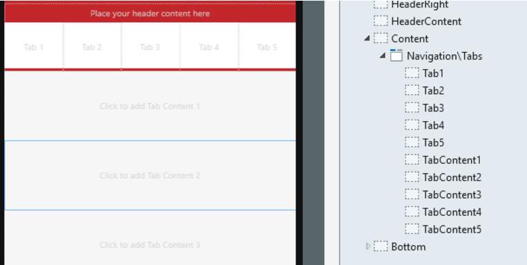
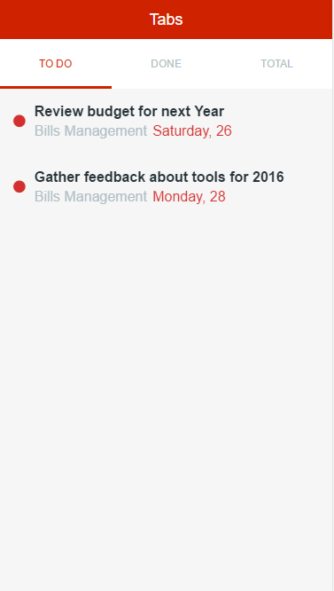

# Tabs

You can use the Tabs UI Pattern to display large sets of information, which can be split into different areas, while always remaining a click away. 

## How to use the Tabs UI Pattern

1. In Service Studio, in the Toolbox, search for `Tabs`. 

    The Tabs widget is displayed.
    
    
    
3. From the Toolbox, drag the Tabs block onto your application's screen. 

    

4. Add your content to the Content placeholders.

     * The **Tab 1** - **Tab 5** placeholders represent the header tabs.

     * The **Tab Content 1** - **Tab Content 5** placeholders represent the content of each tab.   

5. On the **Properties** tab, set the **StartingTab** property to display the tabs when rendering.

After following these steps and publishing the module, you can test the pattern in your app.

### Add styles to tabs and content

The following CSS code is an example of how to change the style of selected items in the tabs:

    
    
    .tabs-header-tab {
         background-color: #ebebeb;
    }
    
    
    .tabs-header-tab.active {
        border-bottom: 3px solid #000;
        background-color: #ebebeb;
        color: #0097eb;
    }
    
    
    .tabs-content-tab {
        background-color: #ccc;
        padding: 20px;
        font-size: 18px;
        font-stretch: condensed;
    }

### Hide tabs with no content

All Silk patterns hide _divs_ with no content. If you only need 2 or 3 tabs, and you want to hide the others, you don’t need to do anything.

## Properties

**Property** |  **Description** |  **Default Value**  
---|---|---  
 StartingTab  |  Index of the currently active tab.  |  0  
  
  
## Device and pattern compatibility

* Incompatibility with RTL on Android devices with 4.4.2 OS version.

* Avoid using the Tabs Pattern inside patterns with swipe events, such as the Stacked Cards or Carousel Patterns.

## Samples

The following samples use the Tabs pattern:

## See also

* OutSystems UI Live Style Guide: [Tabs](https://outsystemsui.outsystems.com/WebStyleGuidePreview/Tabs.aspx)
* OutSystems UI Pattern Page: [Tabs](https://outsystemsui.outsystems.com/OutSystemsUIWebsite/PatternDetail?PatternId=73)