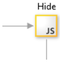
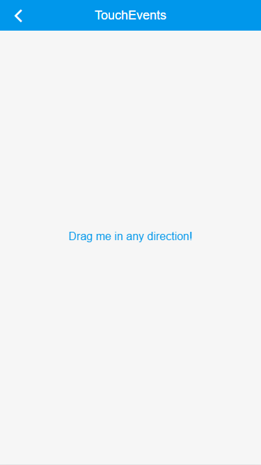

# Touch Events 

You can use the Touch Events UI Pattern to enable touch events on a specific widget.

## How to create custom patterns using the Touch Events UI Pattern

You can call the **event.preventDefault()** to prevent the default action associated with each event from occurring. The touchstart and touchend events don't need this action, but touchmove requires it to stop screen scrolling when the user is moving the finger inside the element.

To use the **event.preventDefault()**, use the following string of code:

`$parameters.Evt.preventDefault();`

## How to hide a header during a scroll action

You can use the Touch Events UI pattern to hide a header during a scroll action.

1. Add the **TouchEvents** pattern to the **Layout** block.

    

1. Add an **End** event.

    

1. Add logic.

    

After following these steps and publishing the module, you can test the pattern in your app.

| Element | Code |
|---|---| 
| |  var header = document.querySelector(".hearder");%%header.classList.add("hide");%%header.classList.add("header-on-scroll");  |
| |  var header = document.querySelector(".header");%%header.classList.remove("hide");%%header.classList.remove("header-on-scroll"); | 
  
**Result**

## Properties

|**Property** |  **Description** |
|---|---| 
| WidgetId  |  This is the element that responds to the touch you configure.| 

## Compatibility with other patterns

There might be conflicts with any pattern with touch events (unless the code is altered to expect this behavior).

## Samples

The following sample uses the Touch Events pattern:

