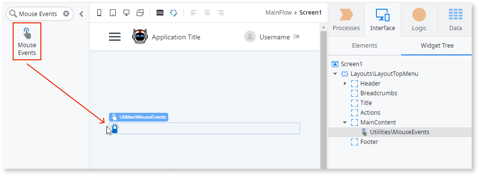
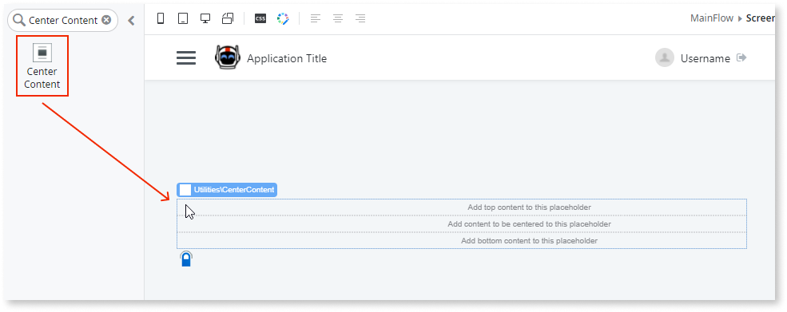
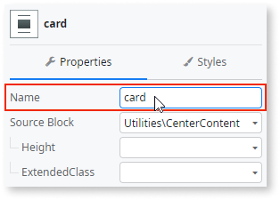
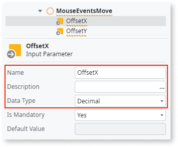
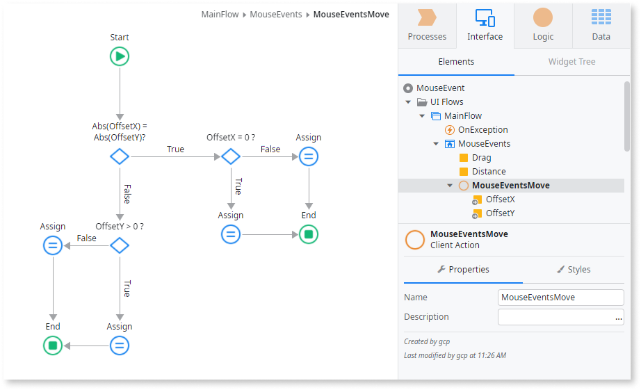
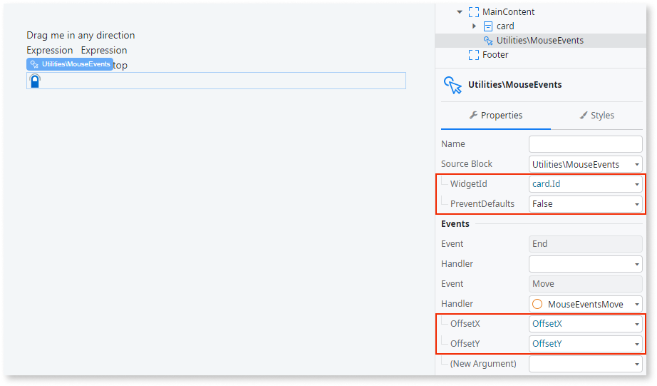

# Mouse Events

You can use the Mouse Events UI Pattern when the user needs to select elements on the interface with high precision.

## How to Use the Mouse Events UI Pattern

The following example shows how you can use the Mouse Events UI pattern to display the distance the mouse is dragged left and right across the screen.

1. In Service Studio, in the Toolbox, search for `Mouse Events`.

    The Mouse Events widget is displayed.

    

1. From the Toolbox, drag the Mouse Events widget into the Main Content area of your application's screen.

    

1. From the Toolbox, drag the Center Content widget into the Main Content area of your screen.
 
    

1. On the **Properties** tab, enter a name in the **Name** property. In this example, we enter `card`.

    

1. Add 2 local variables by right-clicking on your screen name and selecting **Add Local Variable**.

    In this example we call name them **Drag** and **Distance**. Both local variables are of data type text.

    

1. Add the relevant content to the Center Content widget placeholders. 

   In this example, we add text and 2 expressions to the Center placeholder, and text to the Bottom placeholder. 

   

   Each of the expressions are set to the local variables respectively (**Drag** and **Distance**). 

   

1. Add a client action by right-clicking your screen name and selecting **Add Client Action**. 

1. Enter a name for the client action. In this example, we enter `MouseEventsMove`.

   

1. Add 2 input parameters by right-clicking the client action and selecting **Add Input Parameter**.

    In this example, we add the **OffsetX** and **OffsetY** input parameters and set their data type to decimal.

    

1. Add the relevant logic to the client action. In this example, we add the following:

    

  1. Select the Mouse Events widget and set the **WidgetId**, **PreventDefaults**, and the **Handler** properties. 

    In this example, the **WidgetId** is set to **card.Id**, the **PreventDefaults** to **False**, **OfFsetX** to **OffsetX**, and **OffsetY** to **OffsetY**.

    

After following these steps and publishing the module, you can test the pattern in your app.

## Properties

|**Property** |  **Description** |
|---|---| 
| WidgetId (Text): Mandatory  |  The element that responds to the mouse event you configure.|
| PreventDefaults (Boolean): Optional | If True, events propagation to the screen and other widgets is stopped. This is the default. If False, event propagation to the screen and other widgets is enabled.  |
