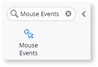
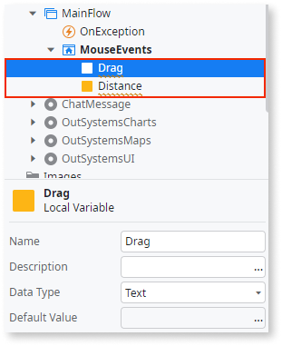
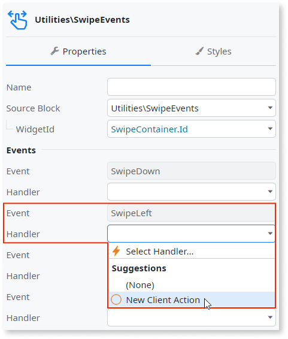
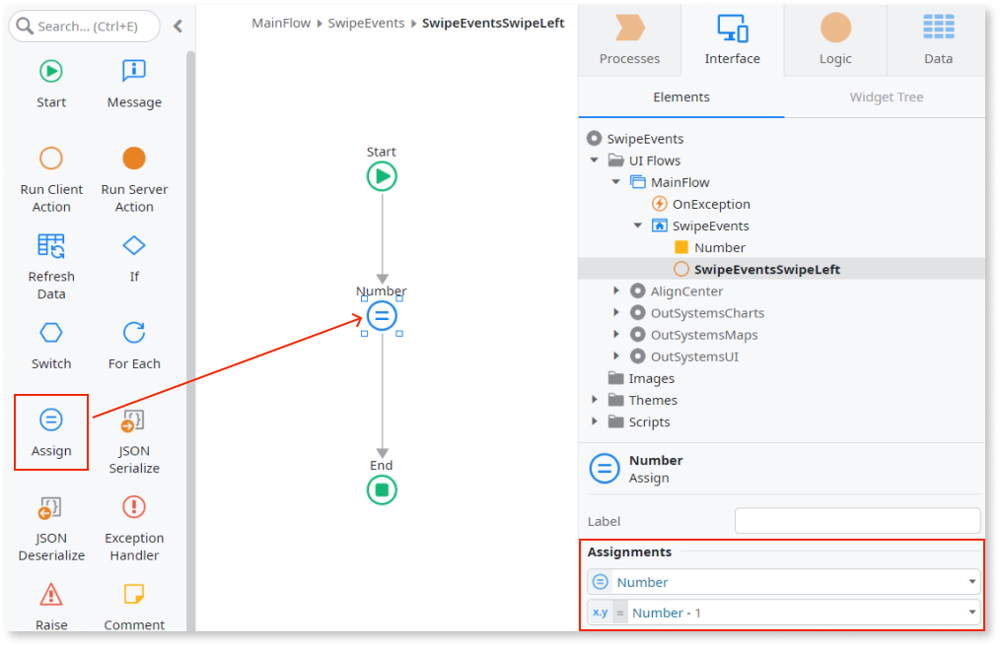

# Mouse Events

You can use the Mouse Events UI Pattern when the user needs to select elements on the interface with high precision.

## How to use the Mouse Events UI Pattern

The following example shows how you can use the Mouse Events UI pattern to increase a number when a button is clicked.

1. In Service Studio, in the Toolbox, search for `Mouse Events`.

    The Mouse Events widget is displayed.

    

1. From the Toolbox, drag the Mouse Events widget into the Main Content area of your application's screen.

    

1. Add a local variable by right-clicking on your screen name and selecting **Add Local Variable**.

    

1. Enter a name, a data type, and a default value for the new variable. In this example, we enter `Number`, `Integer`, and `0` respectively.

    

1. Drag the new variable into the Main Content area of your application's screen.

    

1. From the Toolbox, drag the Container widget into the Main Content area of your application's screen and on the **Properties** tab, enter a name. In this example we enter `MouseContainer`. We also enter the text `Drag me in any direction!`.

    

1. From the **Widget Tree**, select the Mouse Events widget, and on the **Properties** tab, from the **WidgetId** drop-down, select the Id of the container you just created. In this example, we select **MouseContainer.Id**.

    

1. To set the action for when the user swipes left, remaining on the **Properties** tab, from the **SwipeLeft Handler** drop-down, select **New Client Action**.

    

1. Assign the relevant logic you want the swipe left action to perform. In this example, we want the number to decrease by 1 every time the user swipes left. To do this, we drag an Assign onto the client action, set the **Variable** to **Number**, and enter ``Number - 1`` for the **Value**.

    

1. Repeat steps 8 and 9 for the **SwipeRightHandler** and so that the number increases when the user swipes right, enter `Number + 1`.

After following these steps and publishing the module, you can test the pattern in your app

## Properties

| Property | Description |
|---|---|
| IsHorizontal (Boolean): Optional | If True, content is displayed horizontally. This is the default. If False, the content is displayed vertically. |
| ExtendedClass (Text): Optional  | 
Add custom style classes to the Align Center UI Pattern. You define your [custom style classes](../../../look-feel/css.md) in your application using CSS.
 
Examples <ul><li>_Blank_ - No custom styles are added (default value).</li><li>_"myclass"_ - Adds the _myclass_ style to the Align Center UI styles being applied.</li><li>_"myclass1" "myclass2"_ - Adds the _myclass1_ and _myclass2_ styles to the Align Center UI styles being applied.</li></ul>
 |
