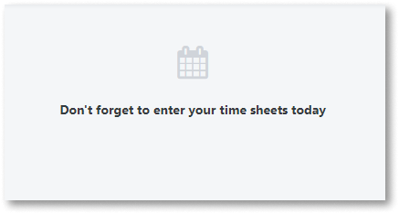
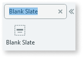
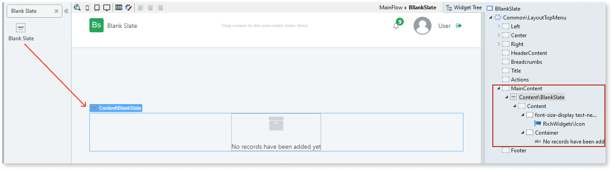
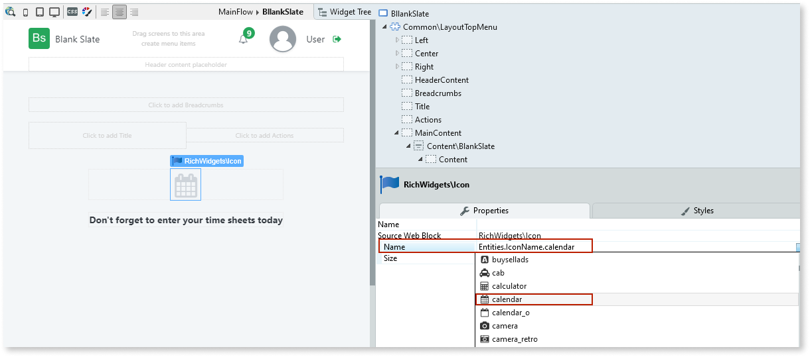

# Blank Slate

Applies only to Traditional Web Apps.

You can use the Blank Slate UI Pattern to inform end users, for example, to complete a task or when there is no data available for display etc.

## How to use the Blank State UI Pattern

1. In Service Studio, in the Toolbox, search for `Blank Slate`.

    The Blank Slate widget is displayed.

    

    If the UI widget doesn't display, it's because the dependency isn't added. This happens because the Remove unused references setting is enabled. To make the widget available in your app:

    1. In the Toolbox, click **Search in other modules**.

    1. In **Search in other Modules**, remove any spaces between words in your search text.
    
    1. Select the widget you want to add from the **OutSystemsUIWeb** module, and click **Add Dependency**. 
    
    1. In the Toolbox, search for the widget again.

1. From the Toolbox, drag the Blank Slate widget into the Main Content area of your application's screen.

    

    By default, the Blank Slate widget contains icon and text placeholders. 

1. Add your content to the placeholders. In this example we change the icon to a calendar icon by selecting the Icon placeholder, and on the **Properties** tab, from the **Name** drop-down, selecting the calendar icon. We also enter new text in the Text placeholder. 

    

After following these steps and publishing the module, you can test the pattern in your app. 

## Properties

| **Property**                                     | **Description**                                                                                                                                                                                                                                                                                                                                                                                                                                                                                                                                                                                                      |
|--------------------------------------------------|----------------------------------------------------------------------------------------------------------------------------------------------------------------------------------------------------------------------------------------------------------------------------------------------------------------------------------------------------------------------------------------------------------------------------------------------------------------------------------------------------------------------------------------------------------------------------------------------------------------------|
| Position (PositionExtended Identifier): Optional | Sets the widget position. 
Examples
<ul><li>Blank - The widget displays in the center of the screen. This is the default.</li><li>Entities.PositionExtended.BottomRight - The widget displays on the bottom right of the screen. </li></ul>                                                                                                                                                                                                                                                                                                                                                                 |
| ExtendedClass (Text): Optional                   | Adds custom style classes to the Pattern. You define your [custom style classes](../../../look-feel/css.md) in your application using CSS.
Examples
<ul><li>Blank - No custom styles are added (default value).</li><li>"myclass" - Adds the ``myclass`` style to the UI styles being applied.</li><li>"myclass1 myclass2" - Adds the ``myclass1`` and ``myclass`` styles to the UI styles being applied. </li></ul>You can also use the classes available on the OutSystems UI. For more information, see the [OutSystems UI Cheat Sheet](https://outsystemsui.outsystems.com/OutSystemsUIWebsite/CheatSheet). |
