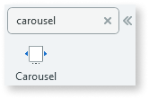

# Carousel

We’ve been working on this article. Please let us know how useful this new version is by voting.

You can use the Carousel UI Pattern to display multiple items in a horizontal slide. This pattern is ideal for creating horizontal slides in smaller screens. You can also use this pattern for dynamic content, by placing a List directly inside the placeholder.

**How to use the Carousel UI Pattern**

1. In Service Studio, in the Toolbox, search for `Carousel`.
  
     The Carousel widget is displayed.

    

    If the UI widget doesn't display, it's because the dependency isn't added. For example, if you are using a ready-made app, it deletes unused widgets from the module. To make the widget available in your app:

    1. In the Toolbox, click **Search in other modules**.

    1. In **Search in other Modules**, remove any spaces between words in your search text.
    
    1. Select the widget you want to add from the **OutSystemsUIWeb** module, and click **Add Dependency**. 
    
    1. In the Toolbox, search for the widget again.

1. To From the Toolbox, drag the Carousel widget into the Main Content area of your application's screen. 

   

1. Place the content you want to appear in the Carousel into the Items placeholder. (In this example we use images.) 

1. From the Toolbox, drag the [Image widget](<../../../../../ref/lang/auto/Class.Image Widget.final.md>) into the Light Box Image widget. This is a thumbnail image. 

    The **Select Image** pop-up is displayed.

1. Select or import the image you want to display. In this example, we use the sample OutSystems UI images.

    

    Note: In this example, the image property Type is set to **Static**. You can also choose [External URL or Database](../../../../../develop/ui/image/display-image.md).

    To use a Carousel with items from a database, drag a [ListRecords widget](<../../../../../ref/lang/auto/Class.List Records Widget.final.md>) into Items placeholder and create your custom content.

    

1. Repeat steps 4 and 5 for each of the Carousel items.

1. From the Element tree, select the Carousel widget, and on the **Properties** tab, set the relevant (optional) properties, for example, navigation arrows and the number of items to display on different devices.

      

1. After following these steps and publishing the module, you can test the pattern in your app.

## Properties

| Property | Description |
|---|---|
|Margin(Integer): Optional  |  Set the distance between each Carousel item. Default value is 0.
Examples<ul><li>Blank - A distance of 16 pixels between each Carousel item.</li><li>32 - A distance of 32 pixels between each Carousel item.</li></ul>
  |
|Padding(Integer): Optional |  Set the distance between the screen edges and the visible items on the screen. 
Examples<ul><li>Blank - No distance between the screen edges and the on screen item. This is the default value.</li><li>5 - A distance of 5 pixels between the screen edges and the on screen item.</li></ul>
 |
| Pagination(Boolean): Optional  | Enable or disable navigational dots that represent items on the Carousel.
Examples<ul><li>Blank - Navigational dots are displayed. This is the default value.</li><li>True - Navigational dots are displayed.</li><li>False - No navigational dots are displayed.</li></ul>
 |
| Autoplay(Boolean): Optional  | If set to True, the items in the Carousel are displayed automatically (with a 5 second time delay between each item). If set to False, the autoplay functionality is disabled. This is the default value.| 
| Rewind(Boolean): Optional  | If True, a rewind effect is applied when the Carousel reaches the end and the Loop property is enabled. The default behavior is to show the first item without rewinding through the remaining. | 
| Loop(Boolean): Optional  | If set to True, once the last item in the Carousel is reached, it loops around to the first item and begins displaying the all of the items again. If set to False, the slide of the Carousel items ends when the last item is reached. This is the default value.|
| InitialPosition(Integer): Optional  |  Set which element you want to show first in the Carousel. 
Examples <ul><li>Blank - The first element in the Carousel is displayed. This is the default value.</li><li>3 - The 4th element in the Carousel is displayed. </li></ul>
|
|ItemsDesktop(Integer): Optional  |  Number of Carousel items visible at the same time on a desktop.
Examples<ul><li>Blank - 1 item is displayed. This is the default value.</li><li>4 - 4 items are displayed.</li></ul>
 |  
|ItemsTablet(Integer): Optional  | Number of Carousel items visible at the same time on a tablet.
Examples<ul><li>Blank - 1 item is displayed. This is the default value.</li><li>4 - 4 items are displayed.</li></ul>
| 
|ItemsPhone(Integer): Optional  | Number of Carousel items visible at the same time on a phone.
Examples<ul><li>Blank - 1 item is displayed. This is the default value.</li><li>4 - 4 items are displayed.</li></ul>
 |
| ExtendedClass (Text): Optional | Adds custom style classes to the Pattern. You define your [custom style classes](../../../../../develop/ui/look-feel/css.md) in your application using CSS. 
Examples <ul><li>Blank - No custom styles are added (default value).</li><li>"myclass" - Adds the ``myclass`` style to the UI styles being applied.</li><li>"myclass1 myclass2" - Adds the ``myclass1`` and ``myclass2`` styles to the UI styles being applied.</li></ul>
You can also use the classes available on the OutSystems UI. For more information, see the [OutSystems UI Cheat Sheet](https://outsystemsui.outsystems.com/OutSystemsUIWebsite/CheatSheet).|
| AdvancedFormat(Text):Optional  |  Enables you to use more options than what is provided in the properties. For more information, visit: <https://github.com/ganlanyuan/tiny-slider>. 
Example `{ axis: 'vertical' }`
 |
