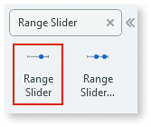
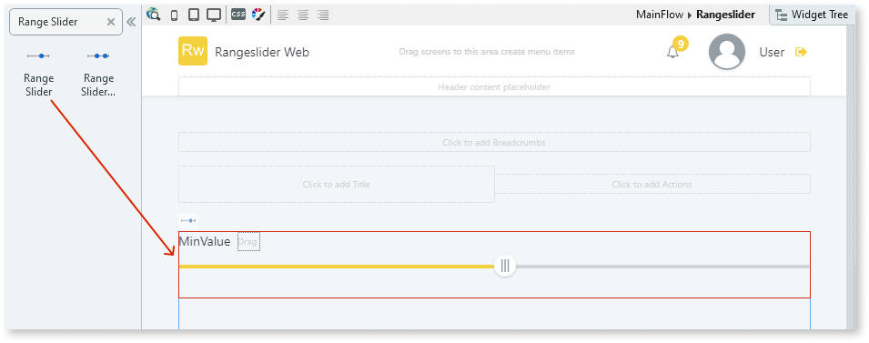
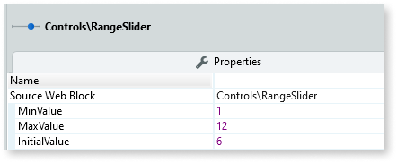
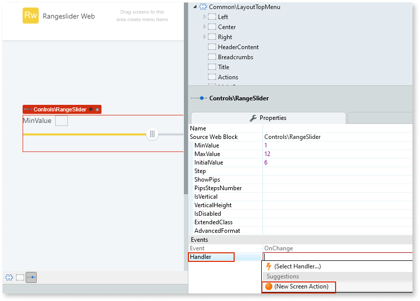
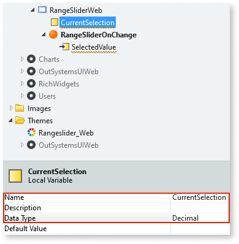
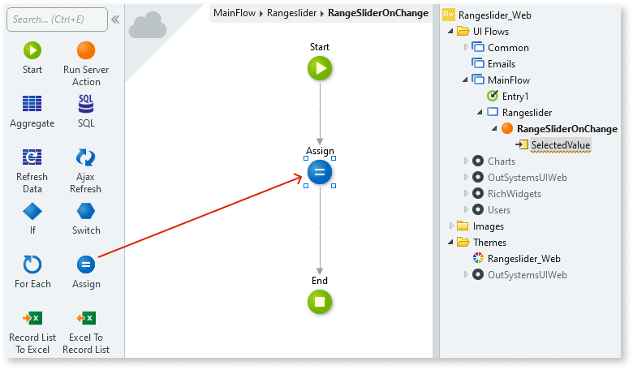
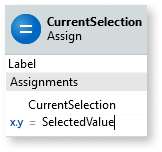
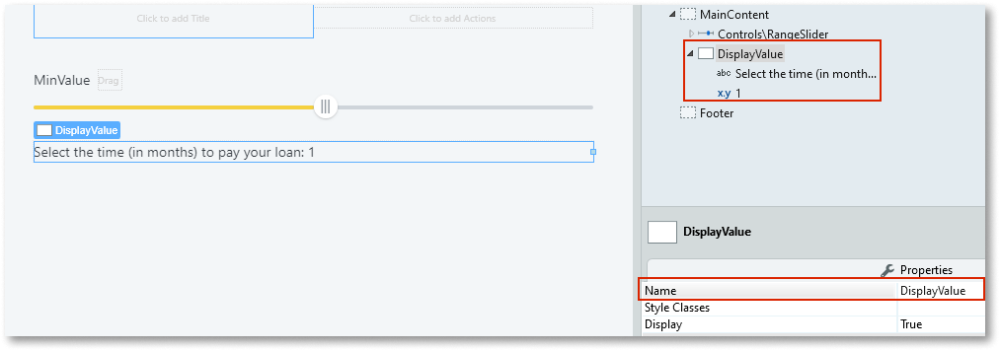
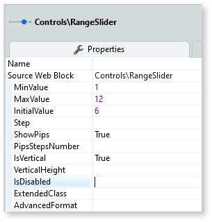

# Range Slider

You can use the Range Slider UI Pattern to allow users select a single value between two range values. This pattern enables the adjustment of content within a predetermined range. Moving the slider along the track, increases or decreases the value.  

**How to use the Range Slider UI Pattern**

In this example, we create a Range Slider that allows the user select the number of months it will take them to pay back a loan.

1. In Service Studio, in the Toolbox, search for `Range Slider`.

    The Range Slider widget is displayed.

    

1. From the Toolbox, drag the Range Slider widget into the Main Content area of your application's screen.

    

1. On the **Properties** tab, enter the minimum, maximum, and initial values for the Range SLider. In this example, we add static values.

    

1. To create an **OnChange** event, on the **Properties** tab, from the **Handler** drop-down, select **New Screen Action**.

    

    By default, the **SelectedValue** input parameter is created.  

    

1. To store the current slider value, create a local variable by right-clicking on your screen name, selecting **Add Local Variable**, and on the **Properties** tab, enter a name and data type (in this example, we use Decimal).

    

1. So that the **SelectedValue** parameter reads the range slider selection, from the Toolbox, add the **Assign** action to the screen action.

    

1. Set the Assign **Variable** to the local variable you created, and the Assign **Value** to the automatically generated input parameter (SelectedValue).

    

1. To display the range slider value, from the Toolbox, drag the Container widget into the Main Content area of your application's screen, enter a name for the Container and add your content to the Container placeholder. In this example, we enter `DisplayValue` for the name and add some text and an expression to the Container.

    

1. From the Toolbox, add the **Ajax Refresh** action to the screen action and in the **Select Widget** pop-up, navigate to and select the Container widget name (in this example, DisplayValue), and click **OK**.

    

1. To bind the new variable to the expression, double-click the expression widget, and in the **Expression Value** editor, select the variable you just have created, and click **Done**.

    

1. From the **Properties** tab, you can change the Range Slider's look and feel by setting the (optional) properties.

    

After following these steps and publishing the module, you can test the pattern in your app.

**Result**

## Properties

| **Property** |  **Description** |
|---|---|
|MinValue (Decimal): Mandatory  |  Slider's minimum value. 
Examples <ul><li>_1_ - The slider's minimum value is 1.</li> </ul>
 |  
|MaxValue (Decimal): Mandatory  |  Slider's maximum value. 
Examples <ul><li>_100_ - The slider's maximum value is 100.</li></ul>
 |
|InitialValue (Decimal): Mandatory  |  Value selected by default when the page is rendered. Must be between min and max values. 
Examples <ul><li>_10_ - Slider's default value when the page is rendered is 10.</li></ul>
 |
|Step (Decimal): Optional  | The increment value for each step. the slider moves in increments of steps.
Examples <ul><li>_Blank_ - The slider increases in steps of 1. This is the default value. </li><li>_10_ - The slider increases in steps of 10.</li></ul>
 |
|ShowPips (Boolean): Optional  | If True, pips are shown below the slider. This is the default value. If False, no pips are shown. |
|PipsStepNumber (Integer): Optional  | Sets the number of Pip steps. This property is only applicable if the ShowPips property is set to True.|
|IsVertical (Boolean): Optional | If True, the slider orientation is vertical. If False, the slider orientation is horizontal. |
|VerticalHeight (Integer): Optional | If IsVertical is True, use this property to set the height (in px) of the slider. 
Examples <ul><li>_Blank_ - The slider is 100px high. This is the default value. </li><li>_250_ - The slider is 250px high.</li></ul>
 |
|IsDisabled (Boolean): Optional | If True, the slider is disabled. If False, the slider is enabled. This is the default value. |
| ExtendedClass (Text): Optional | Add custom style classes to the Range Slider UI Pattern. You define your [custom style classes](../../../look-feel/css.md) in your application using CSS.  Examples  <ul><li>_Blank_ - No custom styles are added (default value). </li><li>_"myclass"_ - Adds the _myclass_ style to the Range Slider UI styles being applied.</li><li>_"myclass1" "myclass2"_ - Adds the _myclass1_ and _myclass2_ styles to the Range Slider UI styles being applied.</li></ul> |  
| AdvancedFormat (Text): Optional  | Allows you to use more options than what is provided in the input parameters. For more options, see [noUiSlider library](https://refreshless.com/nouislider/).
 Example <ul><li>`{ pips: { density: 1 } }`</li></ul>
 |  
