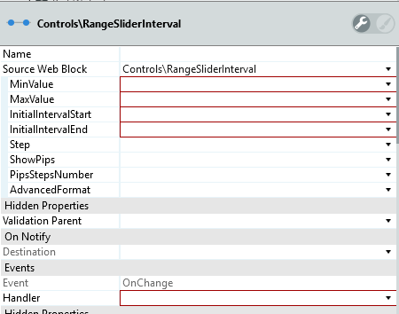

# RangeSliderInterval

Select a single value or a range between two values.

Offer this UI control to let end users select a value or range from a fixed set of options.

**How to use**

Place the range slider pattern on your screen. On the pattern properties, select the minimum and maximum range values.

1. Drag RangeSliderInterval pattern into the preview.

    

1. Enter the mandatory values in the properties pane.

    

## Input parameters

| **Input Name** |  **Description** |  **Type** | **Mandatory** | **Default Value** |
|---|---|---|---|---|
| MinValue  |  Sets lowest possible value. |  Integer | True | none |
| MaxValue  |  Sets highest possible value. |  Integer | True | none |
| InitialValue  |  Value selected by default. Must be between min and max values. |  Integer | False | 1 |
| Step  |  The increment value for each step. For instance, a step of 5 would make the slider jump across 0-5-10-15-20 and so on. The default value is 1. |  Integer | True | none |
| ShowPips  |  If true, displays the range values near the slider. The default value is true. |  Boolean | False | True |
| PipsStepsNumber  | Sets the number of Pip Steps. Only applied if ShowPips is true. |  Integer | False | 0 |
| AdvancedFormat  | Enables you to use more options than what is provided in the input parameters. To find more options that can be used, go to [noUiSlider library](https://refreshless.com/nouislider/ "noUiSlider library"). Example: `{ pips: { density: 1 } }` |  Text | False | "{}" |

## Events

| **Event Name** |  **Description** |  **Mandatory**  |
| ---|---|--- |  
| OnChange | Event triggered once a handler is dragged and the values change.  |  True  |

**Return Values**

* SelectedMinValue: Integer
* SelectedMaxValue: Integer
  
## Layout and classes

## CSS selectors

| **Element** |  **CSS Class** |  **Description**  |
| ---|---|---  
| Lesser handle |  .noUi-handle-lower |  It's the lesser handle, used to customize (use also the :before and :after).  |
| Upper Handle  |  .noUi-handle-upper  |  It's the upper handle, used to customize (use also the :before and :after). |
| Interval  |  .noUi-connect  |  Used to change the color of the interval.  |
  
## Advanced Use Case

### Change the interval color

Write the following CSS in the CSS editor and change the `yourcolor` to your color:

`.range-slider .noUi-connect {
background: yourcolor;
}`

Or using the CSS variables:

`var(--color-yourcolor)`
example:
`.range-slider .noUi-connect {
background: var(--color-red);
}`

### Removing the || of the handlers

1. Create a class `.range-slider .noUi-handle:before, .range-slider .noUi-handle:after`.

1. Set the content to `height: 0px`.

1. Publish the application.

    
