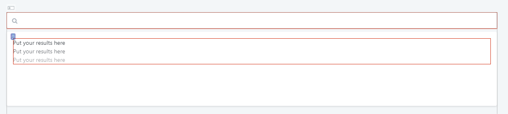
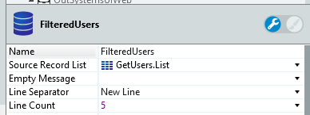
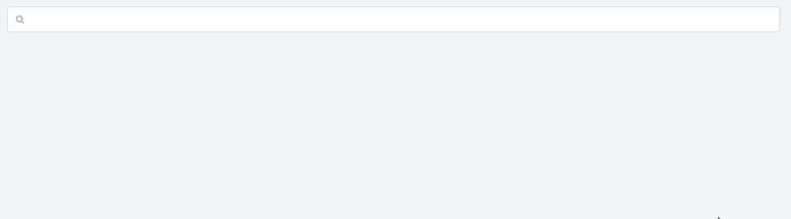

# SearchBalloon

Enables the users to search the content while showing results in a Balloon.

Use the Search Balloon to guide users by, for example, suggesting recommended queries when they create or edit queries in the Search field. 

**How to use**

Drag an Input Widget inside the placeholder. The widget is used as the search input while the Answer Placeholder has the container in which the answers show up.

1. Drag the Search balloon into preview.

1. Set the variable to the search input.
    
    

1. Set the record that you want to use that holds the results of the search. If the list is long, set the Line Count to a smaller number (like 5).

1. Set a name, for example "Filtered Users".
    
    

1. Set an **onChange** action in the search input.

1. Drag a Refresh Data and set your data source as the record that you're using.
    
    

1. Drag an Ajax Refresh and set the Widget as the name that you gave the record on step 3.
    
    

1. Go to the aggregate and double click. Go to the filters and add this filter:
`User.Name like "%" + SearchValue + "%" or User.Username like "%" + SearchValue + "%" or SearchValue = ""` 

1. Publish.

## Input parameters

| **Input Name** |  **Description** |  **Type** | **Mandatory** | **Default Value** |
|---|---|---|---|---|
| ExtendedClass  |  Adds custom style classes to the Tabs Block. |  Text | False | none |
| AdvancedFormat  |  Enables you to use more options than what is provided in the input parameters. Example: `{ arrow: false,   showOnInit: true }`. For more information visit: https://atomiks.github.io/tippyjs/ |  Text | False | none |

## Layout and classes

## Events

| **Event Name** |  **Description** |  **Mandatory**  |
| ---|---|--- |  
| OnHide | Event triggered once the balloon is hidden.  |  False  |
| OnShow | Event triggered once the balloon is shown.  |  False  |

## Advanced

Here are some more advanced use-cases of the widget.

### Show results on init

1. Drag Search Balloon to the preview.
2. On the AdvancedFormat parameter add the following line:
`{ showOnInit: true }`.

### Change animation of results

1. Drag Search Balloon to the preview.
2. On the AdvancedFormat parameter add the following line:
`{ showOnInit: true }`.

