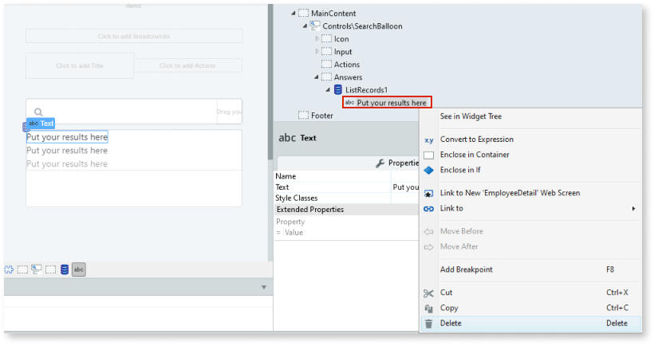

# Search Balloon

Applies only to Traditional Web Apps.

You can use the Search Balloon UI Pattern to provide users with a search field and while the user searches for content, the results are simultaneously updated in a results list.

**How to use the Search Balloon UI Pattern**

In this use case, we create a search balloon for a list of employees.

1. In Service Studio, in the Toolbox, search for `Search Balloon`.

    The Search Balloon widget is displayed.

    

    If the UI widget doesn't display, it's because the dependency isn't added. For example, if you are using a ready-made app, it deletes unused widgets from the module. To make the widget available in your app:

    1. In the Toolbox, click **Search in other modules**.

    1. In **Search in other Modules**, remove any spaces between words in your search text.
    
    1. Select the widget you want to add from the **OutSystemsUIWeb** module, and click **Add Dependency**. 
    
    1. In the Toolbox, search for the widget again.

1. From the Toolbox, drag the Search Balloon widget into the Main Content area of your application's screen.

    

    By default, the Search Balloon widget contains Icon, Input, Actions, and Answers placeholders.

1. Select the Input widget, and on the **Properties** tab, from the **Variable** drop-down, select **New Local Variable**.

    

1. Enter a name for the variable. In this example, we enter `SearchText`.

    

1. Add a preparation action by right-clicking your screen name, and selecting **Add Preparation**.

    

1. Drag the relevant data to the preparation flow. In this example, we drag an **Employee** entity to the preparation flow.

    

1. Select the **ListRecords1** widget, and on the **Properties** tab, from the **Source Record List**  drop-down, select the relevant source list. In this example, we select **GetEmployees.List**. Additionally, we enter `1` in the **Start Index** field.

    

1. Select the **Input** widget, and on the **Properties** tab, from the **Destination** drop-down, select **New Screen Action**.

    

1. Drag a **Refresh Data** node to the OnChange action flow, and in the **Select Data Source** window, select **GetEmployees** and then click **OK**.

    

1. Drag an **Ajax Refresh** node to the OnChange action flow, and in the **Select Widget** window, navigate and select the relevant widget. In this example, we select **ListRecords1** and click **OK**.

    

1. Double-click the Preparation action and then double-click the **GetEmployees** aggregate.

1. Click **Filters**, then click **Add Filter** and in the **Filter Condition** field, enter the relevant logic and click **Done**. In this example, we enter the following condition:

     `Employee.FirstName like "%" + SearchText + "%" or Employee.LastName like "%" + SearchText + "%" or SearchText = ""`.

    This forces the aggregate to return all records that have **SearchText** in the employee's name.

    

1. Double-click your screen name, select the Search Balloon Widget, right-click the Text placeholder, and select **Delete**.

    

1. Drag an Expression Widget to the list and enter the relevant expression value, and click **Done**. In this example, we enter the following:

    `ListRecords1.List.Current.Employee.Name + " "`

    This filters the list to show the employees' name.

    

After following these steps and publishing the module, you can test the pattern in your app.

## Properties

| **Property** |  **Description** |
|---|---|
| ExtendedClass (Text): Optional  |  Adds custom style classes to the Pattern. You define your [custom style classes](../../../look-feel/css.md) in your application using CSS.  Examples   <ul><li>Blank - No custom styles are added (default value).</li><li>"myclass" - Adds the ``myclass`` style to the UI styles being applied.</li><li>"myclass1 myclass2" - Adds the ``myclass1`` and ``myclass2`` styles to the UI styles being applied.</li></ul>You can also use the classes available on the OutSystems UI. For more information, see the [OutSystems UI Cheat Sheet](https://outsystemsui.outsystems.com/OutSystemsUIWebsite/CheatSheet). |
|AdvancedFormat (Text): Optional| Allows you to use more options than what is provided in the input parameters. 
Example <ul><li> `{ arrow: false,   showOnInit: true }`</li></ul>
 For more information, see <https://atomiks.github.io/tippyjs/>. |

