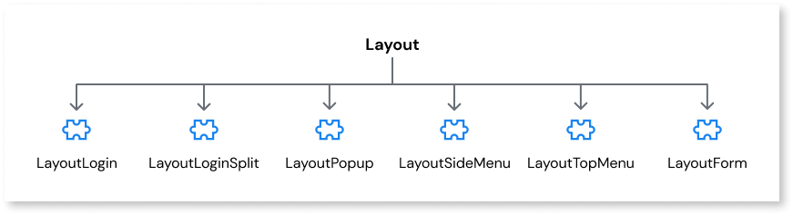

# Layout

The Layout web block helps you define the look and feel of your app. Layout blocks can contains pre-existing web blocks common to multiple screens. Designing an app with Screens that share elements provides users with a more consistent app.

You can add the following pre-existing web blocks to the Layout block:

* [Layout Login](layout-login.md) - web block for a login screen
* [Layout Login Split](layout-loginsplit.md) - web block for a login screen that divides the page into 2 columns
* [Layout Popup](layout-popup.md) - web block useful for displaying additional off-canvas information
* [Layout Side Menu](layout-sidemenu.md) - web block for a side menu
* [Layout Top Menu](layout-topmenu.md) - web block for a fixed top menu and is useful for simple apps, without a complex navigation structure
* [Login Form](layout-loginsplit.md) - web block that can be used to accelerate the creation of a custom login page
