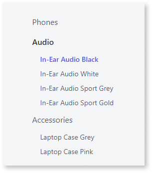
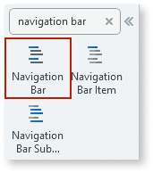
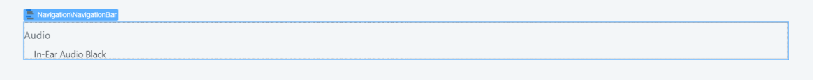
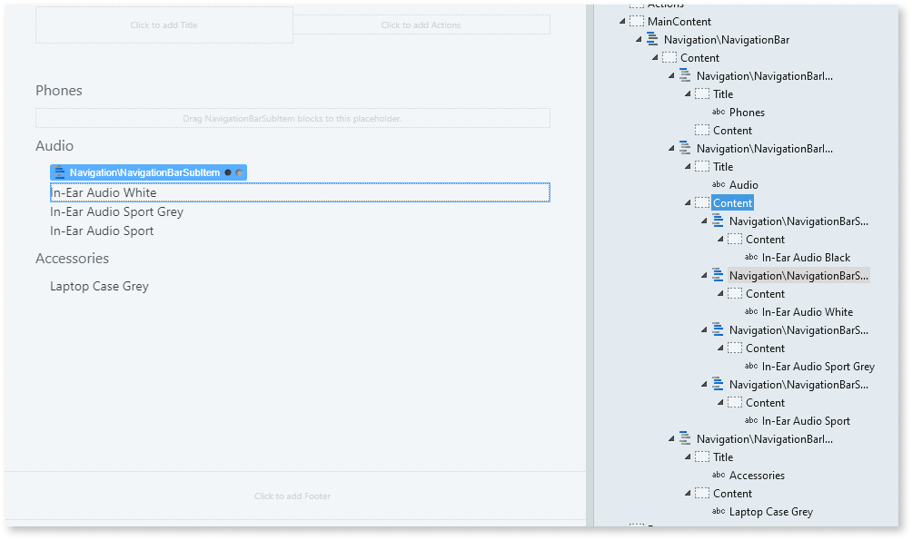
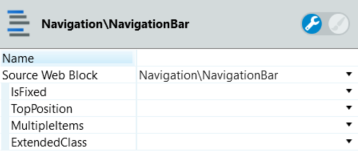

# Navigation Bar

You can use the Navigation Bar UI Pattern to organize content and enable the user to navigate their way around your app using hyperlinks. You use this pattern when the user needs to navigate through an application's main sections while maintaining the ability to browse to another subsection. 

**How to use the Navigation Bar UI Pattern**

1. In Service Studio, in the Toolbox, search for `Navigation Bar`. 

    The Navigation Bar widget is displayed.

      

1. From the Toolbox, drag the Navigation Bar widget into the Main Content area of your application's screen.

      

    By default, the Navigation Bar widget contains a Navigation Bar Item and a Navigation Bar SubItem widgets. You can add or delete as many of these widgets as required.

1. Add the required content to the Navigation Bar Item and Navigation Bar SubItem placeholders. In this example we add some text by typing directly into each of the placeholders.

    

1. On the **Properties** tab, you can customize the Navigation Bar's look and feel by setting any of the optional properties.

    

After following these steps and publishing the module, you can test the pattern in your app.

## Properties

### Navigation Bar

| **Property** |  **Description** |  
|---|---|
| IsFixed (Boolean): Optional |  If set to True, the navigation bar will always be in the same position on the screen. This is the defult value. If set to False, it scrolls with the page content. |  
| TopPosition (Integer): Optional  |  Set the top position when the navigation bar is fixed. 
Examples<ul><li>_Blank_ - This is the default.</li><li>_50_ - </li></ul>
|  
| MultipleItems (Boolean): Optional | If set to True, multiple Navigation Bar Items can be opened at the same time.This is the default value. If set to False, only one Navigation Bar Item can be opened at a time. | 
| ExtendedClass (Text): Optional | Add custom style classes to the Navigation Bar UI Pattern. You define your [custom style classes](../../../../../develop/ui/look-feel/css.md) in your application using CSS. 
Examples <ul><li>_Blank_ - No custom styles are added (default value)</li><li>_''myclass''_ - adds the _myclass_ style to the Navigation Bar UI styles being applied.<li>_''myclass1'' ''myclass2''_ - adds the _myclass1_ and _myclass2_ styles to the Navigation Bar UI styles being applied.</li></ul>
 | 

### Navigation Bar Item

| **Property** |  **Description** | 
|---|---|
| IsActive (Boolean): Optional | If set to True, when the page is rendered, the Item is selected. If set to False, the Item is not selected. This is the default value. | 
| IsOpen (Boolean): Optional  |  If set to True, when the page is rendered, the Navigation Bar Item is open. If set to False, the Navigation Bar Item is not open. This is the default.| 
| ExtendedClass (Text): Optional | Add custom style classes to the Navigation Bar Item UI Pattern. You define your [custom style classes](../../../../../develop/ui/look-feel/css.md) in your application using CSS. 
Examples <ul><li>_Blank_ - No custom styles are added (default value)</li><li>_''myclass''_ - adds the _myclass_ style to the Navigation Bar Item UI styles being applied.<li>_''myclass1'' ''myclass2''_ - adds the _myclass1_ and _myclass2_ styles to the Navigation Bar Item UI styles being applied.</li></ul>
 | 

### Navigation Bar Sub Item

| **Property** |  **Description** |  
|---|---|
| IsActive (Boolean): Optional  |  If set to True, when the page is rendered, the Sub Item is selected. If set to False, the 
Sub Item is not selected. | 

## Device compatibility

In Internet Explorer, `position: fixed` is used instead of `position: sticky` as the latter is not supported.

