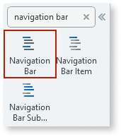
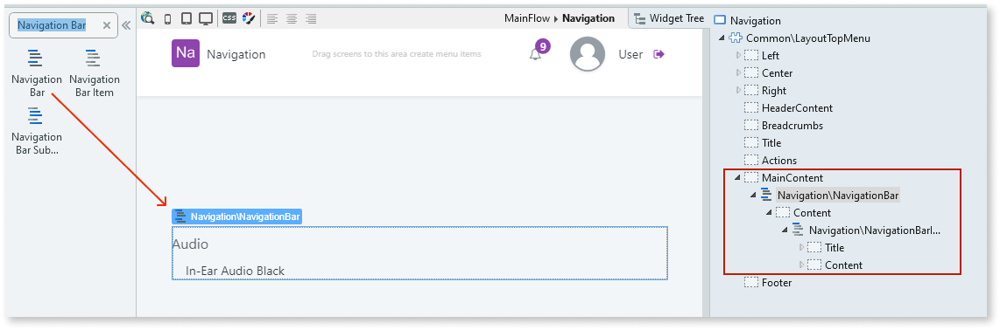
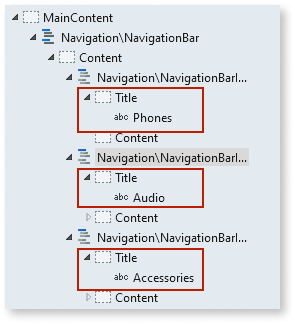
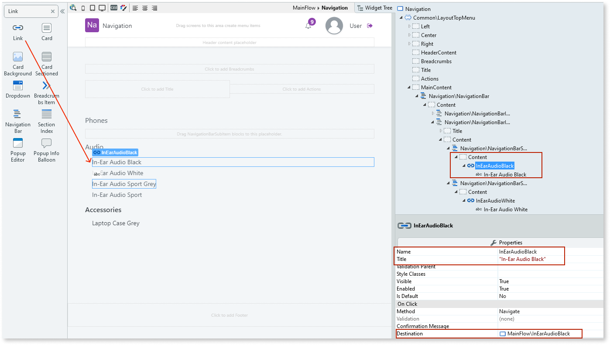
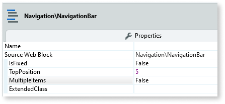

# Navigation Bar

Applies only to Traditional Web Apps.

You can use the Navigation Bar UI Pattern to organize content and enable the user to navigate their way around your app using hyperlinks. You use this pattern when the user needs to navigate through an application's main sections while maintaining the ability to browse to another subsection.

**How to use the Navigation Bar UI Pattern**

The following use case adds the Navigation Bar UI Pattern to **one** screen. If you want the Navigation Bar to appear on multiple screens in your app, we recommend adding the pattern to a web block. For more information, see [Create and Reuse Screen Blocks](../../../reuse/block-create-reuse.md).

1. In Service Studio, in the Toolbox, search for `Navigation Bar`.

    The Navigation Bar widget is displayed.

    

    If the UI widget doesn't display, it's because the dependency isn't added. This happens because the Remove unused references setting is enabled. To make the widget available in your app:

    1. In the Toolbox, click **Search in other modules**.

    1. In **Search in other Modules**, remove any spaces between words in your search text.
    
    1. Select the widget you want to add from the **OutSystemsUIWeb** module, and click **Add Dependency**. 
    
    1. In the Toolbox, search for the widget again.

1. From the Toolbox, drag the Navigation Bar widget into the Main Content area of your application's screen.

    

    By default, the Navigation Bar widget contains a Navigation Bar Item widget and a Navigation Bar SubItem widget. You can add or delete as many of these widgets as required.

1. Add the required content to the Navigation Bar Item and Navigation Bar SubItem placeholders.

    In this example we add `Phones`, `Audio`, and `Accessories` to the Navigation Bar Item **Title** placeholders.

    

    We also add links to the Navigation Bar SubItem **Content** placeholders. For each of the links, on the **Properties** tab, we add a link name and title, as well as the link destination.

    

1. On the **Properties** tab, you can also customize the Navigation Bar's look and feel by setting any of the optional properties.

    

After following these steps and publishing the module, you can test the pattern in your app.

## Properties

### Navigation Bar

| Property                          | Description                                                                                                                                                                                                                                                                                                                                                                                                                                                                                                                                                                                                                        |
|-----------------------------------|------------------------------------------------------------------------------------------------------------------------------------------------------------------------------------------------------------------------------------------------------------------------------------------------------------------------------------------------------------------------------------------------------------------------------------------------------------------------------------------------------------------------------------------------------------------------------------------------------------------------------------|
| IsFixed (Boolean): Optional       | If True, the navigation bar is always in the same position on the screen. This is the default value. If False, the navigation bar scrolls with the page content.                                                                                                                                                                                                                                                                                                                                                                                                                                                                   |
| TopPosition (Integer): Optional   | Set the top position when the navigation bar is fixed.                                                                                                                                                                                                                                                                                                                                                                                                                                                                                                                                                                             |
| MultipleItems (Boolean): Optional | If True, multiple Navigation Bar Items can be opened at the same time. This is the default value. If False, only one Navigation Bar Item can be opened at a time.                                                                                                                                                                                                                                                                                                                                                                                                                                                                  |
| ExtendedClass (Text): Optional    | Adds custom style classes to the Pattern. You define your [custom style classes](../../../look-feel/css.md) in your application using CSS.  Examples   <ul><li>Blank - No custom styles are added (default value).</li><li>"myclass" - Adds the ``myclass`` style to the UI styles being applied.</li><li>"myclass1 myclass2" - Adds the ``myclass1`` and ``myclass2`` styles to the UI styles being applied.</li></ul>You can also use the classes available on the OutSystems UI. For more information, see the [OutSystems UI Cheat Sheet](https://outsystemsui.outsystems.com/OutSystemsUIWebsite/CheatSheet). |

### Navigation Bar Item

| Property                       | Description                                                                                                                                                                                                                                                                                                                                                                                                                                                                                                                                                                                                                        |
|--------------------------------|------------------------------------------------------------------------------------------------------------------------------------------------------------------------------------------------------------------------------------------------------------------------------------------------------------------------------------------------------------------------------------------------------------------------------------------------------------------------------------------------------------------------------------------------------------------------------------------------------------------------------------|
| IsActive (Boolean): Optional   | If True, when the page is rendered, the Item is selected. If False, the Item is not selected. This is the default value.                                                                                                                                                                                                                                                                                                                                                                                                                                                                                                           |
| IsOpen (Boolean): Optional     | If True, when the page is rendered, the Navigation Bar Item is open. If False, the Navigation Bar Item is not open. This is the default.                                                                                                                                                                                                                                                                                                                                                                                                                                                                                           |
| ExtendedClass (Text): Optional | Adds custom style classes to the Pattern. You define your [custom style classes](../../../look-feel/css.md) in your application using CSS.  Examples   <ul><li>Blank - No custom styles are added (default value).</li><li>"myclass" - Adds the ``myclass`` style to the UI styles being applied.</li><li>"myclass1 myclass2" - Adds the ``myclass1`` and ``myclass2`` styles to the UI styles being applied.</li></ul>You can also use the classes available on the OutSystems UI. For more information, see the [OutSystems UI Cheat Sheet](https://outsystemsui.outsystems.com/OutSystemsUIWebsite/CheatSheet). |

### Navigation Bar Sub Item

| Property                     | Description                                                                                           |
|------------------------------|-------------------------------------------------------------------------------------------------------|
| IsActive (Boolean): Optional | If True, when the page is rendered, the Sub Item is selected. If False, the Sub Item is not selected. |

## Device compatibility

In Internet Explorer, `position: fixed` is used instead of `position: sticky` as the latter is not supported.
