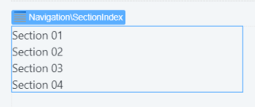

# SectionIndex

Organizes the content of a screen, enabling quick navigation within the page.

Use the Section Index to organize the content of a screen, enabling quick navigation. Related content is preferably grouped adjacent to each other. 

**How to use**

Drag the SectionIndex pattern into the preview.

It creates a link to every section you have on the page. The name of the link is based on the text you have in the Title placeholder of each section.

 

## Input Parameters

| **Input Name** |  **Description** |  **Type** | **Mandatory** | **Default Value** |
|---|---|---|---|---|
| IsSmooth  |  If IsSmooth is true, the navigation to destination will animate. If set to false, it will navigate instantly. | Boolean | False | False |
| IsFixed  |  If Fixed is true, SectionIndex will allways be in the same position within the screen. If set to false, it scrolls with the page content. |  Text | False | True |
| TopPosition  |  Set the top position when the SectionIndex is fixed. Just insert the number, the pixels unit will be added automatically. |  Integer | False | none |
| ExtendedClass  |  Add custom style classes to this Block. | Text | False | none |
  
## Layout and Classes

## CSS Selectors

| **Element** |  **CSS Class** |  **Description**  |
| ---|---|---  
| .section-index |  .section-index.is--sticky|  Defines if the SectionIndex position is fixed or not  |
| .section-index-item |  .section-index-item.is--active|  Defines the current active link  |

## Advanced Use Case

### Change active color

1. Write the following CSS in the CSS editor and change the `yourcolor`.

    `a.section-index-item.is--active {
        border-left-color: yourcolor;
        color: yourcolor;
    }`

1. Or using CSS variables: `var(--color-yourcolor)`.

    `a.section-index-item.is--active {
        border-left-color: var(--color-yourcolor);
        color: var(--color-yourcolor);
    }`

For RTL compatibility, make sure to also add the following code:

    `.is-rtl a.section-index-item.is--active {
        border-right-color: yourcolor;
        color: yourcolor;
    }`

## Notes

Remember to use the Title placeholder in the Section pattern, as this will define the text for each SectionIndex link. 

## Device Compatibility

In Internet Explorer `position: fixed` is used instead of `position sticky`, as the latter is unsupported.

## Compatibility with other Patterns

Only works with Section Pattern in the same screen.

